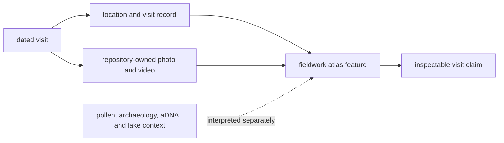
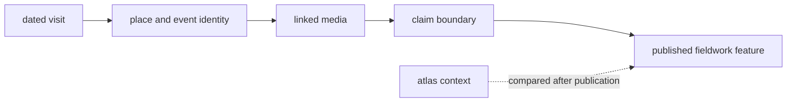

# Fieldwork

Fieldwork records direct observation at a declared place and time. Within
Bijux Pollenomics, that is a distinct evidence role: it can establish that a
visit occurred and preserve what was documented, but it cannot replace pollen,
archaeology, hydrography, or ancient-DNA evidence.

## Evidence Role

```mermaid
flowchart LR
    Visit["dated visit"] --> Record["location and visit record"]
    Visit --> Media["repository-owned photo and video"]
    Record --> Point["fieldwork atlas feature"]
    Media --> Point
    Point --> Claim["inspectable visit claim"]
    Context["pollen, archaeology, aDNA, and lake context"] -. interpreted separately .-> Point
```

| Fieldwork can establish | Fieldwork cannot establish alone |
| --- | --- |
| a visit at the recorded date and location | representative coverage of a lake or region |
| repository ownership of the published media | sediment quality, bathymetry, or coring suitability |
| linkage between a visit record and an atlas feature | temporal overlap among nearby evidence families |
| what is visibly documented in the selected media | a general sampling recommendation |

## Observation Contract

A publishable fieldwork feature binds five elements:

| Element | Required meaning |
| --- | --- |
| place | a stable named feature and coordinates at the precision supported by the visit |
| time | the date or interval during which the observation was made |
| observer context | enough visit identity to distinguish the event from reused media or atlas context |
| media lineage | repository-owned or explicitly licensed material linked to the visit |
| claim boundary | a statement limited to what the visit and selected media establish |

```mermaid
flowchart LR
    Visit["dated visit"] --> Identity["place and event identity"]
    Identity --> Media["linked media"]
    Media --> Review["claim boundary"]
    Review --> Feature["published fieldwork feature"]
    Context["atlas context"] -. compared after publication .-> Feature
```

Atlas context enters after the visit claim is established. Nearby pollen,
archaeology, hydrography, or ancient-DNA records can motivate follow-up, but
they cannot fill a missing visit date, location, media link, or observation.

## Current Record

The published fieldwork surface contains one direct visit record:
[Lyngsjön Lake, 26 February 2026](./lyngsjon-lake-fieldwork/index.md). The
record includes coordinates, atlas identity, a checked-in photograph, and a
checked-in video.

  <a class="md-button md-button--primary" href="./lyngsjon-lake-fieldwork/">Inspect the Lyngsjön visit</a>
  <a class="md-button" href="../../report/regions/nordic/nordic_map.html">Open the Nordic atlas</a>
  <a class="md-button" href="../nordic-atlas/sweden-lake-priorities/">Review Sweden lake priorities</a>
  <a class="md-button" href="../pollenomics-data/">Follow the data evidence chain</a>

## Relationship To Lake Prioritization

A documented visit and a ranked lake answer different questions. Ranking
combines declared evidence and lake attributes to support prioritization. A
visit records direct presence and media at one location. Neither supplies the
missing bathymetry, permits, access analysis, sediment assessment, or complete
field protocol required for sampling readiness.

The fieldwork feature therefore remains its own atlas layer. It can be compared
with nearby context, but proximity does not transfer evidentiary weight between
layers.

| Transition | What is learned | What remains unresolved |
| --- | --- | --- |
| ranking to desk review | whether a lake is evidence-rich under the model | bathymetry, access, permits, and field conditions |
| desk review to visit | whether the candidate merits direct inspection | representative lake conditions and sampling feasibility |
| visit to sampling decision | what was directly observed at one time and place | coring design, sediment integrity, and reproducibility |

Each transition needs its own record. A visit is not a completion flag attached
to a ranking row; it is new evidence with independent identity and limits.

## Publication Boundary

The current record does not imply that every atlas point has field media or
that Lyngsjön represents regional conditions. Additional visits require their
own date, location, media lineage, feature identity, and claim boundary before
publication.
