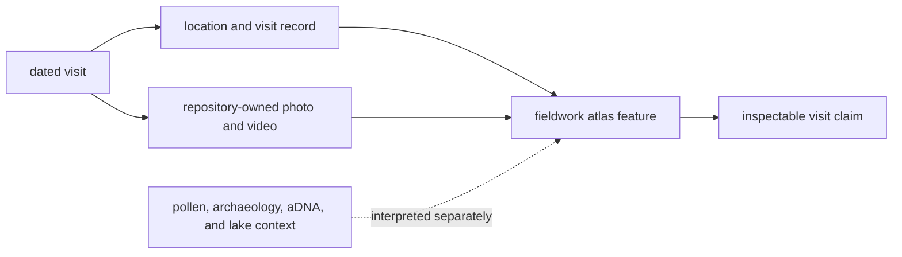
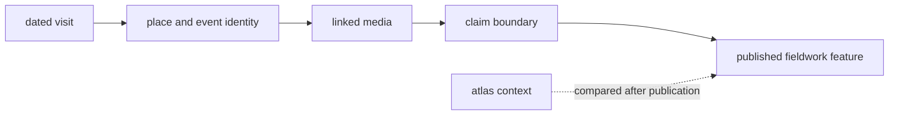
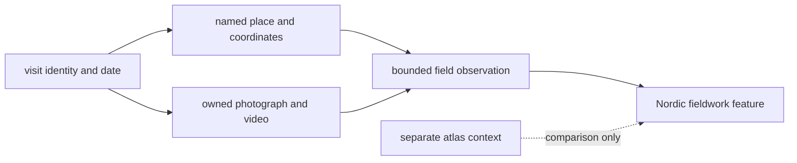

# Fieldwork

Fieldwork records direct observation at a declared place and time. Within
Bijux Pollenomics, that is a distinct evidence role: it can establish that a
visit occurred and preserve what was documented, but it cannot replace pollen,
archaeology, hydrography, or ancient-DNA evidence.

## Evidence Role

```mermaid
flowchart LR
    Visit["dated visit"] --> Record["location and visit record"]
    Visit --> Media["repository-owned photo and video"]
    Record --> Point["fieldwork atlas feature"]
    Media --> Point
    Point --> Claim["inspectable visit claim"]
    Context["pollen, archaeology, aDNA, and lake context"] -. interpreted separately .-> Point
```

| Fieldwork can establish | Fieldwork cannot establish alone |
| --- | --- |
| a visit at the recorded date and location | representative coverage of a lake or region |
| repository ownership of the published media | sediment quality, bathymetry, or coring suitability |
| linkage between a visit record and an atlas feature | temporal overlap among nearby evidence families |
| what is visibly documented in the selected media | a general sampling recommendation |

## Observation Contract

A publishable fieldwork feature binds five elements:

| Element | Required meaning |
| --- | --- |
| place | a stable named feature and coordinates at the precision supported by the visit |
| time | the date or interval during which the observation was made |
| observer context | enough visit identity to distinguish the event from reused media or atlas context |
| media lineage | repository-owned or explicitly licensed material linked to the visit |
| claim boundary | a statement limited to what the visit and selected media establish |

```mermaid
flowchart LR
    Visit["dated visit"] --> Identity["place and event identity"]
    Identity --> Media["linked media"]
    Media --> Review["claim boundary"]
    Review --> Feature["published fieldwork feature"]
    Context["atlas context"] -. compared after publication .-> Feature
```

Atlas context enters after the visit claim is established. Nearby pollen,
archaeology, hydrography, or ancient-DNA records can motivate follow-up, but
they cannot fill a missing visit date, location, media link, or observation.

## Documentation Is Not Measurement

A dated photograph or video documents what the selected media visibly support.
It does not become a limnological, sedimentological, archaeological, or
ecological measurement unless the event also carries the relevant method,
instrument, units, calibration, sampling location, and result.

| Field record | Defensible claim | Additional evidence needed for a stronger claim |
| --- | --- | --- |
| dated visit and media | the visit occurred and the selected conditions are documented | a defined observation protocol for systematic comparison |
| shoreline coordinate | the observer was at the recorded location | surveyed lake geometry or coring position |
| visual water or ice condition | the condition is visible in the media at that moment | instrumented environmental measurement |
| access route used once | the route was used for this visit | legal access, seasonal feasibility, and safety assessment |
| no feature noted in visit record | it was not recorded under this visit's documentation | protocol-defined search effort before claiming absence |

Negative field claims require particular care. “Not recorded” may reflect the
visit scope, season, visibility, or documentation method; it is not equivalent
to “not present.”

## Current Record

The published fieldwork surface contains one direct visit record:
[Lyngsjön Lake, 26 February 2026](./lyngsjon-lake-fieldwork/index.md). The
record includes coordinates, atlas identity, a checked-in photograph, and a
checked-in video.

The Nordic map contract publishes this as one `fieldwork-documentation`
feature. It is enabled by default in Nordic scope, follows country filtering,
and does not use the atlas time filter because the visit date is an event
property rather than an ancient temporal-comparison interval.

  <a class="md-button md-button--primary" href="./lyngsjon-lake-fieldwork/">Inspect the Lyngsjön visit</a>
  <a class="md-button" href="../../report/regions/nordic/nordic_map.html">Open the Nordic atlas</a>
  <a class="md-button" href="../nordic-atlas/sweden-lake-priorities/">Review Sweden lake priorities</a>
  <a class="md-button" href="../pollenomics-data/">Follow the data evidence chain</a>

## Relationship To Lake Prioritization

A documented visit and a ranked lake answer different questions. Ranking
combines declared evidence and lake attributes to support prioritization. A
visit records direct presence and media at one location. Neither supplies the
missing bathymetry, permits, access analysis, sediment assessment, or complete
field protocol required for sampling readiness.

The fieldwork feature therefore remains its own atlas layer. It can be compared
with nearby context, but proximity does not transfer evidentiary weight between
layers.

| Transition | What is learned | What remains unresolved |
| --- | --- | --- |
| ranking to desk review | whether a lake is evidence-rich under the model | bathymetry, access, permits, and field conditions |
| desk review to visit | whether the candidate merits direct inspection | representative lake conditions and sampling feasibility |
| visit to sampling decision | what was directly observed at one time and place | coring design, sediment integrity, and reproducibility |

Each transition needs its own record. A visit is not a completion flag attached
to a ranking row; it is new evidence with independent identity and limits.

## Fieldwork Evidence Packet

| Packet member | What it proves |
| --- | --- |
| visit identity and date | which event is being documented |
| named place and coordinates | where the published visit feature is located |
| media paths and ownership | which checked-in photograph and video support the visit |
| atlas feature and layer | how the visit appears in the Nordic product |
| claim boundary | which observations remain supportable from the event and selected media |
| contextual links | which separately governed atlas evidence can be inspected nearby |

For Lyngsjön, the media authorities are
`docs/gallery/2026-02-26-data-collection.JPG` and
`docs/gallery/2026-02-26-data-collection.mp4`. Copying the atlas marker without
the dated visit and media lineage would leave only a coordinate, not fieldwork
evidence.

```mermaid
flowchart LR
    Event["visit identity and date"] --> Place["named place and coordinates"]
    Event --> Media["owned photograph and video"]
    Place --> Claim["bounded field observation"]
    Media --> Claim
    Claim --> Feature["Nordic fieldwork feature"]
    Atlas["separate atlas context"] -. comparison only .-> Feature
```

### Audit A Published Visit

Start from the atlas feature and recover the evidence in both directions:

1. Confirm that the layer identifies the record as fieldwork rather than a
   lake candidate, environmental measurement, or archaeological observation.
2. Match the feature title, date, and coordinates to the visit page.
3. Open the linked media from repository-owned paths; a thumbnail or copied
   URL alone does not establish media lineage.
4. Read the claim boundary before interpreting anything visible in the media.
5. Follow contextual links separately and retain each source family's spatial
   and temporal qualifications.

This audit distinguishes a complete visit claim from a plausible-looking map
marker. It also prevents contextual density around a lake from being reported
as something directly observed during the visit.

## Identity Across Fieldwork And Lake Data

The same named lake can have more than one legitimate coordinate-bearing
record. A fieldwork coordinate locates an observed event; a registry
representative point locates a water-body feature for inventory and ranking.
They can be linked through lake identity without being treated as the same
observation.

| Identity | Unit represented | Safe use |
| --- | --- | --- |
| fieldwork event | one dated visit at a recorded location | inspect the visit and its media |
| lake registry feature | one mapped water body | identify and compare the lake candidate |
| ranking row | one lake under one declared scoring scenario | compare prioritization evidence |

Coordinate proximity is therefore a linkage clue, not a deduplication rule.
Preserving the three identities keeps a later registry correction from moving
the historic visit and keeps a new visit from rewriting a prior ranking row.

The link also has a direction. A confirmed lake identity can connect the visit
to registry and ranking context; it does not make the field coordinate the
canonical lake representative point. Likewise, a registry correction can
trigger review of the link without rewriting the recorded historic event.

## Publication Boundary

The current record does not imply that every atlas point has field media or
that Lyngsjön represents regional conditions. Additional visits require their
own date, location, media lineage, feature identity, and claim boundary before
publication.

Repeated visits to the same lake remain distinct events. They may share the
lake identity while retaining separate dates, observations, media, methods,
and conditions. Merging them by coordinates would erase the temporal and
observational unit that makes fieldwork evidence auditable.

Cross-visit comparison requires a shared protocol or an explicit statement of
which fields are comparable. Media captured in different seasons, positions,
weather, or visit purposes can document change or contrast, but those
differences must remain part of the interpretation rather than being treated
as interchangeable replicates.
