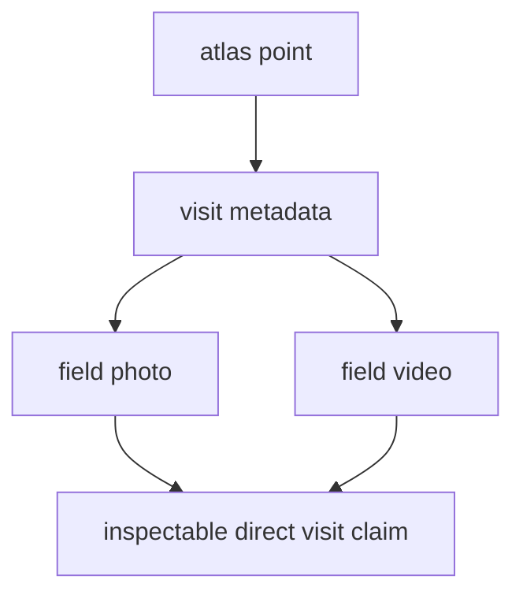

# Lyngsjön Lake Fieldwork

This page is the direct visit record for the fieldwork point published in the
Nordic Evidence Atlas. It ties one visible atlas point to one checked-in visit,
with one photo and one video from the day stored in this repository.

The purpose is not to dramatize a single outing. The purpose is to make the
logic of the site more honest. If the atlas shows a fieldwork point, a reader
should be able to follow that point back to a real documented visit and judge
for themselves what the repository is actually claiming.

## Visit Evidence Model

This page should let a reader verify one direct-evidence claim with very little
friction: the published point corresponds to a real visit, on a real date, at
one stated location, with repository-owned media that can be inspected directly
from the site.

## Visit Record

- lake: Lyngsjön Lake
- country: Sweden
- regional setting: southwest of Kristianstad, in a landscape where pollen,
  archaeology, and ancient-DNA questions can be read together rather than in
  isolation
- field date: `2026-02-26`
- atlas coordinates: `55.9319529, 14.0659044`
- atlas layer label: `Fieldwork documentation`
- atlas point title: `Lyngsjön Lake field sampling`

## Why This Place Matters

Lyngsjön is not presented here as a random stop. It is a sensible starting
point because the surrounding area is unusually rich in the kinds of evidence
this repository is trying to hold together: pollen context, archaeological
context, and ancient DNA all matter nearby. That combination makes the area a
useful candidate for early fieldwork documentation.

Starting here does not prove that the whole repository is mature, and it does
not make one visit representative of a region. What it does provide is a clear
place to begin: an area with genuine cross-evidence interest, where a reader
can see the project move from mapped interpretation back to an actual visit in
the landscape.

## Repository Evidence

- photo: `docs/gallery/2026-02-26-data-collection.JPG`
- video: `docs/gallery/2026-02-26-data-collection.mp4`
- Nordic evidence surface: `docs/report/regions/nordic/nordic_map.html`
- world parent surface: `docs/report/world/world_map.html`

[Open the Nordic evidence surface](https://bijux.io/bijux-pollenomics/report/regions/nordic/nordic_map.html){ .md-button .md-button--primary }
[Open the world parent surface](https://bijux.io/bijux-pollenomics/report/world/world_map.html){ .md-button }
[Open the field video](https://bijux.io/bijux-pollenomics/gallery/2026-02-26-data-collection.mp4){ .md-button }
[Open the field photo](https://bijux.io/bijux-pollenomics/gallery/2026-02-26-data-collection.JPG){ .md-button }

{ loading=lazy }

<figure class="bijux-media-card">
  <video controls preload="metadata" muted playsinline>
    <source src="../../gallery/2026-02-26-data-collection.mp4" type="video/mp4">
    <a href="../../gallery/2026-02-26-data-collection.mp4">Open the field video.</a>
  </video>
  <figcaption>Field documentation from Lyngsjön Lake during winter sampling on 2026-02-26. Playback starts muted so the visit can be inspected without forcing audio.</figcaption>
</figure>

## How To Read This Evidence

- a documented visit happened at the published location on `2026-02-26`
- the repository keeps direct media for that visit rather than referring only
  to derived map output
- the atlas can link to repository-owned field evidence instead of depending
  entirely on upstream database layers
- this visit strengthens the inspectability of one place; it does not by itself
  settle wider scientific claims about the whole region

## Why Only One Photo And One Video

This page shows only one photo and one video on purpose. That is enough to make
the visit concrete without turning the public site into an uncurated gallery.
The goal is clarity, not volume.

If you are especially interested in the visit and would like to ask about more
photos or video from the same day, send an email to `bijan@bijux.io`.

## Design Pressure

The common failure is to read a documented visit as representative field
coverage rather than what it really is: one inspectable anchor for one atlas
point in an evidence-rich candidate area.

## Boundary

This page does not turn the atlas into a field-log archive, and it does not
imply that one visit is representative of regional pollen evidence, regional
archaeology, or the current state of ancient-DNA recovery. Its job is more
precise: make one real visit inspectable, understandable, and honestly framed.
