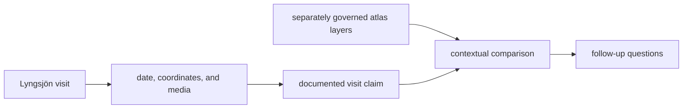
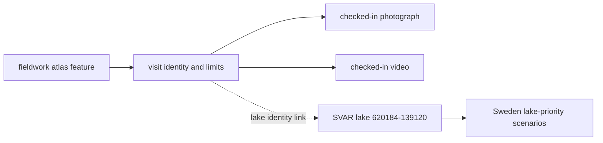

# Lyngsjön Lake Fieldwork

Lyngsjön Lake is the direct visit record behind the corresponding fieldwork
feature in the Nordic Evidence Atlas. The evidence supports a narrow claim: a
visit was documented at the stated coordinates on 26 February 2026, and the
repository preserves selected media from that visit.

## Visit Record

| Field | Value |
| --- | --- |
| lake | Lyngsjön Lake |
| country | Sweden |
| regional setting | southwest of Kristianstad |
| field date | `2026-02-26` |
| atlas coordinates | `55.9319529, 14.0659044` |
| atlas layer | `Fieldwork documentation` |
| atlas feature | `Lyngsjön Lake field sampling` |

The coordinate above belongs to the visit feature. The Sweden lake-priority
registry separately represents Lyngsjön as `svar-lakes:620184-139120` at a
polygon representative point. The two coordinates are close, but they are not
interchangeable: one locates this dated field record and the other identifies
the mapped water body used by the ranking system.

## Atlas Context

The surrounding atlas contains pollen, archaeology, hydrography, and
ancient-DNA context. Those layers explain why the landscape supports
cross-domain investigation; they do not become direct evidence for the visit,
and the visit does not validate their scientific claims. Each layer retains its
own provenance, spatial precision, and temporal semantics.

```mermaid
flowchart LR
    Visit["Lyngsjön visit"] --> Record["date, coordinates, and media"]
    Record --> Claim["documented visit claim"]
    Atlas["separately governed atlas layers"] --> Comparison["contextual comparison"]
    Claim --> Comparison
    Comparison --> Questions["follow-up questions"]
```

The diagram has no shortcut from atlas context to the visit claim. The visit
is supported by its own record and media; contextual comparison begins only
after that narrow claim is established.

## Evidence Route

```mermaid
flowchart LR
    AtlasFeature["fieldwork atlas feature"] --> VisitPage["visit identity and limits"]
    VisitPage --> Photo["checked-in photograph"]
    VisitPage --> Video["checked-in video"]
    VisitPage -. lake identity link .-> Registry["SVAR lake 620184-139120"]
    Registry --> Ranking["Sweden lake-priority scenarios"]
```

The solid path audits the visit. The dotted link enables comparison with the
lake registry without claiming that the registry proves the visit or that the
visit validates the ranking.

## Repository Evidence

- photo: `docs/gallery/2026-02-26-data-collection.JPG`
- video: `docs/gallery/2026-02-26-data-collection.mp4`
- Nordic evidence surface: `docs/report/regions/nordic/nordic_map.html`
- world parent surface: `docs/report/world/world_map.html`

<a class="md-button md-button--primary" href="../../../report/regions/nordic/nordic_map.html">Open the Nordic evidence surface</a>
<a class="md-button" href="../../../report/world/world_map.html">Open the world parent surface</a>
<a class="md-button" href="../../../gallery/2026-02-26-data-collection.mp4">Open the field video</a>
<a class="md-button" href="../../../gallery/2026-02-26-data-collection.JPG">Open the field photo</a>
<a class="md-button" href="../../nordic-atlas/sweden-lake-priorities/">Compare the lake-priority record</a>

{ loading=lazy }

<figure class="bijux-media-card">
  <video controls preload="metadata" muted playsinline>
    <source src="../../../gallery/2026-02-26-data-collection.mp4" type="video/mp4">
    <a href="../../../gallery/2026-02-26-data-collection.mp4">Open the field video.</a>
  </video>
  <figcaption>Field documentation from Lyngsjön Lake during winter sampling on 2026-02-26. Playback starts muted so the visit can be inspected without forcing audio.</figcaption>
</figure>

## Supported Interpretation

| Supported | Not supported by this record |
| --- | --- |
| the published feature corresponds to a dated visit | representative field coverage |
| the selected photo and video are checked-in visit media | lake-wide sediment or bathymetric conditions |
| the location can be compared with separately governed atlas context | causal or temporal association with nearby records |
| one atlas claim can be inspected beyond its marker | regional sampling readiness |

Only one photograph and one video are published. Their role is evidence for the
visit claim, not comprehensive documentation of conditions at the lake.

The map, page, photograph, and video are complementary representations of one
evidence packet. Repetition across those surfaces does not create four
independent observations. A reviewer should count the visit once and use the
media to inspect the bounded claim attached to it.

### Relate The Visit To A Ranking Revision

The visit and lake-priority record can be connected only after fixing both
identities:

| Side of the relation | Required identity |
| --- | --- |
| fieldwork | Lyngsjön visit feature, `2026-02-26` event date, visit coordinate, and media packet |
| lake registry | `svar-lakes:620184-139120`, governed polygon, and representative-point method |
| ranking | product version, candidate population, scenario or aggregate definition, model weights, and evidence revision |

That relation permits a reader to ask what ranking context existed for the
same governed lake. It does not show that the visit was caused by the rank,
that the rank predicted conditions visible in the media, or that the visit
validated the ranking model. Those claims would require a dated selection
decision and a field protocol that measures model-relevant outcomes.

If the registry geometry or ranking later changes, retain the historical visit
and prior ranking identities. Recompute the relation rather than moving the
visit coordinate or rewriting what the earlier model ranked.

## Reading The Media

The photograph and video document selected views during a winter visit. They
support statements about what is visible in those frames and the occurrence of
the recorded visit. They do not establish conditions outside the captured
view, persistence across seasons, lake-wide access, water depth, sediment
structure, or the feasibility of a sampling design.

The atlas coordinates locate the published visit feature. They are not a
coring station, transect, shoreline-access guarantee, or substitute for a
field protocol. Any later sampling record requires its own coordinates,
methods, dates, permissions, observations, and media lineage.

## Evidence Boundary

This record does not establish pollen stratigraphy, archaeological chronology,
ancient-DNA presence, coring suitability, access, permits, or the
representativeness of Lyngsjön for a wider region. Those questions require
their own sources, methods, and review decisions.

A stronger field assessment would add repeated or spatially distributed
observations, bathymetry and basin evidence, access and permission records,
seasonal context, and an explicit sampling protocol. Until then, the durable
claim remains the documented visit described above.
