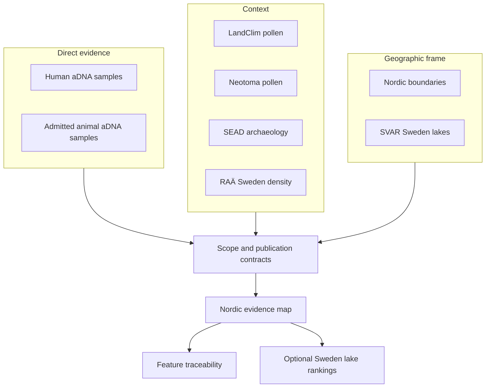
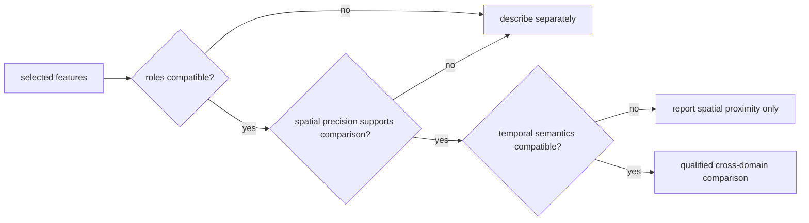

# Nordic Evidence Atlas

The Nordic Evidence Atlas connects sample-backed ancient DNA with pollen and
archaeology context across the Nordic publication scope. Every point belongs
to a declared source family and product contract; popups retain the identifiers
and provenance needed to leave the map and inspect the governing evidence.

The atlas is a comparison surface, not a claim that nearby records describe
the same event. Geography, chronology, and evidence role must all support an
interpretation before proximity becomes meaningful.

## Evidence Architecture

| Layer role | What it can establish | What it cannot establish alone |
| --- | --- | --- |
| Direct evidence | a source-backed sample at an admitted place and chronology posture | regional completeness or causation |
| Pollen context | nearby vegetation-history and sequence context | human or animal presence |
| Archaeology context | surrounding environmental-archaeology or density context | sample ownership or uniform temporal overlap |
| Boundary framing | geographic scope and product membership | scientific support |
| Lake ranking | evidence-rich registry lakes under explicit scenarios | field readiness or optimal coring location |

## Current Nordic Bundle

The checked-in `v66` Nordic bundle was generated on `2026-06-28`. Its map
contract publishes these governed layer populations:

| Layer | Features | Role |
| --- | ---: | --- |
| AADR human samples | 1,231 | shared direct evidence |
| admitted horse aDNA localities | 2 | shared animal evidence |
| LandClim pollen sequences | 492 | Nordic environmental context |
| Neotoma pollen sites | 200 | Nordic environmental context |
| SEAD sites | 2,172 | Nordic archaeology context |
| Lyngsjön fieldwork | 1 | Nordic direct-visit evidence |
| LandClim REVEALS cells | 88 | vegetation-reconstruction context |
| RAÄ density cells | 106 | Sweden-specific archaeology context |
| country boundaries | 4 | filtered geographic framing |

The map also carries optional Sweden lake overlays: aggregate and consensus
top 40, five radius-specific top 40 layers, and a fieldwork-preparation top 20.
Those overlays are derived decision support and are disabled by default.

Counts remain typed by layer. Adding 1,231 samples, 492 sequences, 2,172 sites,
and 106 density cells would not produce a meaningful total because the units,
roles, and admission contracts differ.

## Explore the atlas

  <a class="md-button md-button--primary" href="../../report/regions/nordic/nordic_map.html">Open the Nordic evidence atlas</a>
  <a class="md-button" href="../../report/">Open the report portal</a>
  <a class="md-button" href="../../report/world/world_map.html">Open the world parent</a>
  <a class="md-button" href="../../report/regions/europe-plus/europe-plus_map.html">Open Europe-plus</a>
  <a class="md-button" href="./sweden-lake-priorities/">Inspect Sweden lake priorities</a>

  <strong>Phone view:</strong> Open the atlas in its own tab for full map
  controls.

  <iframe src="../../report/regions/nordic/nordic_map.html" title="Nordic Evidence Atlas"></iframe>

### Choose A Question Before A Layer

| Reader question | Start with | Then verify |
| --- | --- | --- |
| Which admitted aDNA samples are in the Nordic scope? | human or animal direct-evidence layer | feature identity, scope membership, locality, chronology, and coordinate posture |
| What pollen context surrounds a sample or lake? | LandClim or Neotoma | observation unit, distance rule, and compatible temporal fields |
| What archaeology context is visible nearby? | SEAD or RAÄ | inventory semantics, temporal limits, and the difference between a point and a density cell |
| Which lakes are evidence-rich under the declared model? | Sweden aggregate, consensus, or radius overlay | ranking surface, weights, scenario, lake identity, and required review action |
| Why is an expected record missing? | traceability, exclusions, and recovery reviews | whether it is filtered, outside scope, refused, unresolved, or absent from capture |

Starting with the question prevents layer availability from defining the
analysis. The strongest-looking symbol is not necessarily the evidence role
that can answer the question.

## Reading A Feature

Begin with its popup and follow the evidence role before interpreting the
marker:

1. **Identify the layer.** Direct evidence and context layers answer different
   questions.
2. **Check the scope.** Nordic inclusion is explicit and may differ from world
   or Europe-plus eligibility.
3. **Inspect coordinate basis.** Direct coordinates and named-site resolution
   remain visibly distinct; region-only animal evidence is not a point.
4. **Inspect temporal semantics.** Numeric interval, caveated interval,
   contextual label, and unresolved time support different comparisons.
5. **Follow the identifiers.** Feature, evidence-row, site, project, sample,
   and citation fields connect the marker to its narrower source records.

Filtering changes visibility, not eligibility. A hidden feature remains part
of the scoped product; an excluded record cannot be admitted by changing a
browser control.

## Four Identities Behind One Marker

| Identity | Establishes |
| --- | --- |
| map feature ID | the interactive object and layer membership |
| product member ID | inclusion in the Nordic manifest and parent-scope lineage |
| evidence record ID | the governed scientific or framing object |
| source-native ID | the upstream sample, site, record, lake, or dataset identity |

These identifiers can share labels or coordinates without becoming the same
object. A marker audit is complete only when the feature resolves through all
applicable identities and retains role, place, time, and qualification.

## From Marker To Defensible Comparison

The atlas supports comparison only after the features pass three independent
tests:

Role compatibility does not require identical source families; it requires a
question that respects what each family can establish. Spatial compatibility
requires distances no more precise than the underlying coordinates. Temporal
compatibility requires eligible numeric intervals or another explicitly
declared comparison rule. Passing all three tests supports comparison, not
causation.

| Map observation | Defensible next statement | Evidence to inspect |
| --- | --- | --- |
| two markers appear close | they are spatially proximate at the displayed precision | coordinate basis and uncertainty |
| a pollen site and sample overlap numerically | their admitted time intervals overlap under the declared semantics | interval basis, bounds, and caveats |
| a layer disappears after a scope change | the feature is not visible in the active selection | parent/child manifest and inclusion reason |
| an expected record is absent | no marker is present in this view | recovery, refusal, and scope surfaces |

## Sweden Lake Overlays

The optional lake layers rank SVAR registry lakes by nearby human aDNA, direct
and nearby pollen, archaeology context, animal context, evidence diversity,
and basic lake sampling fit. They are off by default because they are derived
decision-support products layered over the evidence map.

Aggregate, consensus, radius-specific, and fieldwork-preparation overlays answer
different questions. None includes bathymetry, coring depth, access, permits,
landowner coordination, or field validation. A high-ranking lake is a candidate
for further review, not a sampling recommendation.

The overlay sequence is intentionally one-way: evidence layers inform a model;
the model orders candidates; field review can accept, defer, or reject a
candidate. A field decision never rewrites the evidence layers or retroactively
changes the model score.

## Contracts And Traceability

- [Nordic map publication contract](../../report/regions/nordic/nordic_map_publication_contract.md)
  defines the product scope and required layers.
- [Nordic point traceability](../../report/regions/nordic/nordic_point_traceability.md)
  connects visible features to governing evidence.
- [Nordic animal evidence rows](../../report/regions/nordic/nordic_animal_atlas_evidence.json)
  expose the admitted animal subset.
- [Animal atlas exclusion report](../../report/animal_atlas_exclusion_report.md)
  records evidence kept outside the point layer.
- [Point publication rules](../pollenomics-data/publications/point-rules.md)
  define animal feature admission.
- [Filters and popups](../pollenomics-data/publications/filters-and-popups.md)
  define browser behavior and visible provenance.
- [Current limits](../pollenomics-data/publications/limits.md) distinguish
  published capability from remaining recovery gaps.

The checked-in animal candidate and accountability surfaces remain under
`data/adna/final/atlas/`. Their broader contents do not override the narrower
Nordic publication contract.

For portable reuse, carry the Nordic bundle, map publication contract,
selected GeoJSON layers, point traceability, scientific review, and visible
caveats together. The HTML map is a rendering of that packet, not a complete
export by itself.
