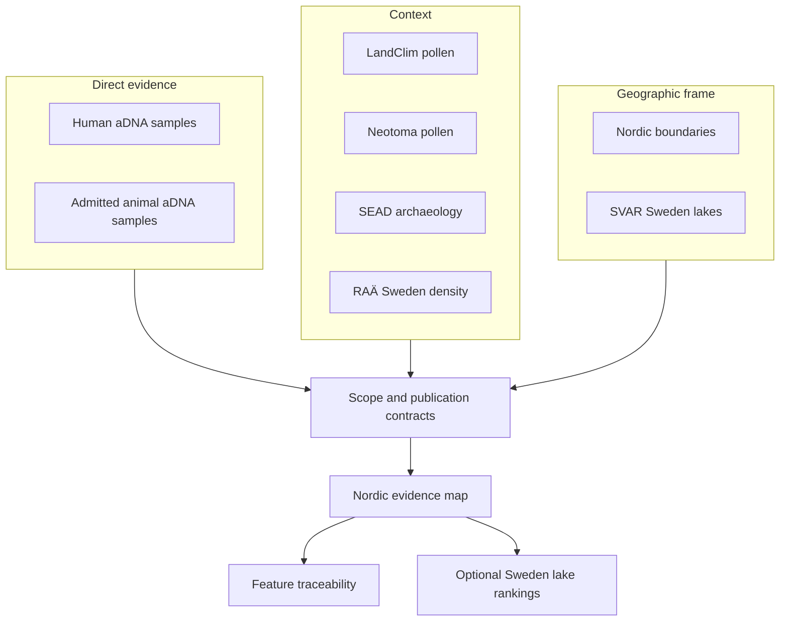

# Nordic Evidence Atlas

The Nordic Evidence Atlas connects sample-backed ancient DNA with pollen and
archaeology context across the Nordic publication scope. Every point belongs
to a declared source family and product contract; popups retain the identifiers
and provenance needed to leave the map and inspect the governing evidence.

The atlas is a comparison surface, not a claim that nearby records describe
the same event. Geography, chronology, and evidence role must all support an
interpretation before proximity becomes meaningful.

## Evidence architecture

| Layer role | What it can establish | What it cannot establish alone |
| --- | --- | --- |
| Direct evidence | a source-backed sample at an admitted place and chronology posture | regional completeness or causation |
| Pollen context | nearby vegetation-history and sequence context | human or animal presence |
| Archaeology context | surrounding environmental-archaeology or density context | sample ownership or uniform temporal overlap |
| Boundary framing | geographic scope and product membership | scientific support |
| Lake ranking | evidence-rich registry lakes under explicit scenarios | field readiness or optimal coring location |

## Explore the atlas

  <a class="md-button md-button--primary" href="../../report/regions/nordic/nordic_map.html">Open the Nordic evidence atlas</a>
  <a class="md-button" href="../../report/">Open the report portal</a>
  <a class="md-button" href="../../report/world/world_map.html">Open the world parent</a>
  <a class="md-button" href="../../report/regions/europe-plus/europe-plus_map.html">Open Europe-plus</a>
  <a class="md-button" href="./sweden-lake-priorities/">Inspect Sweden lake priorities</a>

  <strong>Phone view:</strong> Open the atlas in its own tab for full map
  controls.

  <iframe src="../../report/regions/nordic/nordic_map.html" title="Nordic Evidence Atlas"></iframe>

## Reading a feature

Begin with its popup and follow the evidence role before interpreting the
marker:

1. **Identify the layer.** Direct evidence and context layers answer different
   questions.
2. **Check the scope.** Nordic inclusion is explicit and may differ from world
   or Europe-plus eligibility.
3. **Inspect coordinate basis.** Direct coordinates and named-site resolution
   remain visibly distinct; region-only animal evidence is not a point.
4. **Inspect temporal semantics.** Numeric interval, caveated interval,
   contextual label, and unresolved time support different comparisons.
5. **Follow the identifiers.** Feature, evidence-row, site, project, sample,
   and citation fields connect the marker to its narrower source records.

Filtering changes visibility, not eligibility. A hidden feature remains part
of the scoped product; an excluded record cannot be admitted by changing a
browser control.

## Sweden lake overlays

The optional lake layers rank SVAR registry lakes by nearby human aDNA, direct
and nearby pollen, archaeology context, animal context, evidence diversity,
and basic lake sampling fit. They are off by default because they are derived
decision-support products layered over the evidence map.

Aggregate, consensus, radius-specific, and fieldwork-preparation overlays answer
different questions. None includes bathymetry, coring depth, access, permits,
landowner coordination, or field validation. A high-ranking lake is a candidate
for further review, not a sampling recommendation.

## Contracts and traceability

- [Nordic map publication contract](../../report/regions/nordic/nordic_map_publication_contract.md)
  defines the product scope and required layers.
- [Nordic point traceability](../../report/regions/nordic/nordic_point_traceability.md)
  connects visible features to governing evidence.
- [Nordic animal evidence rows](../../report/regions/nordic/nordic_animal_atlas_evidence.json)
  expose the admitted animal subset.
- [Animal atlas exclusion report](../../report/animal_atlas_exclusion_report.md)
  records evidence kept outside the point layer.
- [Point publication rules](../pollenomics-data/publications/point-rules.md)
  define animal feature admission.
- [Filters and popups](../pollenomics-data/publications/filters-and-popups.md)
  define browser behavior and visible provenance.
- [Current limits](../pollenomics-data/publications/limits.md) distinguish
  published capability from remaining recovery gaps.

The checked-in animal candidate and accountability surfaces remain under
`data/adna/final/atlas/`. Their broader contents do not override the narrower
Nordic publication contract.
