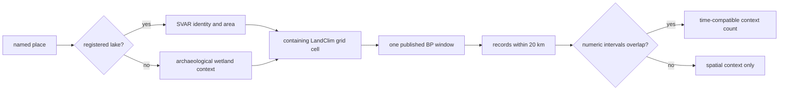

# Southern Sweden Land-Use Synthesis

This surface asks a time-aware question: **what modeled vegetation and governed
archaeological or ancient-DNA context overlap each published LandClim window
around six named southern Sweden places?** It does not treat nearby records as
one event, and it does not turn a wetland into a lake candidate.

The complete machine-readable product contains 150 rows: 25 LandClim windows
for each of four registered lakes and two archaeological wetland contexts.
Every row keeps its own BP interval, source-owned values, spatial rule, and
overlapping-context counts.

## The Join In One Picture



The order matters. Identity is settled before evidence is joined. Spatial
proximity is tested before temporal overlap. A record that fails the temporal
test remains visible in its source product, but it does not enter the
same-window count.

## Read The Vegetation Columns Correctly

LandClim dataset 937075 publishes REVEALS model estimates as percentage cover.
The synthesis retains the source codes rather than inventing new categories:

| Displayed field | Governed source value | Meaning |
| --- | --- | --- |
| forest | `ET + ST` | evergreen-tree plus summer-green-tree cover |
| open land | `OL` | total open-land cover |
| grassland | `GL` | grassland and herb plant-functional type |
| agricultural land | `AL` | agricultural-land/cereal plant-functional type |
| Cerealia-type pollen | `Cerealia.t` | modeled cereal-type pollen cover |
| rye pollen | `Secale` | modeled rye pollen cover |

`Cerealia.t`, `Secale`, and `AL` are valuable land-use indicators, but none is
an observed field boundary or proof that cultivation occurred at the named
target. They describe the containing model cell for one published time window.

## A Worked Reading: Finjasjön

For the 100–350 BP window around Finjasjön, the published model cell reports:

| Measure | Percentage cover |
| --- | ---: |
| forest | 29.224 |
| open land | 70.776 |
| agricultural land | 22.139 |
| Cerealia-type pollen | 1.319 |
| rye pollen | 20.820 |

Eight SEAD sites have at least one numeric chronology interval that both lies
within 20 km and overlaps this window. The correct reading is that modeled
open/agricultural cover and time-compatible archaeology context coexist in the
declared cell and window. It is not evidence that those eight sites caused the
vegetation estimate or cultivated the shore of Finjasjön.

Now compare 0–100 BP: forest is 44.300, open land 55.700, agricultural land
5.950, Cerealia-type pollen 2.131, and rye pollen 3.819. The change is a model
comparison between two published windows. Explaining why it changed requires
additional historical and ecological evidence.

## What Counts As Temporal Agreement

Two intervals overlap when they share at least one BP year. For a LandClim
window 700–1200 BP:

```text
SEAD 850–980 BP       -> overlaps and may enter the count
human aDNA 1100–1400  -> overlaps and may enter the count
animal aDNA 1500–1700 -> does not overlap
undated SEAD site     -> spatial context only
```

This deliberately simple rule prevents a broad place label or undated point
from becoming same-period evidence. It also means overlap is not equivalence:
a 100-year interval and a 1,000-year interval can overlap while carrying very
different precision.

## Governed Place Decisions

| Requested place | Product class | Decision |
| --- | --- | --- |
| Finjasjön | registered lake | include in lake review and temporal synthesis |
| Östra Ringsjön | registered lake | include in lake review and temporal synthesis |
| Havgårdssjön | registered lake | include in lake review and temporal synthesis |
| Bjäresjösjön | registered as `Bjäresjö` | include under official SVAR identity |
| Gullåkra | archaeological wetland context | exclude from lake ranking; retain here |
| Vesums mossar | archaeological wetland context | exclude from lake ranking; retain here |

The distinction prevents two opposite errors: silently losing the wetlands,
or pretending they are registered lake-sampling basins. Their coordinates are
project-area positions derived from the Höje å archaeological report and are
not proposed coring coordinates.

## How To Explore The Time Series

1. Choose one target and one BP window.
2. Read forest and open land first; they partition the modeled land-cover
   surface and should total approximately 100 percent.
3. Read `AL`, `Cerealia.t`, and `Secale` as related but non-interchangeable
   modeled indicators.
4. Inspect SEAD, human aDNA, and animal aDNA counts only after checking the
   20 km rule and interval overlap.
5. Follow the source-owned records before proposing an explanation.
6. Compare adjacent windows, then ask whether the apparent change survives
   uncertainty, model resolution, and independent evidence.

## Claims This Surface Refuses

- proximity proves association;
- interval overlap proves contemporaneity at fine resolution;
- cereal-type pollen equals cultivated acreage;
- an archaeological wetland is a lake candidate;
- a high lake rank authorizes coring;
- absence from an overlap count means absence from the historical landscape.

## Governing Outputs

- [Reader report](../../../report/countries/sweden/sweden_land_use_synthesis_v66.md)
- [Complete JSON](../../../report/countries/sweden/sweden_land_use_synthesis_v66.json)
- [Complete CSV](../../../report/countries/sweden/sweden_land_use_synthesis_v66.csv)
- [Sweden lake priorities](../sweden-lake-priorities/)
- [LandClim source guidance](../../pollenomics-data/sources/landclim.md)
- [SEAD handbook](../../pollenomics-data/sources/sead-handbook.md)
- [Temporal semantics](../../pollenomics-data/evidence/temporal-semantics.md)
