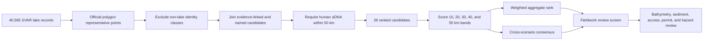
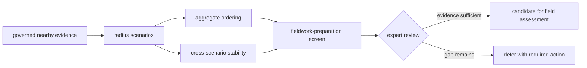
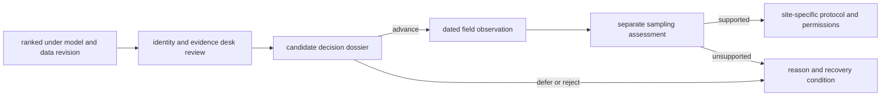

# Sweden Lake Priorities

The Sweden lake priority surface ranks 26 evidence-linked SMHI SVAR lakes that
have at least one human ancient-DNA locality within 50 km. The compact review
registry is derived from the full 40,565-lake capture, the governed pollen
inventory, and named southern Sweden targets. It asks where the current
collection offers the richest combination of direct human evidence, pollen
context, archaeology context, animal context, and basic lake screening. It
does not select a coring site.

Every candidate uses a representative point derived from the official lake
polygon. Pollen-site coordinates never substitute for lake identity. Registry
names that clearly describe engineered water bodies or wetlands are excluded
from the shortlist, while duplicate lake names and coordinate ambiguity remain
visible as required review actions.

## Candidate And Scoring Pipeline



The public atlas exposes aggregate, consensus, per-radius, and fieldwork-review
layers. Lake features are repeated for each direct-pollen source interval, so
the map's time control changes which lake evidence is visible instead of
leaving a static point on every date. A row with unresolved chronology remains
explicitly unresolved and cannot gain same-period credit. The overlays are
disabled by default because they are interpretations over the base evidence
layers.

## Evidence Weights Within A Radius

| Signal | Weight | Interpretation |
| --- | ---: | --- |
| Human aDNA | 0.59 | locality and sample coverage near the lake |
| Direct pollen | 0.14 | pollen records placed on or very near the official lake |
| Nearby pollen | 0.07 | broader pollen context, with chronology-aware credit where supported |
| Lake sampling fit | 0.07 | area- and identity-based screening, not bathymetric suitability |
| Archaeology | 0.07 | SEAD point context and coarse RAÄ density |
| Domesticated animal aDNA | 0.04 | secondary direct-evidence context |
| Evidence diversity | 0.02 | number of represented evidence families |

Within each band, human aDNA locality and sample coverage determine ordering
first. Direct pollen breaks the next tie, followed by broader pollen and
archaeology context. Sampling fit and the blended score resolve later ties.

Temporal credit is conditional. Neotoma, LandClim, and SEAD records gain
stronger chronology contribution only when numeric BP intervals overlap nearby
human locality windows. The current SEAD evidence contains 25,109 chronology
claims, of which 14,324 are comparable. The Swedish discovery layer renders
8,184 numeric interval features from 371 sites and retains 1,554 sites as
explicitly unresolved features. Those unresolved sites contribute spatial
archaeology context but receive no same-period credit.

### Score And Rank Are Separate Contracts

For each radius, the displayed band score is the weighted sum of normalized
signals:

```text
0.59 human aDNA
+ 0.14 direct pollen
+ 0.07 nearby pollen
+ 0.07 lake sampling fit
+ 0.07 archaeology
+ 0.04 domesticated-animal aDNA
+ 0.02 evidence diversity
```

The component weights sum to 1.00, but the score is not the first sort key.
Band and aggregate ordering first compare human aDNA locality and sample
coverage, then direct pollen support, then broader pollen and archaeology
context. Sampling fit and the blended score resolve later ties. This preserves
the model's stated priority instead of letting a dense contextual inventory
outvote direct human evidence.

Signals are normalized within the governed candidate population. A score is
therefore comparable inside the named product version and scenario; it is not
an absolute probability, a cross-version scientific measurement, or a field
success estimate.

## Combining Distance Bands

| Radius | Aggregate weight |
| ---: | ---: |
| 10 km | 0.35 |
| 20 km | 0.27 |
| 30 km | 0.18 |
| 40 km | 0.12 |
| 50 km | 0.08 |

The aggregate rank favors close evidence while retaining broader regional
context. The consensus rank instead rewards recurrence across top scenario
slices, then uses mean scenario rank and aggregate rank as tie-breakers. A lake
that is consistently strong across radii can therefore differ from the lake
with the highest weighted aggregate score.

## Explain Rank Movement By Cause

Ordinal position can change even when a lake's own evidence does not. A
reproducible comparison classifies the cause before interpreting the movement:

| Cause | What changed | Appropriate reading |
| --- | --- | --- |
| source refresh | nearby governed members or their evidence fields | scientific input change |
| candidate-population change | lakes became eligible, ineligible, merged, or separated | denominator and normalization change |
| identity correction | registry match, polygon, name, or representative point | candidate-definition change |
| model change | signal, weight, tie-break, radius, or missingness treatment | decision-policy change |
| precision change | chronology or coordinate posture strengthened or weakened | comparison-rights change |
| unchanged score, changed rank | other candidates moved around this lake | relative ordering change only |

For this reason, “rose five places” is incomplete without the prior and current
candidate populations, model identities, component values, and member-level
evidence diff. Rank movement is not itself evidence that a lake became more
suitable.

## Rank, Stability, And Readiness

The ranking exposes three different signals that must not be collapsed into a
single recommendation:

| Signal | Meaning | Appropriate use |
| --- | --- | --- |
| aggregate rank | weighted evidence richness across all distance bands | identify candidates favored by the declared distance weighting |
| consensus rank | recurrence near the top across scenario slices | identify candidates less dependent on one radius |
| fieldwork-preparation posture | evidence, identity, and lake-screening readiness | order the next review actions |



A high aggregate rank with weak cross-scenario recurrence is sensitive to the
chosen radius. A strong consensus rank indicates stability within the tested
scenarios, not robustness to missing source families or unmodeled field
conditions. The fieldwork-preparation posture can therefore reorder or defer a
high-scoring lake without contradicting the ranking.

## A Concrete Reordering

The current fieldwork-review screen places **Flarken first** even though it is
fifth in the aggregate evidence ranking. The screen retains both
facts:

| Field | Current value |
| --- | --- |
| fieldwork rank | 1 |
| aggregate rank | 5 |
| aggregate score | 0.3726 |
| scenario consistency | high; present in six tested top-20 slices |
| sampling posture | `sampling_lake_candidate` |
| preparation posture | `fieldwork_review_ready` |
| identity posture | `registry_clear` |
| required review | inspect linked SEAD records; complete bathymetry, sediment, access, permit, hazard, and logistics review |

This is not a contradiction or a hidden override. Aggregate rank answers the
weighted evidence-richness question. Fieldwork rank applies a separate
human-context, sampling, scenario-consistency, and identity-review contract.
`fieldwork_review_ready` means ready for the next review, not ready to sample.
The five missing field domains prevent the top row from becoming a sampling
instruction.

## Reading Candidate Fields

Each ranked row preserves:

- lake registry ID, UUID, water identity, and representative source URL;
- official coordinate-resolution method and mapped area;
- duplicate-name, name-status, and coordinate-spread diagnostics;
- per-radius counts, signals, score, and rank;
- aggregate score and rank plus scenario-presence statistics;
- sampling posture, sampling fit, and the limitations behind that posture;
- direct pollen sources and time-aware pollen counts;
- nearby human, animal, SEAD, and RAÄ context metrics.

Sampling postures are screening labels. `small_lake_review` flags a micro-basin
that needs validation; `compact_lake_candidate` marks a small mapped surface;
and `sampling_lake_candidate` indicates a more plausible area-based posture.
None asserts sufficient depth, intact sediment, access, or coring feasibility.

`palaeopen_alignment_posture` is also a local screening field. It summarizes
whether a candidate already has at least two direct pollen sources and four
evidence families within 20 km. It adds no score, source record, network
membership, or PalaeOpen endorsement.

## Current Aggregate Leaders

| Rank | Lake | Score | Area km² | Sampling posture |
| ---: | --- | ---: | ---: | --- |
| 1 | Bjärsjön | 0.7070 | 0.132579 | `compact_lake_candidate` |
| 2 | Häckebergasjön | 0.4204 | 0.758820 | `sampling_lake_candidate` |
| 3 | Sigvaldeträsk | 0.3981 | 0.087327 | `compact_lake_candidate` |
| 4 | Krageholmssjön | 0.3843 | 2.051341 | `sampling_lake_candidate` |
| 5 | Flarken | 0.3726 | 0.165887 | `sampling_lake_candidate` |
| 6 | Bjäresjö | 0.3505 | 0.022251 | `small_lake_review` |
| 7 | Havgårdssjön | 0.3454 | 0.501745 | `sampling_lake_candidate` |
| 8 | Mullsjön | 0.2534 | 3.917566 | `sampling_lake_candidate` |

Aggregate rank is evidence-richness ordering. The fieldwork-preparation screen
reorders candidates by near-lake human evidence, sampling posture, scenario
consistency, and identity risk. It also emits required actions such as resolving
duplicate registry names or inspecting SEAD context before narrowing an
interpretation.

## Why Archaeology Cannot Quietly Control The Ranking

The baseline archaeology weight is 0.07: equal to nearby pollen and lake-area
screening, below direct pollen, and far below human aDNA. The sensitivity
report repeats the ranking at archaeology weights 0.03, 0.07, and 0.15 while
scaling every other component proportionally so each profile still sums to
1.00. The largest observed movement is five ranks.

Finjasjön moves upward under archaeology emphasis, but the decision rule does
not permit that movement to become a recommendation by itself. A promotion
requires inspected SEAD records with a compatible interval. Coarse RAÄ density
is a discovery prompt, never sufficient promotion evidence.

## Named Southern Sweden Targets

Four requested lakes now resolve to official SVAR identities and mapped areas:

| Requested name | Official registry name | SVAR ID | Area km² | Ranking decision |
| --- | --- | --- | ---: | --- |
| Finjasjön | Finjasjön | `622731-136920` | 10.497234 | include in lake review |
| Östra Ringsjön | Östra Ringsjön | `619626-135565` | 24.728453 | include in lake review |
| Havgårdssjön | Havgårdssjön | `615365-134524` | 0.501745 | include in lake review |
| Bjäresjösjön | Bjäresjö | `614958-137018` | 0.022251 | include under the official SVAR name |

Gullåkra and Vesums mossar are retained in the southern Sweden temporal
synthesis as archaeological wetland context. They are excluded from the lake
ranking because the archaeological report describes mosses/wetlands and no
unique SVAR lake identity was established. Exclusion from one product does not
erase them from the research question.

Continue to [southern Sweden land-use synthesis](../southern-sweden-land-use/)
to read these places through LandClim windows, SEAD intervals, and aDNA
chronology rather than as static map labels.

## Evidence Still Required Before Fieldwork

The public ranking does not contain governed bathymetry, basin depth, sediment
preservation, shoreline access, permits, landowner logistics, or field-confirmed
coring conditions. Those are blocking inputs for a sampling recommendation,
not optional refinements to the score.

A responsible progression is therefore:

1. confirm the exact SVAR lake identity and polygon;
2. inspect the direct human and pollen records behind the score;
3. separate temporally comparable evidence from spatial context;
4. acquire bathymetry and sediment-basin information;
5. assess access, permissions, conservation constraints, and field safety;
6. record the expert decision independently of the ranking score.

That final separation preserves auditability. The model score remains the
answer to a reproducible evidence-richness question, while the expert decision
records whether the unmodeled practical and scientific requirements were met.
If the decision differs from rank order, the reason belongs in the field review
rather than in an altered score.

### Candidate Decision Dossier

Before a ranked row becomes a field-assessment candidate, assemble one dossier
containing:

- the exact SVAR identity, polygon, representative-point method, and name-risk
  review;
- contributing evidence members partitioned by family, role, distance band,
  and temporal comparability;
- aggregate, consensus, and sensitivity results under the governing model;
- bathymetry, basin morphology, sediment expectations, access, permissions,
  conservation constraints, logistics, and safety evidence;
- the expert disposition—advance, defer, or reject—with its reason and date.

The dossier does not need to agree with rank order. Its purpose is to preserve
why a decision was made after adding evidence the ranking intentionally does
not model.

### Preserve Candidate State Transitions

A candidate moves through new evidence states; it is not edited from “ranked”
into “field ready”:



Each node retains its own date, inputs, method, and disposition. A later visit
does not rewrite the historical ranking, and a strong historical rank does not
pre-authorize the visit or sampling assessment. This makes disagreement useful:
the evidence shows whether the model, identity review, field conditions, or
operational constraints caused the decision to change.

## Reusing A Ranked Result

A defensible reference to a candidate includes its SVAR identity, ranking
surface, scenario or aggregate definition, model inputs and weights, active
geographic scope, and known required actions. Quoting only the ordinal rank
removes the assumptions that give the number meaning.

The portable ranking packet includes the ranked registry, per-radius scenario
rows, evidence bands, aggregate definition, model weights, ranking-engine
manifest, sensitivity output, and fieldwork-preparation screen. Quoting a row
without the engine manifest and scenario identity makes its rank impossible to
reproduce or interpret after a source refresh.

## Governing Outputs

- [Open the Nordic evidence atlas](../../../report/regions/nordic/nordic_map.html)
- [Full evidence-richness report](../../../report/countries/sweden/sweden_lake_evidence_richness_v66.md)
- [Ranked lake registry](../../../report/countries/sweden/sweden_lake_evidence_richness_v66_registry.csv)
- [Per-radius scenarios](../../../report/countries/sweden/sweden_lake_evidence_richness_v66_scenarios.csv)
- [Evidence bands](../../../report/countries/sweden/sweden_lake_evidence_richness_v66_bands.csv)
- [Fieldwork-preparation screen](../../../report/countries/sweden/sweden_lake_fieldwork_preparation_v66.md)
- [Archaeology-weight sensitivity](../../../report/countries/sweden/sweden_lake_archaeology_sensitivity_v66.md)
- [Southern Sweden temporal synthesis](../../../report/countries/sweden/sweden_land_use_synthesis_v66.md)
- [Temporal semantics](../../pollenomics-data/evidence/temporal-semantics.md)
- [Nordic atlas](../index.md)
