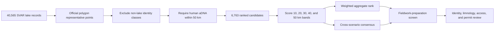

# Sweden lake priorities

The Sweden lake priority surface ranks 6,763 SMHI SVAR registry lakes that
have at least one human ancient-DNA locality within 50 km. It asks where the
current collection offers the richest combination of direct human evidence,
pollen context, archaeology context, animal context, and basic lake
suitability. It does not select a coring site.

Every candidate uses a representative point derived from the official lake
polygon. Pollen-site coordinates never substitute for lake identity. Registry
names that clearly describe engineered water bodies or wetlands are excluded
from the shortlist, while duplicate lake names and coordinate ambiguity remain
visible as required review actions.

## Candidate and scoring pipeline

The public atlas exposes aggregate and consensus top-40 layers, top-40 layers
for each radius, and a fieldwork-preparation top 20. The overlays are disabled
by default because they are interpretations over the base evidence layers.

## Evidence weights within a radius

| Signal | Weight | Interpretation |
| --- | ---: | --- |
| Human aDNA | 0.59 | locality and sample coverage near the lake |
| Direct pollen | 0.14 | pollen records placed on or very near the official lake |
| Nearby pollen | 0.07 | broader pollen context, with chronology-aware credit where supported |
| Lake sampling fit | 0.07 | area- and identity-based screening, not bathymetric suitability |
| Archaeology | 0.07 | SEAD point context and coarse RAÄ density |
| Domesticated animal aDNA | 0.04 | secondary direct-evidence context |
| Evidence diversity | 0.02 | number of represented evidence families |

Within each band, human aDNA locality and sample coverage determine ordering
first. Direct pollen breaks the next tie, followed by broader pollen and
archaeology context. Sampling fit and the blended score resolve later ties.

Temporal credit is conditional. Neotoma and LandClim records gain stronger
chronology contribution only when numeric BP intervals overlap nearby human
locality windows. The current Sweden-facing SEAD capture is a site inventory
without numeric chronology rows, so it contributes spatial archaeology context
but not same-period evidence.

## Combining distance bands

| Radius | Aggregate weight |
| ---: | ---: |
| 10 km | 0.35 |
| 20 km | 0.27 |
| 30 km | 0.18 |
| 40 km | 0.12 |
| 50 km | 0.08 |

The aggregate rank favors close evidence while retaining broader regional
context. The consensus rank instead rewards recurrence across top scenario
slices, then uses mean scenario rank and aggregate rank as tie-breakers. A lake
that is consistently strong across radii can therefore differ from the lake
with the highest weighted aggregate score.

## Reading candidate fields

Each ranked row preserves:

- lake registry ID, UUID, water identity, and representative source URL;
- official coordinate-resolution method and mapped area;
- duplicate-name, name-status, and coordinate-spread diagnostics;
- per-radius counts, signals, score, and rank;
- aggregate score and rank plus scenario-presence statistics;
- sampling posture, sampling fit, and the limitations behind that posture;
- direct pollen sources and time-aware pollen counts;
- nearby human, animal, SEAD, and RAÄ context metrics.

Sampling postures are screening labels. `small_lake_review` flags a micro-basin
that needs validation; `compact_lake_candidate` marks a small mapped surface;
and `sampling_lake_candidate` indicates a more plausible area-based posture.
None asserts sufficient depth, intact sediment, access, or coring feasibility.

## Current aggregate leaders

| Rank | Lake | Score | Area km² | Sampling posture |
| ---: | --- | ---: | ---: | --- |
| 1 | Bergsjön | 0.5947 | 0.063346 | `compact_lake_candidate` |
| 2 | Hulesjön | 0.5875 | 0.037617 | `small_lake_review` |
| 3 | Sjötorpasjön | 0.5862 | 0.603122 | `sampling_lake_candidate` |
| 4 | Hornborgasjön | 0.5037 | 27.925549 | `sampling_lake_candidate` |
| 5 | Skårsjön | 0.4818 | 0.021492 | `small_lake_review` |
| 6 | Rösjön | 0.4651 | 0.956929 | `sampling_lake_candidate` |
| 7 | Bjärsjön | 0.4573 | 0.132579 | `compact_lake_candidate` |
| 8 | Tresjö | 0.4433 | 0.104225 | `compact_lake_candidate` |

Aggregate rank is evidence-richness ordering. The fieldwork-preparation screen
reorders candidates by near-lake human evidence, sampling posture, scenario
consistency, and identity risk. It also emits required actions such as resolving
duplicate registry names or inspecting SEAD context before narrowing an
interpretation.

## Evidence still required before fieldwork

The public ranking does not contain governed bathymetry, basin depth, sediment
preservation, shoreline access, permits, landowner logistics, or field-confirmed
coring conditions. Those are blocking inputs for a sampling recommendation,
not optional refinements to the score.

A responsible progression is therefore:

1. confirm the exact SVAR lake identity and polygon;
2. inspect the direct human and pollen records behind the score;
3. separate temporally comparable evidence from spatial context;
4. acquire bathymetry and sediment-basin information;
5. assess access, permissions, conservation constraints, and field safety;
6. record the expert decision independently of the ranking score.

## Governing outputs

- [Open the Nordic evidence atlas](../../../report/regions/nordic/nordic_map.html)
- [Full evidence-richness report](../../../report/countries/sweden/sweden_lake_evidence_richness_v66.md)
- [Ranked lake registry](../../../report/countries/sweden/sweden_lake_evidence_richness_v66_registry.csv)
- [Per-radius scenarios](../../../report/countries/sweden/sweden_lake_evidence_richness_v66_scenarios.csv)
- [Evidence bands](../../../report/countries/sweden/sweden_lake_evidence_richness_v66_bands.csv)
- [Fieldwork-preparation screen](../../../report/countries/sweden/sweden_lake_fieldwork_preparation_v66.md)
- [Temporal semantics](../../pollenomics-data/evidence/temporal-semantics.md)
- [Nordic atlas](../index.md)
