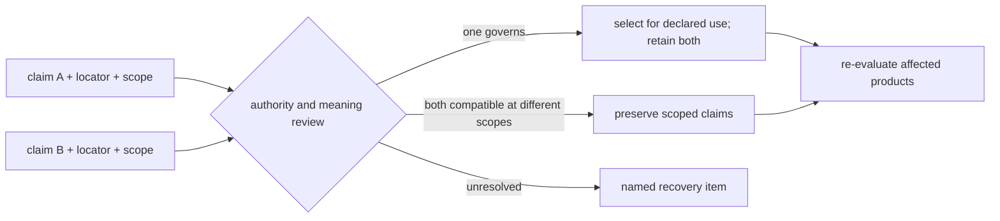
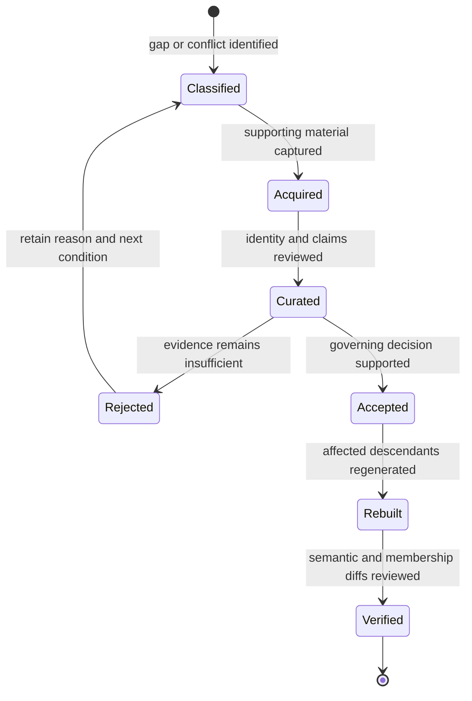
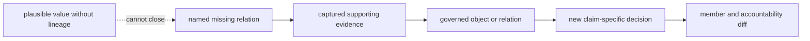

# Conflicts And Recovery

Scientific curation is incomplete when disagreement or missing evidence is
hidden behind one convenient value. Bijux Pollenomics preserves competing
claims, identifies their owners and scopes, and records the evidence required
to resolve or safely bound the disagreement.

## Distinguish The Gap

| State | Meaning | Appropriate response |
| --- | --- | --- |
| absent upstream | the identified source does not provide the needed fact | retain the absence and seek another authoritative source if justified |
| not captured | the source may contain the fact, but the governed capture does not | recover the named artifact or field and record retrieval identity |
| captured but unparsed | useful source text exists but cannot be normalized safely | preserve text, improve a bounded parser only when semantics are known |
| ambiguous | several identities or interpretations remain plausible | keep alternatives and require a discriminating locator or review decision |
| conflicting | captured sources make incompatible claims | preserve both, compare scope and authority, and record the governing decision |
| unsupported for use | the fact may be real, but it does not satisfy the proposed product claim | qualify, use as context, defer, or refuse without weakening the gate |
| outside scope | evidence is valid but not a member of this geography or product | retain source evidence and account for the non-membership |

Missing, false, excluded, and out of scope are not synonyms. Recovery begins
only after the state is correctly classified.

## Conflict Record

A conflict is reviewable when it preserves:

- the governed subject and claim dimension;
- every competing value at its original scope;
- source family, release or accession, artifact, locator, and source wording;
- whether each claim is sample-, site-, project-, paper-, or product-owned;
- precision, dating basis, coordinate basis, and other material qualifiers;
- the selected governing claim, if one is justified, and why;
- the public effect and the evidence that would reopen the decision.

A sample-owned date can govern that sample while a broader project interval
remains valid context. The two claims need not be averaged or reduced to one
unqualified field.

## Resolve By Authority And Scope

Conflict resolution follows evidence ownership before convenience:

1. confirm that the claims concern the same governed subject and dimension;
2. compare observation level, source locator, method, and precision;
3. identify the declared fact owner and the scope in which each source speaks;
4. determine whether the claims conflict or are compatible at different scopes;
5. select a governing value only when the evidence contract justifies it;
6. preserve every competitor and record the effect on dependent products.

Recency alone is not a resolution rule. Neither are majority vote, non-null
preference, greater numeric precision, or agreement with the current map.
Those shortcuts can select a value, but they cannot establish that it belongs
to the correct object or claim.

## Recovery Is Evidence Acquisition

Recovery items name a scientific deficit, not merely an unfinished file:

| Recovery target | Completion evidence |
| --- | --- |
| supporting material | content-identified artifact, paper link, manifest membership, and retrieval context |
| sample identity | source-owned label, stable repository identity, project relation, and ambiguity disposition |
| locality | sample-owned wording, source locator, site relation, hierarchy, and resolution posture |
| chronology | source wording, owner, normalized point or interval when defensible, basis, and precision |
| coordinate | source pair or documented named-place resolution, method, basis, confidence, and mapping posture |
| product admission | rerun decision with passed rules, updated accountability, and descendant review |

Finding a plausible value on the web is not completion. The value becomes
governed evidence only when its identity, source, locator, ownership, meaning,
and downstream impact are recorded.

## Recovery Priority

Recovery order is driven by scientific impact and resolvability, not by which
missing field is easiest to fill. A useful queue records:

| Dimension | Question |
| --- | --- |
| affected authority | does the gap sit in a governing record or only a derived view? |
| descendant reach | which comparisons, maps, counts, and reports can change? |
| claim severity | does the gap risk false identity, false precision, or only reduced context? |
| recoverability | is a named archive object, supplement, field, or relation available? |
| decision stability | could recovery change admission, or only strengthen provenance? |
| verification cost | which semantic and membership comparisons are required afterward? |

This makes high-impact identity and relation failures visible even when a
lower-impact metadata field would be faster to complete.

## Recovery Loop

Recovery does not patch the visible report first. It changes the governing
source or claim record, then rebuilds normalized, review, admission, and
publication descendants. This order prevents a map from disagreeing with the
database that is supposed to explain it.

### Recovery Changes A Decision Only Through Evidence

A recovery item is not complete because a blank field now has a value. The
new material must close the specific missing edge that blocked the claim.
Consider a project-context point awaiting sample recovery:

| State | Required record |
| --- | --- |
| before recovery | project and paper identity, place statement, provisional context member, failed sample-evidence condition |
| recovered evidence | captured sample-bearing artifact with content identity and exact row locator |
| identity decision | project-owned stable sample key plus source-native labels and ambiguity disposition |
| claim review | sample-to-site, locality, chronology, and coordinate decisions evaluated independently |
| product effect | prior context member retained in history; replacement, qualification, or continued refusal explained at member level |

The publication count may remain unchanged even when the evidence class
changes. Recovery review therefore compares stable identities, roles,
precision, and qualifications—not totals alone.

## Accept A Recovery

A recovery is complete when the intended evidence boundary is coherent and
the causal diff is explainable:

1. the recovered artifact has stable source and content identity;
2. the object and claim owners are unambiguous or explicitly qualified;
3. original wording, nulls, conflicts, and precision remain preserved;
4. previous recovery and exclusion records close by reason, not disappearance;
5. every affected normalized and published member is identified;
6. unchanged descendants are also explainable when the new evidence does not
   cross their product contract.

Closing a recovery item does not delete its history. The prior state, recovered
artifact, decision change, and affected descendants remain connected so a
reader can explain both the earlier exclusion and the later admission.

Continue with [record admission](record-admission.md) to interpret the revised
decision, [animal source intake](../sources/animal-source-intake.md) for the
literature and archive boundary, and [verification evidence](../../pollenomics/quality/test-strategy.md)
for claim-specific proof.
