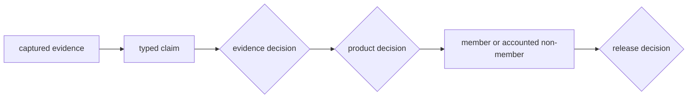
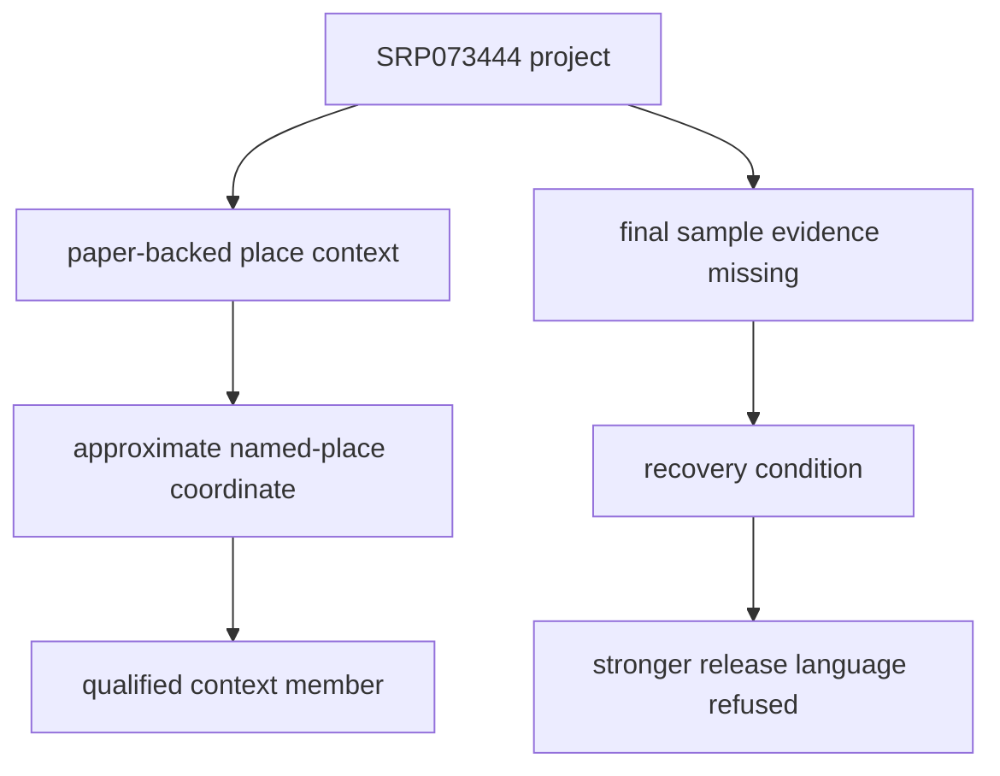
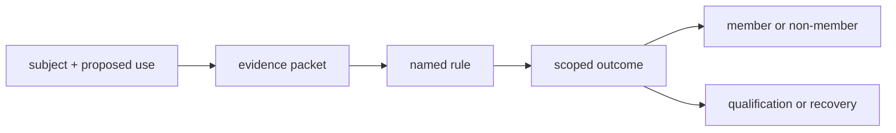

# Evidence Decision Records

An evidence decision records what one governed claim supports for one declared
use. It connects source evidence to an outcome without overwriting the source,
discarding an unresolved object, or granting the same fitness to every
downstream product.

The [domain language](../domain-language.md) defines claim posture, product
admission, qualification, exclusion, and recovery condition.

## Evidence, Product, And Release Decisions Differ

| Decision class | Governing question | Typical outcomes |
| --- | --- | --- |
| evidence decision | What does this source-supported claim establish, at what scope and precision? | accepted, qualified, conflicted, unresolved, or refused |
| product decision | Does that evidence belong in this named publication and role? | admitted, excluded, deferred, outside scope, or qualified member |
| release decision | Do the complete product and its dependencies support the proposed release language? | allowed, blocked, or refused with dimensions |

These decisions can legitimately differ. A location claim can be strong
enough for a qualified context marker while the object remains ineligible for
a recovered-sample count. A retained publication can remain inspectable while
the current database snapshot refuses stronger release language because a
contracted lifecycle stage is absent.

## Anatomy Of A Decision Record

A reusable decision keeps the following members together:

| Member | Responsibility |
| --- | --- |
| subject | stable typed object or claim identity under review |
| proposed use | exact comparison, publication, geography, role, or release claim being evaluated |
| evidence basis | source identities, locators, normalized facts, and relations considered |
| rule identity | contract or predicate applied to the evidence |
| outcome | admission, qualification, conflict, exclusion, deferral, refusal, or scope result |
| reason | evidence-grounded explanation for the outcome |
| precision and limits | spatial, temporal, identity, taxonomic, or role ceiling that survives reuse |
| recovery condition | named material or relation that could change an incomplete outcome |
| revision | database and product state in which the decision was evaluated |
| descendants | manifests, tables, maps, reviews, or release language governed by the decision |

An outcome without its subject and rule is only a label. A reason without an
evidence locator cannot be independently checked. A public member without the
decision that admitted it cannot explain why similar candidates are absent.

### Decision Identity And Supersession

A decision is keyed by subject, claim or proposed use, scope, rule identity,
and evidence revision. Decisions with different keys may coexist; a newer row
does not supersede an older row merely because it was written later.

| Relationship between decisions | Required treatment |
| --- | --- |
| same subject, different claim dimension | retain both; locality, chronology, identity, and role are independent |
| same evidence, different product or geography | evaluate and retain separate admission decisions |
| broad project context and narrow sample claim | retain both at natural scope; the narrow claim governs only its sample |
| same key, stronger evidence, new revision | record explicit supersession, reason, prior outcome, and descendant impact |
| same key, conflicting evidence, no justified owner | preserve both claims and move the decision to conflicted or unresolved |
| evidence decision and release decision | keep separate; repository release posture cannot rewrite the underlying claim |

Supersession changes which decision governs a named use; it does not delete the
prior evidence or outcome. This makes a later admission explainable without
making the earlier exclusion look like an undocumented error.

## One Object Can Carry Several Decisions

The Wadi Halfa dromedary context illustrates why decisions remain scoped:

| Claim or use | Governed posture |
| --- | --- |
| project identity | archive project `SRP073444` is tracked |
| source context | paper-backed Site 1040 wording supplies a recoverable named-place claim |
| sample identity | a final sample-master identity is not yet recoverable |
| coordinate claim | named-place geocoding supports an approximate point, not a supplied excavation coordinate |
| point product | admitted as a visibly qualified project-context feature |
| recovered-sample population | not admitted as a final recovered sample |
| release posture | incomplete recovery remains part of the repository release refusal |

The context member and recovery failure are not contradictory. They answer
different questions and remain linked so readers do not count the marker as a
fully recovered sample.

## Decision Surfaces In The Checked-In Database

| Surface | Decision represented |
| --- | --- |
| `data/adna/final/atlas/animal_atlas_candidate_accountability.json` | whether each animal atlas candidate has the required sample, site, chronology, coordinate, and lineage companions |
| `data/adna/governance/source_library/sample_locality_conflict_ledger.json` | locality disagreement and ownership posture |
| `data/adna/governance/source_library/sample_chronology_conflict_ledger.json` | chronology normalization, precision, and conflict posture |
| `data/adna/governance/source_library/source_recovery_release_guard.json` | projects whose implausibly low recovery blocks stronger release language |
| `docs/report/animal_atlas_exclusion_report.json` | known evidence rows that do not satisfy the animal point product |
| `docs/report/repository_final_release_refusal.json` | repository-wide dimensions that refuse final-release language |

These surfaces are projections of related decisions rather than one universal
quality table. Their denominators differ: atlas candidates, chronology rows,
tracked projects, excluded evidence rows, and repository release dimensions
are distinct observation units.

## Read Candidate Accountability Correctly

The current animal accountability surface contains 234 candidates and 233
rows that pass its complete sample-accountability test. The remaining Wadi
Halfa context feature is intentionally represented under a different point
class. Its presence does not turn the failed sample-accountability predicate
into a pass.

| Question | Correct authority |
| --- | --- |
| Is the candidate fully sample-accountable? | candidate accountability row |
| May a qualified project-context marker appear? | point publication contract and traceability row |
| May it enter a recovered-sample count? | sample-foundation and sample-master population contract |
| Does the overall repository permit final-release language? | repository release-refusal surface |

One summary boolean cannot answer all four questions. Preserve the decision
class and observation unit when citing a total.

## Audit A Decision

1. Identify the stable subject and the exact claim or use being evaluated.
2. Recover every evidence locator named by the decision.
3. Confirm which record owns each repeated fact.
4. Read the rule as a conjunction of required dimensions; do not let strength
   in one dimension compensate for missing identity, locality, chronology, or
   lineage unless the contract explicitly allows it.
5. Compare the outcome with the product member or non-member surface.
6. Verify that the qualification, conflict, or recovery condition remains
   reachable from the public result.
7. Check that later geographic products preserve the same meaning.

The audit fails if the public wording is stronger than the decision, if a
qualified member loses its qualification, or if an exclusion cannot be
connected to a known candidate and failed predicate.

## Decision Changes And Supersession

Stronger evidence can change a decision without erasing the earlier state.
The revised record should preserve:

- the prior subject, evidence, rule, and outcome;
- the new evidence locator or corrected fact owner;
- the reason the earlier posture no longer governs;
- affected product memberships and aggregate counts; and
- the revision in which each outcome applied.

This makes decision history interpretable as evidence improved. Replacing a
reason with a new label or editing only the visible map would destroy that
history and leave dependent products without a causal explanation.

## Reuse Contract

When carrying a decision outside its original bundle, retain the stable
subject, proposed use, evidence locators, rule identity, outcome, reason,
precision, recovery condition, revision, and product scope. If those members
cannot travel, describe the result as an orientation aid rather than a
reproducible evidence decision.

Continue with [record admission](record-admission.md), [conflicts and
recovery](conflicts-and-recovery.md), [querying governed
evidence](../database/querying-evidence.md), and the [publication
model](../publications/index.md).
