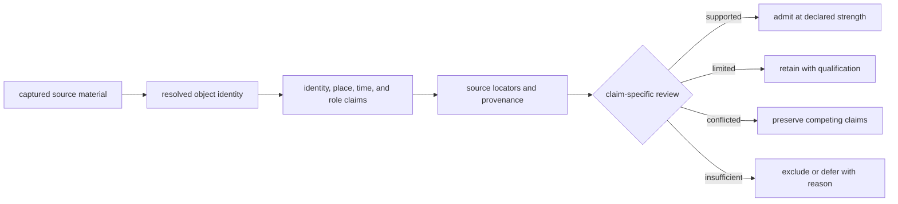
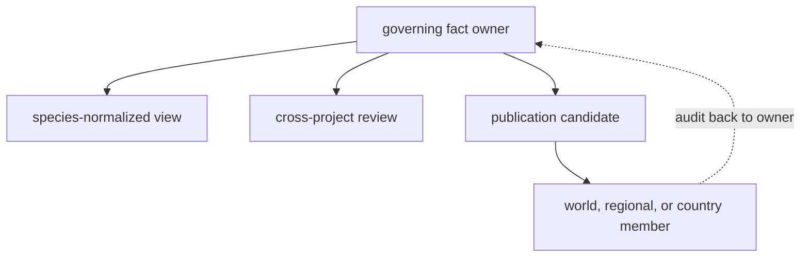

# Evidence Curation

Curation is the accountable work between acquiring a source and publishing a
claim. It determines which object a source row describes, which facts the row
supports, how precise those facts are, and whether they are fit for one
declared product. Normalization makes records structurally consistent;
curation makes their scientific meaning and limits explicit.

## The Curation Boundary

The review is claim-specific. One sample can have a final identity, a directly
supported site, an approximate coordinate, and unresolved numeric chronology.
A single record-level quality flag would hide those independent outcomes.

## What Is Curated

| Curation object | Governing question | Durable result |
| --- | --- | --- |
| source | Which release, archive, paper, supplement, or service supplied the material? | source identity, retrieval context, content identity, and use boundary |
| object identity | Which project, paper, sample, site, sequence, lake, or registry record is this? | stable identity, native key, aliases, and ambiguity state |
| claim | What does the captured material say about taxonomy, locality, chronology, coordinates, or role? | source wording, subject, value, scope, precision, and locator |
| relation | How does one governed object relate to another? | typed sample-to-project, sample-to-site, paper-to-project, or product-to-member link |
| decision | Is the claim usable for the proposed comparison or publication? | admitted, qualified, conflicted, deferred, or refused posture with reason |
| recovery item | What evidence would change an unresolved decision? | named missing artifact, field, relationship, or review action |

These objects live at their natural scope. Project registries govern project
identity; project sample masters govern samples; per-sample evidence packets
govern locality and chronology claims; species views combine reviewed records;
publication manifests govern product membership.

## Curation Is Database Construction

Curation does more than annotate imported rows. It constructs the joins and
negative states that make the evidence database queryable without erasing the
source model.

| Construction decision | What must remain recoverable |
| --- | --- |
| resolve two labels to one sample | both source labels, their locators, the governed sample key, and the resolution basis |
| split one source row into several claims | the shared source locator and the owner, scope, and precision of each claim |
| connect a sample to a site | the typed relation, supporting evidence, and whether the relation is direct or curated |
| decline to create a coordinate | the locality evidence examined and the reason precision would be fabricated |
| admit a record to a product | the exact evidence state and rule set under which membership was granted |
| retain a known non-member | candidate identity, failed or inapplicable rule, and product scope |

A database that retains only successful joins cannot explain its own
denominator. The unresolved, refused, deferred, and outside-scope populations
are part of the curated state, not editorial debris.

## Fact Ownership

Facts often appear in several convenient exports. Repetition does not transfer
authority. `data/source_fact_ownership_registry.json` names the governing
surface for repeated facts and identifies downstream supporting surfaces.

For example, a project-owned `sample_master.json` governs animal sample
identity. A species record, atlas candidate, CSV export, and popup may repeat
the label, but corrections begin in the project authority and propagate
through every descendant.

## Curation Outcomes

| Outcome | Meaning | Public effect |
| --- | --- | --- |
| admitted | required evidence and relations support the product claim | publish with its declared role and precision |
| qualified | the claim is useful but materially limited | publish only when the qualification remains visible |
| contextual | evidence informs interpretation without directly supporting the target object | retain as a separately labelled context layer |
| conflicted | two captured claims disagree and neither may be silently erased | preserve both, select an owner where justified, and expose the conflict |
| deferred | a named recovery action could resolve the decision | keep outside the stronger product until recovery and review complete |
| refused | the proposed claim exceeds the available evidence or product contract | publish the refusal or exclusion reason, not the unsupported claim |

Refusal is preserved evidence about the boundary of the database. It does not
mean that the source object is false or irrelevant; it means that the proposed
use is not currently justified.

## Decision Granularity

Decisions are attached to a claim and use, not to a source family or file.
The following questions therefore receive independent answers:

- Is the sample identity resolved?
- Is its relation to a project or paper recoverable?
- Does locality evidence support a named site, a broader region, or neither?
- Is a coordinate reported, resolved from a name, representative, or derived?
- Is chronology numeric, textual, contextual, conflicted, or absent?
- May the object support the target claim, appear only as context, or remain a
  known non-member?

Keeping those answers separate prevents a strong source-level reputation from
overriding a weak sample-level relation. It also prevents one unresolved
dimension from hiding evidence that remains useful at a narrower strength.

## Audit One Curated Claim

Start from either the source or the public member and recover the same chain:

1. identify the governed object and its source-native key;
2. locate the captured artifact, field, table row, or excerpt;
3. identify which surface owns the disputed fact;
4. inspect normalization, precision, null, and conflict posture;
5. inspect the product-specific admission decision and scope;
6. confirm that warnings, exclusions, and recovery items remain reachable.

Continue with [record admission](record-admission.md) for the product gate and
[conflicts and recovery](conflicts-and-recovery.md) for unresolved evidence.
Use [source families](../sources/index.md) for acquisition context,
[evidence dimensions](../evidence/index.md) for claim semantics, and
[publications](../publications/index.md) for manifested outputs.
