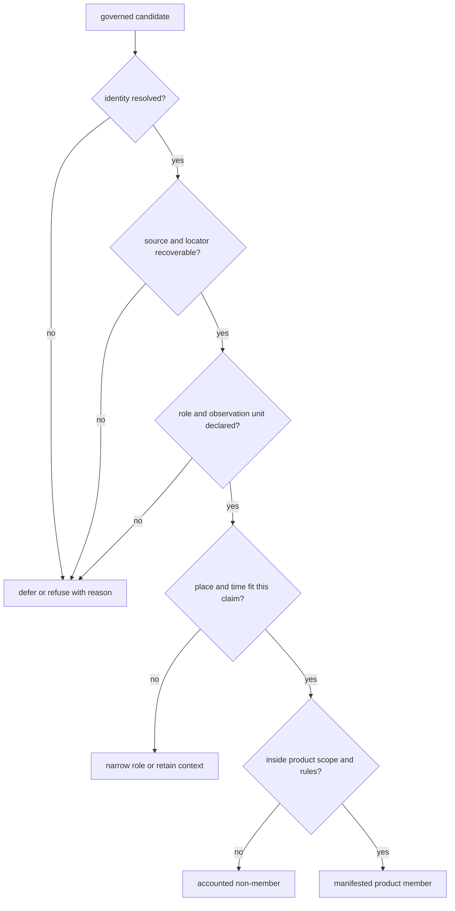
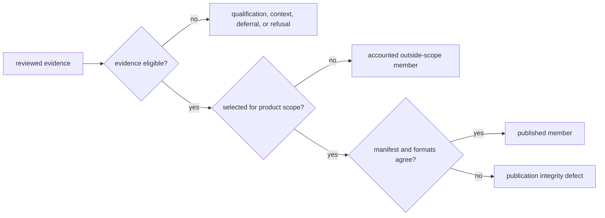
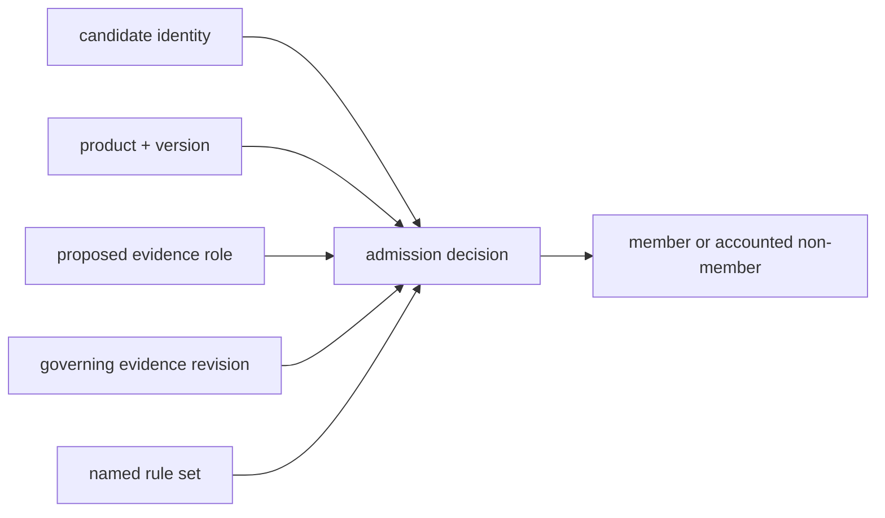

# Record Admission

Admission connects reviewed evidence to one declared use. It is not a global
approval attached to a row. The same object can be admissible as spatial
context, inadmissible for chronology-aware comparison, and outside the scope
of a country product.

The [domain language](../domain-language.md) defines eligible population,
admission, qualification, exclusion, outside scope, and publication member.

## Admission Is Conjunctive



Confidence in one dimension cannot compensate for a missing relation in
another. Exact coordinates do not repair unresolved sample identity; a final
sample label does not supply chronology; project membership does not establish
a sample-owned site.

## Admission Packet

Every reusable decision needs enough information to be independently read:

| Packet member | Required content |
| --- | --- |
| candidate identity | stable object, source-native identity, and observation unit |
| proposed use | product, geography, evidence role, and claim being evaluated |
| governing evidence | fact owners, captured locators, source versions, and typed relations |
| precision | locality resolution, coordinate basis, chronology class, uncertainty, and null semantics |
| rules | required fields, allowed roles, geographic selection, and comparison requirements |
| outcome | admitted, qualified, contextual, excluded, deferred, or refused |
| accountability | reason, warnings, failed rule, recovery condition, and affected descendants |

A bare Boolean cannot distinguish an evidence failure from an out-of-scope
record. That distinction determines whether recovery, a different product, or
no further action is appropriate.

### Separate Eligibility, Selection, And Materialization

Three gates sit between reviewed evidence and a visible feature:

| Gate | Question | Non-member meaning |
| --- | --- | --- |
| evidence eligibility | does this object support the proposed role and claim strength? | qualified, contextual, deferred, or refused under the evidence contract |
| product selection | does an eligible object belong to this geography, species, scenario, and product scope? | valid evidence outside this product population |
| publication materialization | does every selected member appear in the manifest and required formats? | integrity defect if selection has no accountable published result |



This separation prevents an out-of-country sample from being described as
weak evidence and prevents an eligible-but-missing feature from being hidden
as a scientific refusal. Recovery belongs to the gate that actually failed.

### Admission Is Not Monotonic

Newer or more detailed evidence can strengthen, preserve, narrow, or reverse
an admission. A source refresh may expose that two labels identify one sample,
that a coordinate was project-level rather than sample-owned, or that a date
uses an incompatible basis. More data is not guaranteed to produce more
members.

| Evidence change | Possible admission effect |
| --- | --- |
| recovered sample-bearing supplement | context member may become sample-backed after independent dimension review |
| identity merge | two apparent candidates may become one governed object and one member |
| weaker coordinate provenance discovered | exact point may become approximate or be withheld |
| chronology basis corrected | spatial member may remain while temporal-comparison eligibility is removed |
| product boundary revision | evidence decision may remain valid while membership moves outside scope |

Acceptance review therefore compares identities, roles, precision, and
non-members as well as totals. A reduction can be the correct outcome of a
stronger database.

## Decision Identity

An admission decision is identified by the candidate, product, product
version, proposed role, and evaluated evidence state. Change any one of those
inputs and the decision must be evaluated again.



This identity prevents a decision made for a narrative report from being
reused silently for a point map. It also prevents a previous admission from
surviving a changed locality, chronology, boundary, or product rule merely
because the candidate key stayed the same.

### Admission Is A Query Result, Not A Record Flag

The database does not carry one universal `publishable` property. Admission is
the result of evaluating a typed object against a versioned product question:

```text
admission = evaluate(candidate, evidence revision, role, product, rule set)
```

For a Direkli Cave goat sample, the point-product query can pass because the
sample identity, sample-to-site relation, supplied coordinates, chronology
posture, and source locator are connected. The same object still requires a
different decision for a numeric temporal comparison. For the Wadi Halfa
dromedary context, the map query can return a qualified context member while a
sample-backed query must refuse it because no final sample identity was
recovered.

| Query | Direkli sample | Wadi Halfa context |
| --- | --- | --- |
| may appear on the animal point surface? | admitted as sample-backed evidence | qualified as project context |
| may count as a recovered sample? | yes, through the project sample master | no |
| may be treated as source-supplied exact geometry? | only at the coordinate record's declared basis | no; named-place resolution is approximate |
| may support numeric temporal comparison? | evaluate the sample chronology contract | unavailable without sample-owned chronology |

This query model prevents a decision from leaking between roles. Visibility
is not a reusable approval token.

## Product-Specific Fitness

| Evidence posture | Point map | Numeric temporal comparison | Narrative context |
| --- | --- | --- | --- |
| sample-owned site with source-backed coordinates and eligible chronology | admissible when scope rules pass | admissible at declared interval precision | admissible with provenance |
| sample-owned site with approximate named-place geocoding | qualified when the product allows approximate points | chronology evaluated independently | admissible with spatial caveat |
| region-only locality with project chronology | not a sample point | not sample-level time evidence | contextual use only |
| resolved identity with text-only chronology | spatial admission evaluated independently | unavailable, not non-overlapping | textual chronology may remain visible |
| contextual archaeology site without numeric time | context layer when geography passes | refused for same-period comparison | admissible as archaeology context |
| boundary polygon | framing only | no scientific temporal role | admissible as scope description |

Admission therefore preserves evidence roles rather than forcing every family
through one generic completeness definition.

## Population Accounting

A product should expose the populations on both sides of its gate:

| Population | Question answered |
| --- | --- |
| discovered | which potential sources or objects are known? |
| captured | which source material was acquired? |
| normalized | which objects have stable repository representations? |
| reviewed | which claims received a fitness decision? |
| eligible | which reviewed claims satisfy the scientific requirements? |
| admitted | which eligible members fall inside this product contract? |
| published | which admitted members appear in the manifested artifacts? |

These counts need not be equal. The differences are informative only when
each transition has explicit reasons and stable member identities. A published
count without the reviewed and excluded populations cannot establish
completeness.

Population accounting also requires stable identities on the non-member side.
A total such as “234 published” is reproducible only when the 233
sample-backed members and one project-context member remain separately
addressable. Otherwise the same total can survive a silent change in evidence
class.

### Admission Reconciliation

For one product and decision revision, every candidate in the declared
population resolves to exactly one accountable outcome:

```text
candidate population
= admitted
+ qualified
+ contextual
+ excluded
+ deferred
+ refused
+ outside scope
```

The categories are disjoint only within the same decision key. The same
governed object may be admitted to one product, contextual in another, and
outside the geography of a third.

| Reconciliation check | Integrity condition |
| --- | --- |
| population closure | every expected candidate has one outcome and stable identity |
| manifest closure | every admitted, qualified, or contextual member required by the product appears in the manifest |
| non-member closure | exclusions, deferrals, refusals, and outside-scope objects remain addressable with reasons |
| role closure | direct evidence, context, framing, and decision-support members retain distinct roles |
| projection closure | JSON, CSV, GeoJSON, maps, tables, and narratives agree on member identity and qualification |

An unaccounted candidate is not an implicit exclusion. It is a population or
publication-integrity defect until the missing boundary is identified.

## Admission Result Contract

| Result | Required accounting | Permitted interpretation |
| --- | --- | --- |
| admitted | passed rules, member identity, evidence role, and product membership | supports only the claim and strength declared by the product |
| qualified | passed rules plus visible qualification and bounded strength | usable only while the qualification travels with the member |
| contextual | context role, source scope, and separation from direct evidence | informs interpretation but does not support the target observation |
| excluded | candidate identity, evaluated rule, and exclusion reason | known non-member of this product, not globally invalid evidence |
| deferred | blocking evidence and explicit recovery condition | no admission until the condition is satisfied and reviewed |
| refused | proposed claim and evidence boundary that makes it unsupported | the stronger claim must not be inferred from another product |

Admission is complete only when the result is represented on both sides of the
gate: admitted members in the manifest and known non-members in accountable
exclusion, deferral, or refusal surfaces.

## Read An Admission Decision

For one visible member, confirm that its feature identity resolves to the
product manifest, admission record, governing evidence, and source locator.
For one expected non-member, inspect scope, eligibility, conflict, recovery,
and exclusion surfaces before describing the absence.

When a rule changes, compare member identity before totals. One record can
replace another without changing the count; a member can remain present while
its coordinate or chronology becomes less precise. Both are substantive
admission changes.

Continue with [conflicts and recovery](conflicts-and-recovery.md) when a rule
cannot be decided from current evidence, [locality](../evidence/localities.md),
[chronology](../evidence/chronology.md), and
[coordinate provenance](../evidence/coordinates.md) for dimension-specific
fitness, and [publication types](../publications/publication-types.md) for the
authority of the resulting surface.
