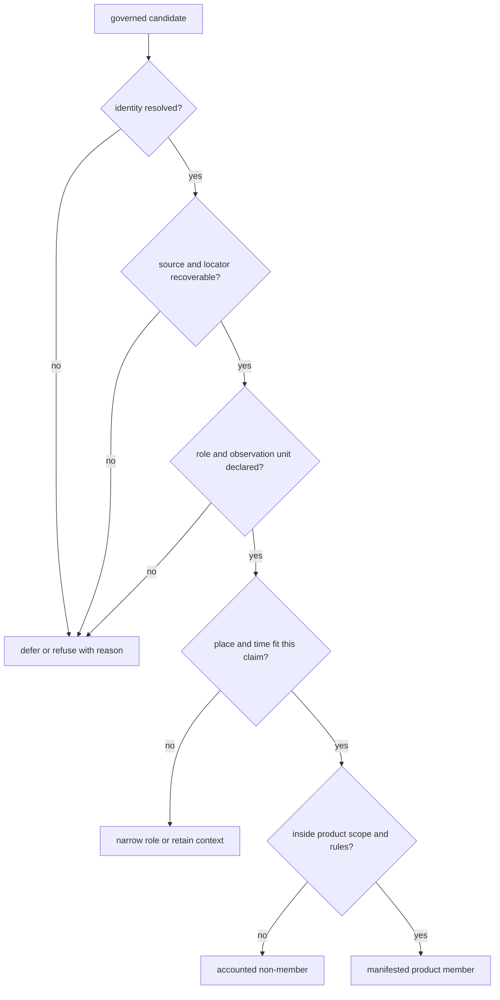

# Record Admission

Admission connects reviewed evidence to one declared use. It is not a global
approval attached to a row. The same object can be admissible as spatial
context, inadmissible for chronology-aware comparison, and outside the scope
of a country product.

## Admission Is Conjunctive

Confidence in one dimension cannot compensate for a missing relation in
another. Exact coordinates do not repair unresolved sample identity; a final
sample label does not supply chronology; project membership does not establish
a sample-owned site.

## Admission Packet

Every reusable decision needs enough information to be independently read:

| Packet member | Required content |
| --- | --- |
| candidate identity | stable object, source-native identity, and observation unit |
| proposed use | product, geography, evidence role, and claim being evaluated |
| governing evidence | fact owners, captured locators, source versions, and typed relations |
| precision | locality resolution, coordinate basis, chronology class, uncertainty, and null semantics |
| rules | required fields, allowed roles, geographic selection, and comparison requirements |
| outcome | admitted, qualified, contextual, excluded, deferred, or refused |
| accountability | reason, warnings, failed rule, recovery condition, and affected descendants |

A bare Boolean cannot distinguish an evidence failure from an out-of-scope
record. That distinction determines whether recovery, a different product, or
no further action is appropriate.

## Product-Specific Fitness

| Evidence posture | Point map | Numeric temporal comparison | Narrative context |
| --- | --- | --- | --- |
| sample-owned site with source-backed coordinates and eligible chronology | admissible when scope rules pass | admissible at declared interval precision | admissible with provenance |
| sample-owned site with approximate named-place geocoding | qualified when the product allows approximate points | chronology evaluated independently | admissible with spatial caveat |
| region-only locality with project chronology | not a sample point | not sample-level time evidence | contextual use only |
| resolved identity with text-only chronology | spatial admission evaluated independently | unavailable, not non-overlapping | textual chronology may remain visible |
| contextual archaeology site without numeric time | context layer when geography passes | refused for same-period comparison | admissible as archaeology context |
| boundary polygon | framing only | no scientific temporal role | admissible as scope description |

Admission therefore preserves evidence roles rather than forcing every family
through one generic completeness definition.

## Population Accounting

A product should expose the populations on both sides of its gate:

| Population | Question answered |
| --- | --- |
| discovered | which potential sources or objects are known? |
| captured | which source material was acquired? |
| normalized | which objects have stable repository representations? |
| reviewed | which claims received a fitness decision? |
| eligible | which reviewed claims satisfy the scientific requirements? |
| admitted | which eligible members fall inside this product contract? |
| published | which admitted members appear in the manifested artifacts? |

These counts need not be equal. The differences are informative only when
each transition has explicit reasons and stable member identities. A published
count without the reviewed and excluded populations cannot establish
completeness.

## Read An Admission Decision

For one visible member, confirm that its feature identity resolves to the
product manifest, admission record, governing evidence, and source locator.
For one expected non-member, inspect scope, eligibility, conflict, recovery,
and exclusion surfaces before describing the absence.

When a rule changes, compare member identity before totals. One record can
replace another without changing the count; a member can remain present while
its coordinate or chronology becomes less precise. Both are substantive
admission changes.

Continue with [conflicts and recovery](conflicts-and-recovery.md) when a rule
cannot be decided from current evidence, [locality](../evidence/localities.md),
[chronology](../evidence/chronology.md), and
[coordinate provenance](../evidence/coordinates.md) for dimension-specific
fitness, and [publication types](../publications/publication-types.md) for the
authority of the resulting surface.
