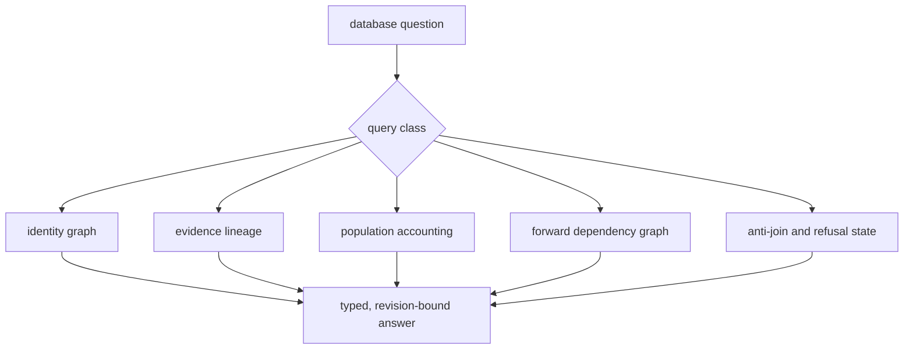
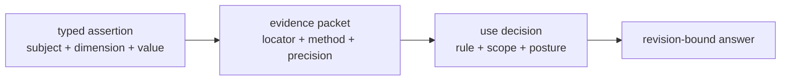
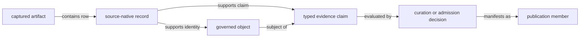
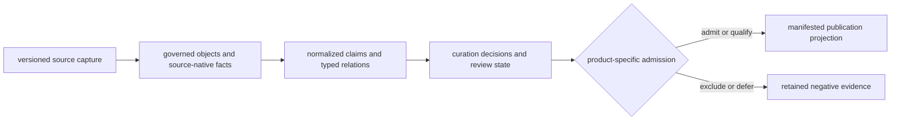
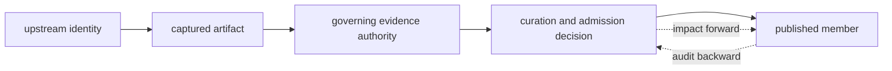

# Evidence Database

Pollenomics is built on a version-controlled evidence database. The database
retains source captures, governed identities, normalized facts, scientific
decisions, unresolved states, and publication membership. Maps and reports
are projections over that state; they are not the authority from which source
or sample facts are recovered.

The [domain language](../domain-language.md) defines the object, claim,
decision, member, and projection terms used below.

## What The Database Governs

| Concern | Governed representation | Why it matters |
| --- | --- | --- |
| source identity | family, owner, release or accession, acquisition, licence posture, and content identity | establishes which upstream material was used |
| object identity | stable keys for releases, projects, papers, samples, sites, claims, and products | prevents names and row positions from becoming joins |
| fact ownership | one declared authority for each recurring fact | makes disagreement resolvable |
| evidence relations | typed links between objects with provenance and cardinality | keeps a plausible association from becoming an asserted identity |
| curation state | accepted, qualified, conflicted, unresolved, excluded, deferred, or outside scope | preserves negative and partial evidence |
| publication membership | product, version, scope, member identity, role, and admission decision | explains why an object appears in a public result |

The database is file-backed rather than service-backed. JSON, CSV, GeoJSON,
source artifacts, review ledgers, and manifests carry different parts of the
model. Their authority comes from explicit contracts and relations, not from
their file format.

### Five Database Questions

The database is designed to answer five classes of question without treating
one denormalized export as universal truth:

| Query | Start with | Resolve to |
| --- | --- | --- |
| identity | native key, accession, DOI, governed key, or product member | one typed object plus aliases and source locators |
| lineage | governed claim or public member | supporting artifact, source-native record, transformation, fact owner, and decision |
| population | source family, evidence posture, species, geography, or product | eligible members, admitted members, non-members, and denominator |
| impact | changed artifact, fact, relation, or rule | dependent claims, decisions, manifests, and rendered products |
| absence | expected object or relation | capture, normalization, curation, admission, scope, filter, or integrity boundary that explains non-membership |

Every answer is revision-bound. “Which record is this?” and “why is it absent?”
can change when source identity, evidence, scope, or admission rules change,
even when the display label remains stable.

### A Database Answer Has Three Parts

A defensible answer is not only a value. It combines a governed assertion, the
evidence that supports or limits it, and the decision that authorizes the
requested use:

For example, coordinates may be asserted and source-backed while sample
lineage remains incomplete. The coordinate question can have a supported
answer while the full-accountability question fails. Database queries must
name the requested dimension and use; otherwise a true component can be
mistaken for approval of the whole record.

### Files Are Projections Of A Typed Graph

Directory position is useful for discovery, but the database model is the
network of typed identities and evidence-bearing relations:

A JSON row can serialize several nodes for convenience, but it does not erase
their types. The source row is not the governed sample, the sample is not its
locality claim, and the locality claim is not the point feature. Readers
should join on stable typed identities and declared relation keys, never on
display labels, row positions, or coordinate equality.

## Database Boundaries

Two persisted surfaces answer different questions:

| Surface | Primary responsibility | Authority limit |
| --- | --- | --- |
| evidence state under `data/` | captured bytes, source-native facts, normalized objects and claims, provenance, relations, and review decisions | does not define membership in every product |
| publication state under `docs/report/` | versioned product manifests, admitted members, exclusions, accounting, maps, tables, and reports | remains a descendant of governed evidence and cannot rewrite its facts |

The boundary matters during correction. A map cannot become the authority for
the sample, locality, chronology, or coordinate facts it displays. Conversely,
a valid evidence record does not enter a product until the product's eligible
population, admission rule, and manifest account for it.

### Authority Depends On The Question

| Question | Authority | Cross-check |
| --- | --- | --- |
| what material was acquired? | capture identity and source artifact | retrieval outcome, digest, source version, and licence posture |
| which object does the material describe? | governed identity and explicit relations | source-native key, aliases, ambiguity posture, and cardinality |
| what place, time, or taxonomy is supported? | claim-specific fact owner | evidence locator, method, precision, conflict, and qualification |
| may the object appear in this product? | admission decision for the named product | eligible population, rule result, exclusion, and scope |
| what exactly was published? | manifest and member identities | structured projections, warnings, counts, and parent–child lineage |

This order prevents a repeated value from carrying the authority of whichever
file is most convenient. The same fact can be copied into a popup, table, and
report while remaining governed by one claim record.

## Evidence Lifecycle

Movement through the lifecycle does not transfer authority. A normalized
sample remains subordinate to its project-owned sample evidence. A published
point remains subordinate to the locality and coordinate claims that made it
eligible. An exclusion remains part of the database even though it is absent
from the visible projection.

## Database Contracts

Three registries make the file-backed model inspectable:

| Contract | Governs |
| --- | --- |
| `data/source_family_contracts.json` | source roles and captured, normalized, reviewed, and published roots |
| `data/source_fact_ownership_registry.json` | the authority for recurring source, sample, locality, chronology, species, and publication facts |
| `data/evidence_artifact_contracts.json` | required project, paper, sample, site, atlas, and country artifact sets |

`data/collection_summary.json` binds the current collected source versions,
retrieval state, hashes, and replacement rules. The evidence-stage matrix
reports lifecycle presence and counts, but its presence labels do not grant
uniform scientific readiness to every member.

Stage presence is established by the concrete artifacts named in the source
family contract. An empty directory, a `.gitkeep` file, a family summary, or
the evidence-stage matrix itself cannot stand in for a missing normalized or
review artifact. This makes absence machine-readable instead of allowing
repository shape to imply work that has not been materialized.

## Inspect A Database Claim

For a claim in a table, map, or narrative, inspect in this order:

1. identify the product and its manifested member;
2. follow the member to the governed sample, site, source, or contextual object;
3. locate the fact owner in `source_fact_ownership_registry.json`;
4. inspect the supporting locator, method, precision, and review posture;
5. read exclusions and unresolved competitors before interpreting coverage;
6. confirm that the evidence and product belong to the same repository state.

This order separates *what the product says* from *why the database permits it
to say that*. It also exposes the exact boundary at which a result becomes
qualified, conflicted, or non-reproducible.

### Minimum Inspection Packet

An independently reviewable answer retains more than the displayed value:

| Packet member | Why it is required |
| --- | --- |
| repository revision | fixes the joined database snapshot |
| product and member identity | fixes the projection and declared role |
| governed object identity | names the sample, site, source record, or context object |
| claim and relation identities | distinguishes identity, place, time, coordinate, and membership assertions |
| source artifact and locator | permits recovery of the supporting material |
| decision posture and rule | explains admission, qualification, exclusion, or refusal |
| precision, conflict, and recovery state | preserves the ceiling on reuse |

If an extract cannot supply this packet, it may still support display or
orientation, but it cannot independently carry the database claim.

## Read The Database In Two Directions

Backward traversal answers what supports a visible claim. Forward traversal
answers which products depend on a corrected source or evidence fact. Both
directions must preserve object type, role, version, and qualification.

## Continue By Question

| Question | Contract |
| --- | --- |
| How do I inspect checked-in records without rebuilding them? | [Querying governed evidence](querying-evidence.md) |
| Which objects exist and how may they relate? | [Object and relation model](object-and-relation-model.md) |
| What does a database state mean at one revision? | [Revision and state model](revision-and-state-model.md) |
| How does upstream material enter the database? | [Source families](../sources/index.md) |
| How are claims evaluated and conflicts retained? | [Curation](../curation/index.md) and [evidence chain](../evidence/index.md) |
| How does governed state become a map, table, or report? | [Publications](../publications/index.md) |
