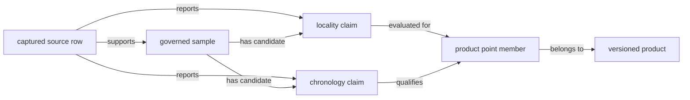
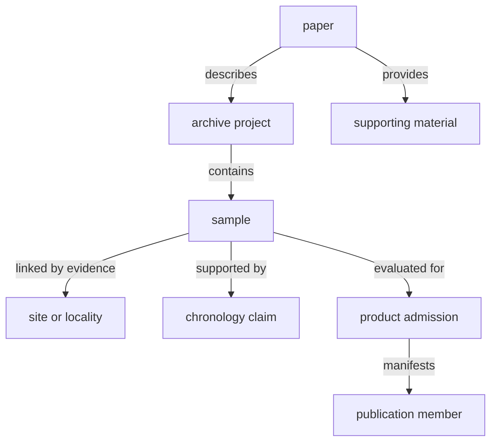
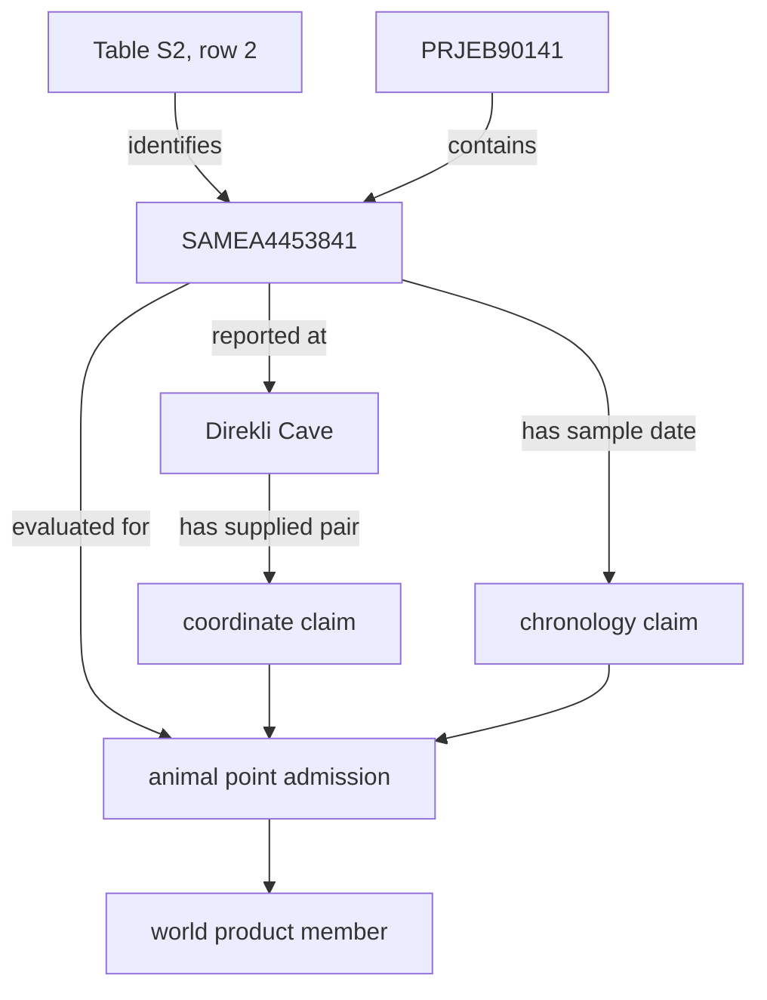

# Object And Relation Model

Pollenomics preserves scientific meaning by assigning every identifier to a
specific object type and every join to a typed relation. A shared label,
coordinate, place name, or publication is evidence to investigate a relation;
it is not a universal key.

## Governed Object Types

| Object | Stable identity | Facts it may own |
| --- | --- | --- |
| source family and release | family key plus release, accession, or captured snapshot identity | upstream owner, version, acquisition, licence posture, and source role |
| captured artifact | content identity plus path or source locator | retrieved bytes or response, media type, size, digest, and acquisition outcome |
| archive project | project accession within its archive | project metadata and captured project surface |
| paper | DOI or another stable publication identity | publication identity and supporting-material inventory |
| sample | project-owned sample key with source locator | sample identity and sample-owned evidence links |
| site or locality | stable site key or governed locality claim | place wording, locality class, relation to samples, and supported precision |
| chronology claim | claim key bound to a governed object and evidence locator | reported time, normalized interval, basis, precision, and conflict posture |
| product | product key, scope, and version | admission rules, membership, roles, warnings, and exclusions |
| publication member | product identity plus governed evidence identity | the role and posture of one object in one product |

Identifiers remain typed even when an export places several of them in one
row. A paper DOI does not identify a sample. A project accession does not
identify a site. A map feature identifier does not become the sample key.

## Identity, Evidence, And Projection Are Separate

The same real-world subject can participate in several database objects
without those objects collapsing into one record:

The sample owns its identity; the evidence surfaces own their reported facts;
the curation decision owns which claim is accepted; and the product manifest
owns membership. This separation permits one locality correction to propagate
to every dependent product without rewriting the captured source or changing
the sample key.

## Cardinality Is Scientific Meaning

One paper may describe several projects. One project may contain many samples.
Several samples may share a site while retaining different dates. One sample
may carry competing locality or chronology claims. One governed object may
enter several products under separate admission decisions.

Flattening those relations can create false facts. Copying one project place
or age into every sample is not normalization; it is an unsupported change in
fact ownership and cardinality.

## Relation Contract

A defensible relation retains:

| Field | Required meaning |
| --- | --- |
| left and right identities | typed governed objects on both sides |
| relation type | identity, ownership, citation, membership, containment, proximity, temporal overlap, or another declared predicate |
| evidence locator | source row, supplement location, registry relation, or deterministic derivation supporting the link |
| method | direct capture, curated resolution, geometric predicate, temporal rule, or declared normalization |
| precision and scope | where the relation is valid and how strongly it may be interpreted |
| posture | accepted, qualified, conflicted, unresolved, refused, or outside scope |
| revision identity | database state under which the relation was evaluated |

Proximity and containment are derived relations. They can be reproducible and
useful without proving biological association, shared identity, or
contemporaneity.

### Relation Direction Is Part Of Meaning

Relations are read from a declared subject to a declared object. Reversing an
edge may produce a different claim or no valid claim at all.

| Directed relation | Valid reading | Invalid reversal |
| --- | --- | --- |
| project `contains` sample | the source project population includes the sample | the sample owns or exhaustively represents the project |
| source row `supports` chronology claim | the located row provides evidence for that claim | the normalized claim is the source row |
| sample `linked by evidence to` locality | a governed relation connects this sample to this place | every sample at the place shares that sample's evidence |
| product `admits` governed object | the object satisfies one product contract | the object's existence authorizes every product |
| point `within` boundary | geometry satisfies a versioned containment predicate | the boundary supplies the point's locality evidence |
| interval `overlaps` interval | two compatible intervals meet one declared rule | the underlying observations are associated or independent |

A relation key therefore includes its typed endpoints, predicate, method,
scope, posture, and revision. A pair of object identifiers without the edge
contract is not enough to reproduce the join.

### Worked Relation Graph

The Direkli Cave goat record shows why typed relations matter. The public
feature resolves through a product member to sample
`capra_hircus:sample:prjeb90141:samea4453841`. That sample is namespaced by
project `PRJEB90141` and supported by supplementary workbook Table S2, row 2.
Separate relations connect it to the Direkli Cave locality, supplied
coordinates, and sample-owned chronology.

None of the arrows can be replaced by label similarity. The paper label
`Direkli1-2`, archive identity `SAMEA4453841`, and product feature token are
different identifiers connected by evidence. Keeping them distinct allows a
coordinate or chronology correction without changing the specimen identity.

## Fact Ownership

When a fact is repeated, the database does not resolve disagreement by taking
the newest file or the majority value. The fact-ownership registry names the
governing surface. Supporting surfaces are derived consumers that must be
regenerated when the authority changes.

| Fact | Governing level | Typical dependent views |
| --- | --- | --- |
| animal project inventory | cross-project project registry | species summaries and coverage dashboards |
| animal sample identity | project sample master | species-normalized records and atlas candidates |
| sample-to-site linkage | project sample-site evidence | locality summaries and point admission |
| chronology | sample chronology evidence | temporal comparison, popup wording, and product eligibility |
| pollen context | normalized family record | regional pollen layers and comparison packets |
| country framing | normalized boundary geometry | country membership, counts, maps, and reports |

## Join Safety

| Candidate bridge | Safe only when | Refuse when |
| --- | --- | --- |
| sample labels | source locators or curated aliases establish the same sample | spelling or position is the only match |
| site names | stable site identity or explicit sample-site evidence exists | the name is broad, reused, or project-level |
| coordinates | basis, precision, method, and governed objects are retained | rounded equality is treated as identity |
| temporal overlap | both claims have compatible bases, intervals, and a declared overlap rule | one side is textual, contextual, or incomparable |
| country membership | governed point evidence and boundary version support the predicate | a representative regional point creates false locality precision |

The correct result of an unsafe join is an unresolved or refused relation,
not a fabricated key.

### Anti-Joins Are Accountability Queries

The database must also support questions about missing relations. A sample
without a site link, a site without defensible coordinates, or an admitted
candidate absent from a product manifest is not discarded by an inner join.
It belongs in an unresolved, excluded, or integrity population with a named
reason.

| Anti-join | Meaning to investigate |
| --- | --- |
| recovered sample without locality claim | locality evidence has not been recovered or related |
| locality claim without mappable coordinate | the place may be broad, ambiguous, or intentionally withheld |
| reviewed candidate without product membership | scope, qualification, exclusion, or manifest defect must explain the absence |
| product member without governing evidence relation | database-integrity failure; publication must be blocked |

This is how the file-backed database preserves denominators. A query that
silently drops unmatched objects cannot support a completeness statement.

## Relation Evidence Must Survive Export

A compact export may denormalize labels and values for use, but it must retain
enough information to recover the governed relation. At minimum that means the
typed object keys, relation or claim key, evidence locator, method, posture,
and relevant revision or product identity. If those fields are omitted, the
export is a presentation extract: it may be convenient for display but cannot
independently support the database claim.

This distinction is especially important for GeoJSON. Geometry proves only
that a feature can be drawn. The associated properties must still distinguish
reported coordinates, representative points, derived centroids, and governed
sample-locality evidence.
