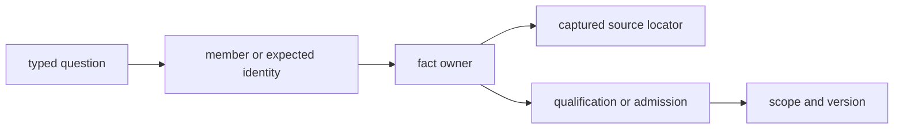
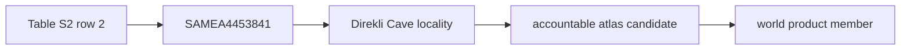

# Querying Governed Evidence

The checked-in database can be inspected without running collection or
publication producers. A sound query begins with a typed question, follows the
record that owns the disputed fact, and ends with both source evidence and the
decision that connects it to a product.

## Begin With A Query Contract

Record these fields before selecting a JSON, CSV, GeoJSON, or Markdown file:

| Field | Required question |
| --- | --- |
| observation unit | Is the object a release, project, paper, sample, site, locality, grid cell, lake, product member, or aggregate? |
| claim dimension | Is the question about identity, origin, place, time, role, membership, exclusion, or recovery? |
| revision | Which repository revision, source release, and product version bound the answer? |
| authority | Which record is allowed to govern this fact? |
| intended use | Is the result for inventory, spatial display, temporal comparison, ranking, or another declared product? |
| stopping condition | Which source locator and decision identity make the answer auditable? |

Choosing a convenient file first is unsafe because the same value can appear
in source capture, normalized evidence, review state, a publication member,
and a rendered narrative. Those copies do not have equal authority.



## Inspect Lifecycle State

`data/source_family_evidence_stage_matrix.json` reports whether each
contracted family's exact raw, normalized, reviewed, and published artifacts
are materialized. The following read-only query prints the current state and
blocking reasons:

```bash
python3 - <<'PY'
import json
from pathlib import Path

matrix = json.loads(
    Path("data/source_family_evidence_stage_matrix.json").read_text()
)
for row in matrix["rows"]:
    stages = ", ".join(
        f"{name}={row[f'{name}_status']}"
        for name in ("raw", "normalized", "reviewed", "published")
    )
    print(f"{row['source_key']}: {stages}")
    for reason in row["blocking_reasons"]:
        print(f"  blocked: {reason}")
PY
```

A `published` status establishes that the contracted publication artifact
exists. It does not repair an earlier missing stage or prove that the current
checkout can rebuild the retained product.

## Locate The Fact Owner

`data/source_fact_ownership_registry.json` maps recurring facts to their
governing surface and supporting copies. Query it before editing or citing a
repeated value:

```bash
python3 - <<'PY'
import json
from pathlib import Path

registry = json.loads(
    Path("data/source_fact_ownership_registry.json").read_text()
)
for row in registry["rows"]:
    print(row["fact_key"])
    print(f"  owner: {row['governing_surface_path']}")
    for supporting in row["supporting_surface_paths"]:
        print(f"  supporting: {supporting}")
PY
```

The supporting paths are useful cross-checks. They are not alternative places
to correct the fact. A disagreement is resolved at the governing surface and
then propagated through declared descendants.

## Trace A Published Animal Member

The world bundle exposes a sample-backed goat feature whose lineage reaches a
specific supplementary workbook row. This query selects it by stable feature
identity:

```bash
python3 - <<'PY'
import json
from pathlib import Path

feature_id = (
    "animal-atlas-feature:capra-hircus-locality-prjeb90141-"
    "direklicave-taurusmountainsturkey"
)
trace = json.loads(
    Path("docs/report/world/world_animal_point_traceability.json").read_text()
)
row = next(item for item in trace["rows"] if item["feature_id"] == feature_id)
for key in (
    "evidence_row_id",
    "site_record_id",
    "sample_record_ids",
    "coordinate_basis",
    "coordinate_confidence",
    "source_artifact_path",
    "source_locator",
):
    print(f"{key}: {row[key]}")
PY
```

The result resolves the visible feature to project `PRJEB90141`, sample
`SAMEA4453841`, the Direkli Cave locality record, supplementary-table
coordinates, and Table S2 row 2 of the recovered workbook. The trace supports
a qualified sample-backed point. It does not establish complete recovery of
the project or equal ascertainment across species.



### Query A Visible Accountability Gap

The current animal candidate population also contains a dromedary-camel member
whose sample row, site evidence, chronology evidence, and coordinate
provenance are present while sample lineage is not. Query the failed dimension
directly rather than inferring completeness from visibility:

```bash
python3 - <<'PY'
import json
from pathlib import Path

accountability = json.loads(
    Path("data/adna/final/atlas/animal_atlas_candidate_accountability.json")
    .read_text()
)
for row in accountability["rows"]:
    if not row["fully_accountable"]:
        print(row["evidence_row_id"])
        print(f"  sample rows: {row['sample_rows_present']}")
        print(f"  sample lineage: {row['sample_lineage_present']}")
        print(f"  site evidence: {row['site_evidence_present']}")
        print(f"  chronology evidence: {row['chronology_evidence_present']}")
        print(f"  coordinate provenance: {row['coordinate_provenance_present']}")
PY
```

The answer is a dimensioned failure, not an instruction to discard the other
evidence or promote the missing relation. The row stays addressable so source
recovery can repair exactly the lineage boundary and dependent decisions can
then be reevaluated.

## Audit An Expected Non-Member

Non-visibility is not one state. Begin with the expected identity and inspect
the possible decision surfaces in this order:

1. source discovery and capture;
2. normalization and identity resolution;
3. locality, chronology, and coordinate evidence;
4. ambiguity, conflict, substitution, and recovery records;
5. product admission or exclusion;
6. geographic scope and client-side filter state.

| Outcome | Meaning |
| --- | --- |
| not captured | no governed source member is available in this revision |
| captured but unresolved | source material exists without a defensible governed identity or claim |
| refused or deferred | the required evidence is absent, conflicting, or below the product contract |
| excluded | a known candidate failed a named product rule |
| outside scope | valid evidence does not belong to this product geography or purpose |
| admitted but hidden | the member exists in the manifest but the current view suppresses it |

An absence audit closes only when one of these states has an identity and a
reason. A blank map location or missing CSV row is not a decision record.

## Compare Counts Safely

Before computing a percentage or difference, require both populations to
declare the same observation unit, scope, revision, and evidence role.

| Count | Observation unit | Valid use |
| --- | --- | --- |
| animal foundation rows | curated source row | grounding and blocker posture |
| recovered sample-master rows | project-owned sample identity | recovered identity inventory |
| animal atlas rows | admitted point-evidence member | spatial publication accounting |
| LandClim rows | site sequence or grid cell, depending on surface | source-specific pollen context |
| RAÄ density values | selected registry members per declared grid cell | coarse Sweden heritage context |

Counts from these surfaces cannot be added or divided merely because they
appear in the same repository or map. Preserve numerator identities,
denominator identities, exclusions, and the contract that made them
comparable.

## Carry A Query Result

A reusable result includes:

- repository revision and relevant source or product version;
- typed observation unit and stable governed identity;
- fact owner and captured evidence locator;
- reported value and any normalized representation;
- precision, conflict, qualification, or unresolved posture;
- product scope and decision identity when publication is involved; and
- the exact query or deterministic selection used.

This packet is the minimum needed to distinguish a reproducible evidence claim
from a value copied out of a convenient serialization.

## Continue The Audit

- [Object and relation model](object-and-relation-model.md)
- [Revision and state model](revision-and-state-model.md)
- [Evidence curation](../curation/index.md)
- [Evidence chain](../evidence/index.md)
- [Publication model](../publications/index.md)
