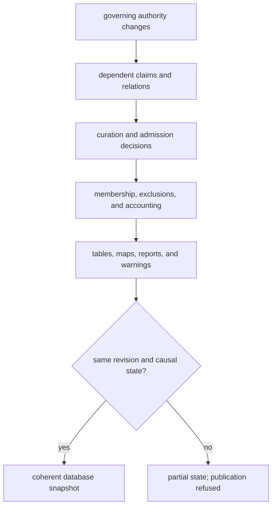

# Revision And State Model

A Git revision is a Pollenomics database snapshot. Trust depends on the
snapshot carrying authorities, required companions, review decisions,
manifests, exclusions, and public projections from the same causal state.

## Lifecycle State Is Not A Quality Score

| State | Establishes | Does not establish |
| --- | --- | --- |
| captured | identified material entered the repository | correct interpretation or completeness |
| normalized | source meaning has a repository representation | fitness for a scientific claim |
| reviewed | named dimensions were evaluated under declared rules | fitness for every product |
| published | a governed object entered one manifested projection | universal acceptance or source completeness |

A family can be present at every lifecycle stage while individual records are
qualified, unresolved, or excluded. Stage presence reports infrastructure and
coverage state; record-level decisions report scientific fitness.

## How Stage Presence Is Proven

`data/source_family_contracts.json` names the artifact or artifacts that prove
each stage for each source family. The state evaluator requires those named
artifacts to contain governed content.

| Observation | Stage result | Reason |
| --- | --- | --- |
| contracted normalized GeoJSON exists and is non-empty | normalized may be `present` | the declared normalized evidence is materialized |
| normalized directory contains only `.gitkeep` | normalized is `missing` | directory structure is not evidence |
| a summary exists but the contracted member dataset does not | normalized is `missing` | counts cannot replace the governed records they summarize |
| evidence-stage matrix exists but a source-specific review does not | reviewed is `missing` | a status report cannot certify its own review input |
| a retained publication exists while an upstream stage is missing | published is `present`, readiness remains blocked | historical product existence and current reproducibility are different facts |

This last condition is intentional. A published artifact is not deleted merely
because the current database state exposes a missing prerequisite. Instead,
the matrix preserves the publication surface, marks the missing stage, and
sets a blocking posture. Readers can then distinguish retained output from a
product that can be regenerated and defended from the current snapshot.

## Claim And Membership States

| State | Meaning |
| --- | --- |
| accepted | the claim satisfies the declared evidence contract |
| qualified | the claim is usable only with an explicit limit |
| conflicted | incompatible supported values remain unresolved |
| unresolved | evidence is insufficient to select a defensible value |
| excluded | a known object fails a named product contract |
| deferred | a decision awaits recoverable evidence or review |
| outside scope | the object may be valid but is not part of the product population |

These states are database values. They must survive summaries and refreshes
even when only accepted and qualified members appear in a public map.

## Coherent Snapshot

Updating a visible map without its manifest is a partial transaction. Updating
a normalized fact without reevaluating dependent admissions is also partial,
even if the map happens to remain visually unchanged.

## Snapshot Invariants

A coherent revision satisfies all of these invariants:

- every repeated fact resolves to one declared authority;
- every admitted member resolves backward to typed evidence and a decision;
- every exclusion names a known object, rule, and product population;
- stage labels are reproducible from contracted artifacts, not directory names;
- public counts reconcile with manifests and their declared denominators;
- generated descendants do not become authorities for their own inputs;
- missing, conflicted, and unresolved states remain visible after refresh.

Violation of an invariant is a database defect even when every Markdown page
renders and every map opens.

## Version Identities

Different versions answer different questions:

| Identity | Fixes |
| --- | --- |
| upstream release or accession | the source program or archive material selected |
| captured content digest | the bytes or logical capture represented |
| schema version | the interpretation expected for one artifact shape |
| repository revision | the joined database state across authorities and descendants |
| product version | the declared membership and delivery contract |

None substitutes for another. A product filename containing `v66` does not
prove that every input comes from AADR v66, and an unchanged source release
does not prove unchanged normalized semantics.

## Change Classes

| Change | Required review |
| --- | --- |
| new source release | identity, licence, schema, observation unit, coverage, and semantic diff |
| parser or normalization change | source-to-field lineage, null behavior, precision, and member equivalence |
| identity merge or split | aliases, relations, counts, species views, and every dependent product |
| locality or coordinate correction | spatial posture, containment, distances, maps, and exclusions |
| chronology correction | basis, interval semantics, overlap eligibility, summaries, and wording |
| product rule change | population, admissions, exclusions, manifests, counts, and public claims |

## Replacement And Failure

Collected source roots use staged replacement where declared by the collection
summary. A failed refresh preserves the preceding governed root. A successful
swap still requires semantic review: newer bytes can narrow coverage, expose a
conflict, or invalidate a previous publication decision.

External unavailability is not evidence that the governed state is false. It
is a blocked refresh condition. Conversely, a successful download is not
evidence that interpretation and publication remain valid.

## Reuse Contract

A reusable database extract retains the repository revision, product and
source versions, typed object identities, evidence roles, relation methods,
precision, admission posture, and material qualifications. If an extract
drops exclusions, unresolved states, or its denominator, it cannot carry the
same coverage claim as the governed snapshot.
