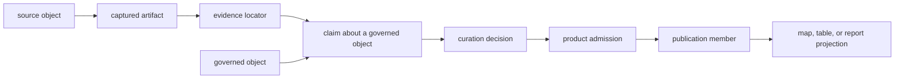

# Pollenomics Domain Language

Pollenomics connects sources, scientific claims, curation decisions, and public
products without treating them as the same object. The vocabulary below is a
contract: each term names one responsibility, and using a broader term must not
silently transfer authority or precision.

## How The Core Objects Relate

The graph is traversable in both directions. A visible member resolves
backward to its decision, claim, evidence locator, and captured source. A
source correction resolves forward to every dependent claim, admission, and
publication projection.

## Objects And Evidence

| Term | Meaning | It is not |
| --- | --- | --- |
| **source family** | an upstream system or curated intake family with one declared role, observation unit, and lifecycle contract | a claim that every family is comparable or equally mature |
| **source object** | a source-native dataset, release, project, paper, sample, site, registry row, or other identifiable upstream unit | the repository's interpretation of that unit |
| **captured artifact** | the bytes or logical response acquired from a source, with retrieval context and content identity | proof that extraction, normalization, or review succeeded |
| **governed object** | a repository-owned identity for a sample, site, lake, claim subject, product, or other typed entity | whichever row happens to repeat its label |
| **claim** | one assertion about one governed object, such as identity, locality, chronology, coordinate, taxonomy, or evidence role | a complete record-level quality score |
| **evidence locator** | the recoverable source location supporting or conflicting with a claim: artifact, table, row, field, page, or deterministic derivation | a citation that cannot be tied to the acquired material |
| **fact owner** | the governing record for a fact repeated in normalized, reviewed, or published descendants | the newest, most polished, or most frequently copied value |
| **relation** | a typed, directed link between governed objects with method, evidence, scope, posture, and revision | label similarity, coordinate equality, or visual proximity alone |

Objects and claims remain separate because one object can have strong identity
evidence, qualified locality evidence, unresolved chronology, and different
publication outcomes at the same time.

## Decisions And State

| Term | Meaning | Reader consequence |
| --- | --- | --- |
| **curation decision** | the repository's treatment of one claim under a named rule and use | inspect the claim, evidence, rule, outcome, and reason together |
| **posture** | the current evidence state of a claim or relation: accepted, qualified, conflicted, unresolved, refused, or another declared state | posture is dimension-specific, not a universal grade for the object |
| **qualification** | an explicit limit that narrows how an otherwise usable claim may be stated | preserve the qualification in every downstream reuse |
| **conflict** | two or more supported values cannot yet be reconciled under the governing authority | do not select a convenient value or average unlike claims |
| **recovery condition** | the named evidence or action that could resolve an incomplete claim or decision | missingness becomes testable work rather than an undocumented blank |
| **eligible population** | the governed objects to which one product rule is applied | the admitted subset or the entire captured source population |
| **admission** | the result of evaluating one eligible object for one product and role | permanent approval of the object for every product |
| **exclusion** | a known eligible object that fails or falls outside a named product rule, with a retained reason | evidence that the source object does not exist |
| **outside scope** | a governed object is not part of the declared product population | a scientific rejection or a capture failure |

Lifecycle words answer a different question. **Captured**, **normalized**,
**reviewed**, and **published** say which material stages exist. They do not
replace claim posture or establish equal scientific fitness across all members
of a stage.

## Products And Views

| Term | Meaning | Authority boundary |
| --- | --- | --- |
| **product** | a versioned, scoped publication contract with an eligible population, rules, roles, members, and accounting | owns selection and presentation, not upstream scientific facts |
| **manifest** | the identity, scope, version, members, and required companions of one product | establishes the bundle, not source completeness |
| **publication member** | one governed object admitted to one product in one declared evidence role | the source object, claim, or rendered marker itself |
| **projection** | a JSON, CSV, GeoJSON, Markdown, HTML, map, or table representation of governed product state | a new evidence authority created by formatting |
| **direct evidence** | evidence that supports a claim about its governed observation or sample | proof of regional completeness, association, or causation |
| **context** | evidence that describes the environmental, archaeological, temporal, or sampling setting around another claim | direct support for the other observation |
| **framing** | geometry or registry identity used to define scope, navigation, or candidate space | scientific evidence merely because it appears on the map |
| **decision support** | a declared ranking or comparison that helps prioritize review or fieldwork | an autonomous scientific or operational decision |

A map may contain all four evidence roles. Shared presentation does not make
their observation units, precision, or inferential strength equivalent.

## Scope, Precision, And Counting

| Term | Required interpretation |
| --- | --- |
| **observation unit** | the thing counted or compared: source row, project, paper, sample, site, sequence, cell, lake, product member, or another named unit |
| **denominator** | the declared population against which admitted, qualified, excluded, unresolved, and outside-scope states are counted |
| **scope** | the source family, geography, species, product, claim dimension, and intended use within which a statement holds |
| **precision** | the supportable spatial, temporal, taxonomic, or identity resolution, including whether it is supplied, derived, approximate, substituted, or unresolved |
| **revision** | the joined repository state under which authorities, relations, decisions, and products agree |
| **lineage** | the recoverable path connecting a source object to a governed claim and a product member, or connecting a correction to its descendants |
| **independence** | distinct observation-level provenance sufficient to treat two records as separate support rather than duplicated descendants |

Every count should therefore read as a typed statement, for example:

> 234 animal sample rows admitted to the exact-or-qualified point product under
> the checked-in review contract.

That wording is stronger than “234 records” because it names the observation
unit, decision, product, and governing snapshot without implying complete
source recovery.

## False Equivalences To Refuse

| Do not equate | Because |
| --- | --- |
| source discovered = source captured | discovery does not establish acquired material or content identity |
| captured = normalized | acquisition does not define repository meaning |
| normalized = admitted | representation does not establish product fitness |
| published = reproducible | a retained product can outlive a missing current prerequisite |
| project = sample | one archive project may contain many independently governed samples |
| site = sample locality | a named or project-level place may not be sample-owned |
| marker = coordinate evidence | rendering consumes a coordinate claim; it does not create one |
| temporal overlap = contemporaneity | interval intersection does not establish association, causation, or equal dating basis |
| nearby = related | distance is a derived relation whose scientific meaning requires an explicit bridge |
| absent from view = absent from evidence | filters, scope, exclusion, unresolved state, and capture gaps produce different absences |

## Translate A Marker Into A Defensible Claim

A map marker is a projection. To describe it as evidence, resolve these nouns
in order:

1. **projection** — which map and layer rendered the marker;
2. **publication member** — which stable member belongs to which manifest;
3. **admission** — which product rule accepted or qualified the member;
4. **governed object and claims** — which identity, place, time, and role are
   asserted;
5. **evidence locators** — which acquired source locations support those
   claims; and
6. **scope and posture** — which precision, conflict, qualification, and
   recovery limits bound the wording.

If the chain stops early, state what is visible and what remains unresolved.
Do not let a familiar label or precise-looking symbol supply the missing term.

Continue to the [evidence database](database/index.md) for storage and
authority, [curation](curation/index.md) for decisions, and
[publications](publications/index.md) for manifested products.
