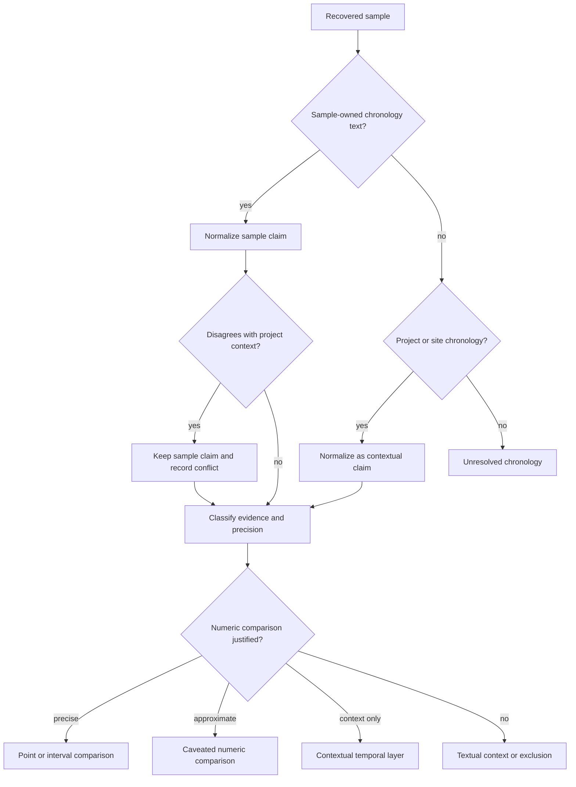
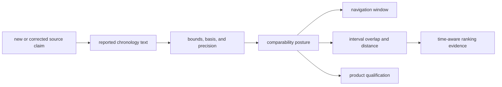

# Chronology evidence

Chronology records what the source says about a sample's age, how that wording
was interpreted, and how precisely it may be compared with other evidence. A
numeric value is not automatically a precise sample date: it may describe a
project context, a modeled estimate, or a broad interval.

Bijux Pollenomics therefore keeps three questions separate:

1. **What was reported?** The original chronology text and its source locator.
2. **What can be normalized?** A BP point or interval only when the wording and
   dating basis support one.
3. **What comparison is safe?** A precision posture derived from ownership,
   evidence class, and normalization status.

## Current Evidence Posture

The governed chronology audit covers all 868 recovered animal samples:

| Normalization result | Samples | Interpretation |
| --- | ---: | --- |
| numeric point | 469 | one defensible BP value is available |
| numeric interval | 296 | comparison must preserve interval width |
| text only | 87 | wording is useful but is not safely parsed into BP bounds |
| unresolved | 16 | no trustworthy chronology claim has been recovered |

Evidence class and comparison precision cut across those normalization counts.
The collection includes 729 direct radiocarbon-date rows, 30 archaeological
context dates, 93 historical or recent dates, and 16 unresolved rows. Its
precision postures include 461 sample-precise points, 254 sample-precise
intervals, 87 approximate or modeled sample claims, 50 contextual intervals,
and 16 unresolved claims. Ten projects currently require manual chronology
review.

These views are deliberately different. A row may contain numbers and still be
contextual or approximate; numeric normalization does not confer sample-level
precision.

## Sample Evidence Outranks Project Context

When a sample-owned date conflicts with a project-level range, the sample claim
remains attached to that sample and the disagreement is explicit. Falling back
to project context is allowed only when the sample row lacks its own
chronology, and the result stays classified as contextual rather than
sample-precise.

## Evidence Class And Precision

| Precision posture | Typical support | Comparison rule |
| --- | --- | --- |
| `sample_precise_point` | sample-owned numeric point | compare numerically without implying narrower source precision |
| `sample_precise_interval` | sample-owned numeric interval | compare by interval overlap or distance |
| `sample_approximate_or_modeled` | circa wording, model output, or parsed approximate date | numeric comparison requires a visible caveat |
| `contextual_interval` | site- or project-level numeric context | context only; not a sample-owned date |
| `broad_period_only` | textual archaeological or historical period | label-based orientation, not numeric interval comparison |
| `unresolved` | no recovered or trustworthy date claim | no temporal comparison |

The corresponding evidence classes distinguish direct radiocarbon dates,
modeled sample dates, archaeological context dates, broad period labels, and
historical or recent dates. Evidence class describes *what kind of support
exists*; precision posture describes *how that support may be used*.

## The Normalized Chronology Contract

A chronology row preserves:

- stable sample identity and preferred source label;
- original chronology text;
- chronology strength and evidence class;
- precision posture and normalization status;
- provenance artifact, artifact kind, locator, and supporting excerpt;
- `time_start_bp`, `time_end_bp`, and `time_mean_bp` when defensible;
- dating basis, conflict note, and review note.

Normalization status remains `text_only_unparsed` when useful wording cannot
be converted safely, and `unresolved` when no chronology has been recovered.
For numeric values, equal BP bounds represent a point; unequal bounds represent
an interval. Original text remains the authoritative source expression.

`time_mean_bp` is a summary coordinate, not a replacement for the interval.
Range overlap and distance calculations use the bounds when they exist. A map
or chart that displays a mean must retain access to the original bounds,
precision posture, evidence class, and comparison note so that an interval
does not acquire false point precision.

### Calendar Conversion Contract

Numeric BP values use 1950 CE as the reference year. For chronology text that
matches the supported BCE or CE forms, the current normalization applies:

| Source expression | Numeric conversion |
| --- | --- |
| year BCE | `year + 1949` BP, accounting for the absence of year zero |
| year CE | `max(0, 1950 - year)` BP |
| BCE or CE range | convert both endpoints, then order the BP interval from younger to older |
| explicit BP point or range | retain the BP value or ordered bounds |

For example, `11367-11220 BCE` becomes `13169-13316 BP`: 11220 BCE is the
younger bound and 11367 BCE is the older bound. The source wording remains
stored beside the normalized interval.

Calendar conversion is not radiocarbon calibration. It does not infer a
laboratory uncertainty, choose a calibration curve, reinterpret an
archaeological period, or prove that a source label is sample-owned. Words such
as *calibrated*, *modeled*, *circa*, and *contextual* remain part of the dating
basis and precision posture after numbers are available.

## Worked Chronology Trace

The same sample used in the identity and locality guides,
`prjeb22390:cgg_1_017139`, preserves `1979 BP` from the captured supplementary
rows. Its governed chronology currently records:

| Field | Value |
| --- | --- |
| ownership | sample-owned |
| evidence class | `direct_radiocarbon_date` |
| normalization | `normalized_point` |
| precision posture | `sample_precise_point` |
| BP bounds | `1979` to `1979` |
| dating basis | `mixed_radiocarbon_and_archaeological_context` |
| conflict posture | sample claim disagrees with the project-level interval |

The equal normalized bounds mean that the captured claim contributes one BP
value to the current comparison contract. They do not prove zero laboratory,
calibration, or archaeological uncertainty. The original wording, supporting
row, dating basis, and conflict note remain necessary to interpret the value.

The project disagreement is retained rather than averaged away. Sample-owned
evidence governs this sample; project context remains visible as a conflicting
broader claim. If later source recovery provides an interval or calibration
detail, the chronology descendant can change while the stable sample identity
and Haunstetten locality remain intact.

## Chronology Revision Impact

A chronology correction can change several descendants without changing the
sample identity:

Review the semantic cause before aggregate effects. A changed midpoint can
move a record between navigation windows while leaving its source interval
unchanged; a corrected interval can change overlap without changing the
window; a reclassified contextual claim can remove a row from numeric scoring
even when its numbers remain present.

Chronology diffs should therefore compare reported text, source locator,
dating basis, bounds, evidence class, precision, and comparability—not only the
final display label or mean.

## What is never inferred

The chronology pipeline does not assign conventional numeric bounds to a named
period merely to make it sortable. It does not treat a project's overall age
range as the precise age of every sample. It does not erase qualifiers such as
*circa*, modeled, calibrated, historical, or recent.

Those restraints matter in a cross-domain atlas. Two layers can overlap in
space while lacking comparable time support. A pollen sequence with a numeric
BP interval, a SEAD site-inventory point, and an animal sample with a modeled
date must retain their different temporal semantics.

Cross-source comparison is therefore an admission decision, not a generic
date join. Exact and interval-supported rows may participate in numeric window
tests; approximate rows require a visible caveat; contextual intervals remain
context; and text-only or unresolved rows cannot silently inherit a numeric
window from a neighboring record.

Chronology absence is also claim-specific. `text_only` means a source statement
was recovered but cannot be safely converted; `unresolved` means no trustworthy
claim is available. Neither is numeric non-overlap, and neither should be
counted as evidence that two records belong to different periods.

## Auditing Chronology Lineage

Chronology evidence remains project-owned under
`data/adna/governance/source_library/projects/<project-accession>/`, including
`sample_chronology.json`, `sample_chronology_evidence.json`, and
`sample_chronology_provenance.json`. Cross-project audits expose coverage,
precision, conflicts, and unrecovered dates:

- `data/adna/governance/source_library/project_sample_chronology_review.json`;
- `data/adna/governance/source_library/sample_chronology_precision_audit.json`;
- `data/adna/governance/source_library/sample_chronology_conflict_ledger.json`;
- `data/adna/governance/source_library/date_evidence_gap_queue.json`.

Continue to [temporal semantics](temporal-semantics.md) for cross-source
comparability and to [point publication rules](../publications/point-rules.md)
for the effect of chronology on map admission.
