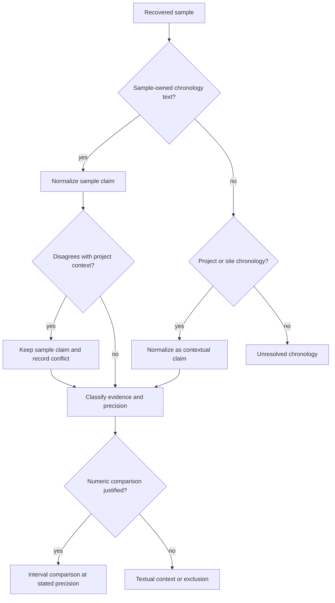

# Chronology evidence

Chronology records what the source says about a sample's age, how that wording
was interpreted, and how precisely it may be compared with other evidence. A
numeric value is not automatically a precise sample date: it may describe a
project context, a modeled estimate, or a broad interval.

Bijux Pollenomics therefore keeps three questions separate:

1. **What was reported?** The original chronology text and its source locator.
2. **What can be normalized?** A BP point or interval only when the wording and
   dating basis support one.
3. **What comparison is safe?** A precision posture derived from ownership,
   evidence class, and normalization status.

## Sample evidence outranks project context

When a sample-owned date conflicts with a project-level range, the sample claim
remains attached to that sample and the disagreement is explicit. Falling back
to project context is allowed only when the sample row lacks its own
chronology, and the result stays classified as contextual rather than
sample-precise.

## Evidence class and precision

| Precision posture | Typical support | Comparison rule |
| --- | --- | --- |
| `sample_precise_point` | sample-owned numeric point | compare numerically without implying narrower source precision |
| `sample_precise_interval` | sample-owned numeric interval | compare by interval overlap or distance |
| `sample_approximate_or_modeled` | circa wording, model output, or parsed approximate date | numeric comparison requires a visible caveat |
| `contextual_interval` | site- or project-level numeric context | context only; not a sample-owned date |
| `broad_period_only` | textual archaeological or historical period | label-based orientation, not numeric interval comparison |
| `unresolved` | no recovered or trustworthy date claim | no temporal comparison |

The corresponding evidence classes distinguish direct radiocarbon dates,
modeled sample dates, archaeological context dates, broad period labels, and
historical or recent dates. Evidence class describes *what kind of support
exists*; precision posture describes *how that support may be used*.

## The normalized chronology contract

A chronology row preserves:

- stable sample identity and preferred source label;
- original chronology text;
- chronology strength and evidence class;
- precision posture and normalization status;
- provenance artifact, artifact kind, locator, and supporting excerpt;
- `time_start_bp`, `time_end_bp`, and `time_mean_bp` when defensible;
- dating basis, conflict note, and review note.

Normalization status remains `text_only_unparsed` when useful wording cannot
be converted safely, and `unresolved` when no chronology has been recovered.
For numeric values, equal BP bounds represent a point; unequal bounds represent
an interval. Original text remains the authoritative source expression.

## What is never inferred

The chronology pipeline does not assign conventional numeric bounds to a named
period merely to make it sortable. It does not treat a project's overall age
range as the precise age of every sample. It does not erase qualifiers such as
*circa*, modeled, calibrated, historical, or recent.

Those restraints matter in a cross-domain atlas. Two layers can overlap in
space while lacking comparable time support. A pollen sequence with a numeric
BP interval, a SEAD site-inventory point, and an animal sample with a modeled
date must retain their different temporal semantics.

## Auditing chronology lineage

Chronology evidence remains project-owned under
`data/adna/governance/source_library/projects/<project-accession>/`, including
`sample_chronology.json`, `sample_chronology_evidence.json`, and
`sample_chronology_provenance.json`. Cross-project audits expose coverage,
precision, conflicts, and unrecovered dates:

- `data/adna/governance/source_library/project_sample_chronology_review.json`;
- `data/adna/governance/source_library/sample_chronology_precision_audit.json`;
- `data/adna/governance/source_library/sample_chronology_conflict_ledger.json`;
- `data/adna/governance/source_library/date_evidence_gap_queue.json`.

Continue to [temporal semantics](temporal-semantics.md) for cross-source
comparability and to [point publication rules](../publications/point-rules.md)
for the effect of chronology on map admission.
