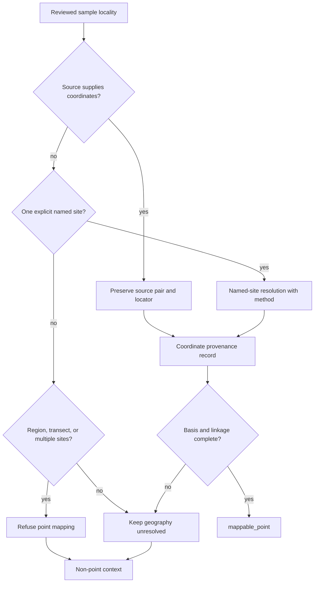
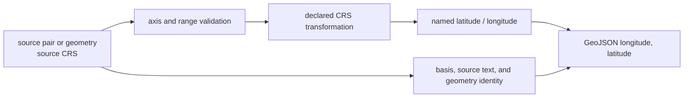
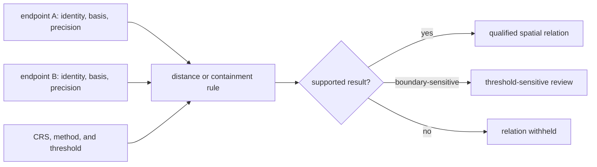

# Coordinate Provenance

A coordinate is a spatial interpretation of locality evidence. It may be
reported directly with a sample, resolved from an explicit named site, or
withheld because the source supports only a region. Bijux Pollenomics records
which of those paths produced—or refused—a point.

This matters because every marker is visually exact. Without provenance, a
regional study extent and a source-published excavation coordinate would look
equally precise on a map.

## Current Evidence Posture

The cross-species map-readiness review currently reports 234 direct
coordinate-backed entries, two indirectly geocoded entries, 21 unresolved
entries, and seven entries refused from mapping. These are readiness units in
the governed species/site review, not a count of all recovered samples: many
samples can share a reviewed locality, and samples without defensible linkage
must not inherit it.

The asymmetry across species is material. Horse accounts for 207 of the direct
entries, goat for 27, while several other species currently have no direct
coordinate-backed entry. The public collection should expose that unevenness
rather than let the strongest species imply equal spatial resolution for all
animal evidence.

## From Locality To Mapping Posture

A region centroid is not a compromise point. It is a different geographic
claim and remains refused from point publication. Likewise, a source that names
multiple caves or a transregional dispersal route cannot be represented by one
marker until sample-to-site evidence separates the component locations.

Point eligibility is conjunctive: identity, locality linkage, coordinate
basis, mapping posture, and product-specific rules must all pass. Confidence
cannot compensate for a missing link earlier in the chain.

## Confidence Is Not Decimal Precision

| Confidence | Coordinate basis | Public interpretation |
| --- | --- | --- |
| `exact` | direct published coordinates or an explicit archive pair | source-backed point at the reported resolution |
| `approximate` | one explicit named place resolved through a documented method | cautious named-site point; not a source-supplied pair |
| `inferred` | indirect derivation | retained for non-public context, not point publication |
| `withheld` | region-only, aggregate, or unresolved geography | no public point |
| `unknown` | basis has not been normalized | no claim of coordinate precision |

`exact` describes provenance, not archaeological certainty to an arbitrary
number of decimal places. `approximate` is allowed only when the named place is
explicit and the resolution method remains visible. A mapping posture of
`mappable_point` is still required for either confidence class to publish.

The display should preserve that distinction. An approximate named-site
resolution needs a visibly different interpretation from a source-published
pair even if both use the same marker geometry. Decimal formatting must not
suggest more precision than the source or resolution method supports.

## Point Geometry Is Not The Observation

A point is a representation chosen for a product. The underlying observation
may be a specimen, core, archaeological site, registry feature, field visit, or
resolved place name. Those units cannot be merged merely because each has a
latitude and longitude.

| Point owner | What the pair locates | Common overreading |
| --- | --- | --- |
| sample | source-backed or reviewed sample locality | exact excavation position when only a site anchor is known |
| pollen sequence | sampling or core location as supplied by its source | uniform temporal coverage across sequences |
| archaeological site | site or registry feature | a dated event or direct biological observation |
| density cell | an aggregate spatial unit | one site at the cell centroid |
| field observation | one recorded visit or sample event | representative coverage of the surrounding lake or region |

Distance and containment operate on the represented geometry; scientific
interpretation operates on the observation and its role. Both identities must
remain available.

## The coordinate record

Each animal coordinate-provenance row preserves:

- project accession, species, and site label;
- original and resolved place text;
- source artifact path and locator;
- coordinate basis and mapping posture;
- latitude and longitude as source-preserving text;
- resolution method and gazetteer or curated anchor;
- confidence class and rationale;
- paper or supplement linkage;
- associated chronology and interpretation notes;
- an explicit support-gap note when point publication is refused.

For samples whose own supplementary rows contain coordinates, the sample
lineage supplies the coordinate basis directly. For broader project leads,
coordinate provenance remains a separate reviewed record so a project-level
anchor cannot silently become sample-level geography.

## Coordinate Reuse Contract

A downstream export that retains latitude and longitude but drops their basis
has converted reviewed evidence into unexplained geometry. Reuse should retain:

| Required field | Question it preserves |
| --- | --- |
| governing sample or site ID | Which observation owns this point? |
| original and resolved place text | What place was reported and what was interpreted? |
| source artifact and locator | Where is the supporting statement or pair? |
| coordinate basis and method | Was the point supplied, curated, or resolved? |
| confidence and mapping posture | May it appear as a point, and with what qualification? |
| spatial precision or caveat | How narrowly may distance or containment be interpreted? |
| product and admission decision | Why is the point visible in this scope? |

Coordinate reference conversion and decimal formatting may change
representation, but they must not change basis, confidence, or supported
precision. A transformed pair remains the same governed spatial claim only
when its lineage to the original pair is retained.

### Axis, Range, And Reference-System Contract

Coordinate serialization has two conventions that must not be confused:

| Surface | Order |
| --- | --- |
| named record fields and human-readable tables | latitude, then longitude |
| GeoJSON coordinate arrays | longitude, then latitude |

The normalized animal pair is accepted only when both values are present,
latitude lies within `-90..90`, and longitude lies within `-180..180`. The
source text is retained beside the numeric representation so parsing and
rounding remain inspectable.

Reference-system conversion is a separate lineage event. For example, the
SVAR collector transforms source geometry from EPSG:3006 to EPSG:4326 before
publication. That operation changes coordinate representation, not lake
identity, source geometry ownership, or sampling suitability. A reusable
transformation therefore retains source CRS, target CRS, method, source
geometry identity, and any rounding applied.

## Spatial Relations Are Derived Claims

A distance, containment result, or nearest-neighbour label is not stored truth
about either endpoint. It is a derived claim whose lineage includes both
coordinates and the operation applied to them:

The result cannot be more precise than its weakest endpoint. A 20 km band
around a registry representative point and an approximate named-site point is
a qualified proximity test, not an exact statement about the physical
distance between a coring location and a specimen. When coordinate uncertainty
could change threshold membership, the result is boundary-sensitive rather
than simply inside or outside.

Every reusable spatial relation should retain:

- both governing endpoint identities;
- each coordinate basis, confidence, and supported precision;
- the coordinate reference system and distance or containment method;
- the threshold, band, or polygon snapshot used; and
- whether uncertainty can change the classification.

Recomputing that relation after either endpoint changes is required. Copying a
previous distance into a revised product would preserve a number while losing
the claim that made it meaningful.

### Classify Coordinate Changes

| Change | Scientific interpretation |
| --- | --- |
| formatting or numeric type only | representation change if numeric meaning is identical |
| axis-order correction | geometry correction; recompute containment, distance, and membership |
| declared CRS transformation | representation change only when the full transform lineage is retained |
| new source-backed pair replaces geocoding | evidence-strength and geometry change |
| site anchor changes after locality review | locality-linked geometry change; reassess admission |
| precision or confidence becomes weaker | interpretation change even if the numeric pair is unchanged |

An unchanged marker is not proof of an unchanged spatial claim. Basis,
confidence, locality ownership, and boundary snapshot can change the meaning
or eligibility of the same pair.

## Why Points Are Withheld

Common refusal conditions include:

- only a country, basin, region, or cultural area is supported;
- one recovered row still aggregates multiple named sites;
- the paper describes a transect or dispersal extent rather than a sample site;
- a site name is present but the sample-to-site linkage is unresolved;
- an apparent coordinate lacks its source locator or resolution rationale.

Withholding does not delete the evidence. The region or named places remain in
the curation and review surfaces, where they can support broader context and
identify the missing source work needed for a future point.

### Spatial representations by support

| Supported claim | Defensible representation |
| --- | --- |
| source-backed sample or site coordinate | point, with basis and confidence available |
| one explicit place resolved approximately | qualified point when product rules allow it |
| region, basin, country, or transect | polygon, aggregate, label, or non-point context |
| multiple unresolved candidate sites | review surface, never one synthesized point |
| no defensible geography | explicit exclusion or unresolved count |

## Read A Distance Carefully

Distance is derived from geometry, so its usefulness is bounded by both
endpoints. An exact lake centroid and an approximate named-site point produce
an approximate distance relation. A region-only sample has no defensible point
distance even if a centroid is technically available. Ranking and proximity
views should carry endpoint identity, basis, precision, distance method, and
the threshold or band used.

## Auditing A Mapped Sample

The species-owned record is
`data/adna/species/<species-slug>/normalized/coordinate_provenance.json`.
Compare its sample and locality linkage with `sample_sites.json`, then inspect
the cross-species review surfaces:

- `data/adna/governance/coordinate_caveat_surface.json` groups direct,
  place-resolved, and still-weak geography;
- `data/adna/governance/cross_species_map_readiness.json` reports publication
  readiness across animal species;
- `data/adna/governance/unresolved_site_ledger.json` and
  `overbroad_site_ledger.json` expose geography that cannot support a point.

Read [locality evidence](localities.md) when the underlying place claim is in
question, and [point publication rules](../publications/point-rules.md) for the
full admission boundary.
