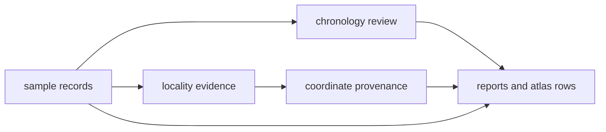

# Evidence

This section explains how an animal ancient DNA claim becomes evidence that can
actually be checked inside the repository.

The public question is usually simple: why is this sample, locality, date, or
point shown here at all. The answer is not stored in one file. It is spread
across sample records, locality evidence, chronology review, and coordinate
provenance.

Use this section when your question sounds like one of these:

- why is this point allowed to appear publicly
- how strong is the place or date claim behind this record
- where should I look when the map feels cleaner than the evidence probably is
- what kind of support stands behind one country row or atlas point

## The Evidence Chain

## Start Here

- [Sample records](sample-records.md) for sample identity and lineage
- [Localities](localities.md) for site-level place claims
- [Chronology](chronology.md) for date evidence and normalization status
- [Temporal semantics](temporal-semantics.md) for cross-family comparison
  posture and uncertainty
- [Coordinates](coordinates.md) for why a row maps as a point or stays blocked

## What This Section Helps You Judge

- whether a visible record is strong because the evidence is strong or only
  because the presentation is smooth
- whether a challenge belongs at sample level, locality level, chronology
  level, or coordinate level
- whether the current public output is direct evidence, cautious projection, or
  still too weak for exact publication

## A Practical Reading Order

- start with sample records when the identity or project lineage is unclear
- move to localities when the place claim seems too broad or too confident
- move to chronology when the date language looks cleaner than the source
  probably was
- move to coordinates when the map precision itself is the question

The important rule is that the visible point is not the beginning of the
argument. It is the downstream result of these narrower evidence decisions.

## The Key Principle

No visible point or country row should outrank the evidence chain behind it.
If a record appears publicly, the sample, locality, date, and coordinate basis
should still be traceable in the tracked files.
