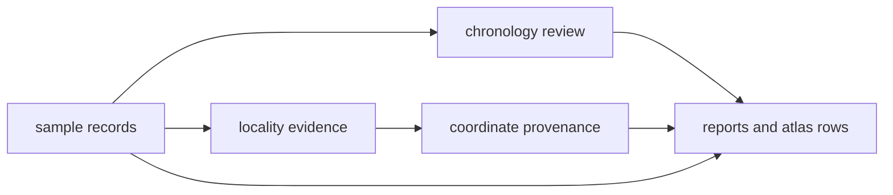

# Evidence

This section explains how ancient DNA claims become reviewable evidence inside
the repository.

The public-facing question is usually simple: why is this sample, locality,
date, or point shown here at all? The answer is not stored in one file. It is
spread across sample records, locality evidence, chronology review, and
coordinate provenance.

## The Evidence Chain

## Start Here

- [Sample records](sample-records.md) for sample identity and lineage
- [Localities](localities.md) for site-level place claims
- [Chronology](chronology.md) for date evidence and normalization status
- [Temporal semantics](temporal-semantics.md) for cross-family comparison posture and uncertainty
- [Coordinates](coordinates.md) for why a row maps as a point or stays blocked

## Reader Rule

No visible point or country row should outrank the evidence chain behind it.
If a record appears publicly, the sample, locality, date, and coordinate basis
should still be traceable in the tracked files.
