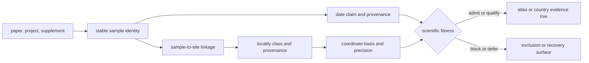
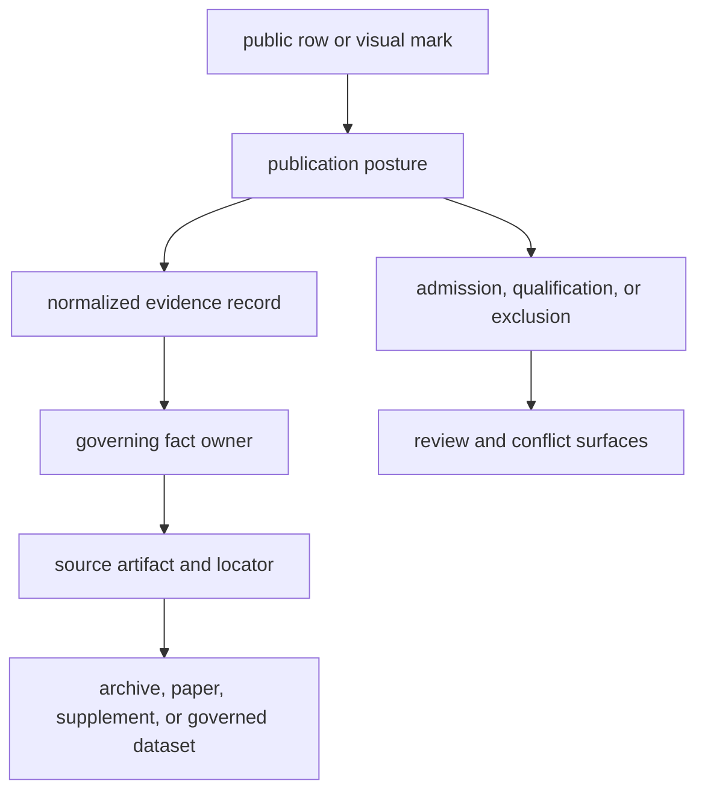

# Evidence Chain

Evidence in Pollenomics is a linked set of claims, not a single confidence
label. A public row can involve source identity, record identity, place, time,
coordinates, scientific role, and publication eligibility. Each claim keeps
its own provenance and precision.

This model serves two kinds of reader at once. A scientific reader can see
what a plotted or summarized record means. An auditor can follow the same row
back through its governing surface, source locator, transformation, caveat,
and admission decision.

## Trust model

Four invariants govern the evidence chain:

1. **Authority is scoped.** Project records govern project facts; sample
   records govern sample facts; aggregates summarize but do not replace them.
2. **Transformation cannot strengthen evidence.** Normalization may make a
   supported claim comparable, but cannot invent finer place, time, or identity
   resolution.
3. **Joins require evidence.** Shared labels, proximity, and convenient project
   context are not sufficient linkage on their own.
4. **Refusal is data.** Unresolved, conflicted, blocked, and deferred outcomes
   remain visible so published coverage is not mistaken for source coverage.

## Cross-Domain Evidence

All source families preserve origin, version, normalization, review, and
publication posture. Their scientific evidence units remain different:

- pollen sources govern sites, sequences, samples, and modelled context;
- archaeology sources govern sites and contextual records;
- SVAR governs hydrographic registry records;
- AADR governs release-versioned human ancient-DNA metadata;
- animal aDNA governs project-, paper-, supplement-, sample-, and site-owned
  evidence; and
- boundaries govern geographic selection, never scientific support.

[Temporal semantics](temporal-semantics.md) explains how time claims from these
families can be compared without pretending they have equal resolution.

## Animal Sample Evidence

Animal aDNA has the deepest explicit chain because a project accession or paper
citation is not enough to justify a sample-level map point.

```mermaid
flowchart LR
    Source["paper, project, supplement"] --> Sample["stable sample identity"]
    Sample --> Site["sample-to-site linkage"]
    Site --> Locality["locality class and provenance"]
    Sample --> Chronology["date claim and provenance"]
    Locality --> Coordinates["coordinate basis and precision"]
    Chronology --> Fitness{"scientific fitness"}
    Coordinates --> Fitness
    Fitness -->|admit or qualify| Point["atlas or country evidence row"]
    Fitness -->|block or defer| Ledger["exclusion or recovery surface"]
```

Every arrow represents a claim that can fail independently. A stable sample
identifier does not prove a site. A named site does not prove coordinates. A
date attached to a project does not automatically belong to every sample.

The final decision is product-specific. A row may be valid evidence for a
regional count, qualified contextual layer, or curation inventory while still
being ineligible for an exact point or time-aware comparison.

## Evidence Dimensions

| Dimension | Governing question | Failure if flattened |
| --- | --- | --- |
| Identity | Which physical or analytical sample does this row represent? | duplicate or conflated samples |
| Lineage | Which project, paper, supplement, table, and source row support it? | unverifiable extraction |
| Locality | Is the place sample-specific, site-specific, regional, substituted, or unresolved? | false geographic precision |
| Chronology | Is the date direct, derived, interval-based, textual, or unresolved? | false temporal precision |
| Coordinates | What created the point and with what confidence? | map marker outranks place evidence |
| Fitness | Is the combined record eligible for the declared publication? | presentation silently strengthens evidence |

## Evidence Joins Are Claims

Joining records is not a neutral formatting operation. Each relationship needs
an identity rule and provenance because a wrong join can create a plausible but
unsupported public point.

| Relationship | Required support | Unsafe shortcut |
| --- | --- | --- |
| project to paper | registry linkage or source-backed publication association | matching by title fragment alone |
| paper to supplement | captured artifact identity and supporting-material manifest | assuming every attachment contains sample rows |
| project to sample | recoverable source label and stable repository identity | treating a project accession as one sample |
| sample to site | sample-owned row, defined group, or explicitly broader locality class | assigning all project samples to the project title's place |
| sample to chronology | sample-owned claim or visibly contextual fallback | copying the project age range to every sample |
| locality to coordinate | declared coordinate source, method, and precision | geocoding a broad region as an exact site |
| evidence row to product | stable identifier and successful product admission | plotting every normalized row |

Conflict and substitution ledgers preserve cases where more than one join is
possible or where a broader relationship is used provisionally. That record is
part of the evidence, not an implementation detail.

## Evidence Outcomes

- **direct** evidence resolves to a sample-owned source location such as a
  supplementary table row;
- **derived** evidence records the transformation and its assumptions;
- **qualified** evidence is usable only with an explicit precision or source
  caveat;
- **conflicted** evidence preserves incompatible claims pending resolution;
- **blocked** evidence fails a known publication requirement; and
- **deferred** evidence awaits source recovery or manual curation.

Blocked and deferred states remain part of the database. Their presence makes
coverage gaps and recovery work measurable.

## Inspect A Claim

1. Begin with the public evidence identifier and publication posture.
2. Resolve the normalized record and governing fact owner.
3. Inspect sample identity and source lineage.
4. Inspect locality and chronology as separate claims.
5. Compare coordinate precision with locality evidence.
6. Read conflicts, caveats, exclusions, and release-gate outcomes.

```mermaid
flowchart TD
    Public["public row or visual mark"] --> Posture["publication posture"]
    Posture --> Normalized["normalized evidence record"]
    Normalized --> Owner["governing fact owner"]
    Owner --> Locator["source artifact and locator"]
    Posture --> Decision["admission, qualification, or exclusion"]
    Decision --> Review["review and conflict surfaces"]
    Locator --> Source["archive, paper, supplement, or governed dataset"]
```

Start from the public artifact when checking a visible claim. Start from the
governing fact owner when checking collection completeness or curation state.
Those directions meet at the normalized evidence record, but they answer
different questions.

The relevant references are [sample records](sample-records.md),
[localities](localities.md), [chronology](chronology.md), and
[coordinates](coordinates.md).
