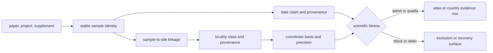

# Evidence Chain

Evidence in Pollenomics is a linked set of claims, not a single confidence
label. A public row can involve source identity, record identity, place, time,
coordinates, scientific role, and publication eligibility. Each claim keeps
its own provenance and precision.

## Cross-Domain Evidence

All source families preserve origin, version, normalization, review, and
publication posture. Their scientific evidence units remain different:

- pollen sources govern sites, sequences, samples, and modelled context;
- archaeology sources govern sites and contextual records;
- SVAR governs hydrographic registry records;
- AADR governs release-versioned human ancient-DNA metadata;
- animal aDNA governs project-, paper-, supplement-, sample-, and site-owned
  evidence; and
- boundaries govern geographic selection, never scientific support.

[Temporal semantics](temporal-semantics.md) explains how time claims from these
families can be compared without pretending they have equal resolution.

## Animal Sample Evidence

Animal aDNA has the deepest explicit chain because a project accession or paper
citation is not enough to justify a sample-level map point.

```mermaid
flowchart LR
    Source["paper, project, supplement"] --> Sample["stable sample identity"]
    Sample --> Site["sample-to-site linkage"]
    Site --> Locality["locality class and provenance"]
    Sample --> Chronology["date claim and provenance"]
    Locality --> Coordinates["coordinate basis and precision"]
    Chronology --> Fitness{"scientific fitness"}
    Coordinates --> Fitness
    Fitness -->|admit or qualify| Point["atlas or country evidence row"]
    Fitness -->|block or defer| Ledger["exclusion or recovery surface"]
```

Every arrow represents a claim that can fail independently. A stable sample
identifier does not prove a site. A named site does not prove coordinates. A
date attached to a project does not automatically belong to every sample.

## Evidence Dimensions

| Dimension | Governing question | Failure if flattened |
| --- | --- | --- |
| Identity | Which physical or analytical sample does this row represent? | duplicate or conflated samples |
| Lineage | Which project, paper, supplement, table, and source row support it? | unverifiable extraction |
| Locality | Is the place sample-specific, site-specific, regional, substituted, or unresolved? | false geographic precision |
| Chronology | Is the date direct, derived, interval-based, textual, or unresolved? | false temporal precision |
| Coordinates | What created the point and with what confidence? | map marker outranks place evidence |
| Fitness | Is the combined record eligible for the declared publication? | presentation silently strengthens evidence |

## Evidence Outcomes

- **direct** evidence resolves to a sample-owned source location such as a
  supplementary table row;
- **derived** evidence records the transformation and its assumptions;
- **qualified** evidence is usable only with an explicit precision or source
  caveat;
- **conflicted** evidence preserves incompatible claims pending resolution;
- **blocked** evidence fails a known publication requirement; and
- **deferred** evidence awaits source recovery or manual curation.

Blocked and deferred states remain part of the database. Their presence makes
coverage gaps and recovery work measurable.

## Inspect A Claim

1. Begin with the public evidence identifier and publication posture.
2. Resolve the normalized record and governing fact owner.
3. Inspect sample identity and source lineage.
4. Inspect locality and chronology as separate claims.
5. Compare coordinate precision with locality evidence.
6. Read conflicts, caveats, exclusions, and release-gate outcomes.

The relevant references are [sample records](sample-records.md),
[localities](localities.md), [chronology](chronology.md), and
[coordinates](coordinates.md).
