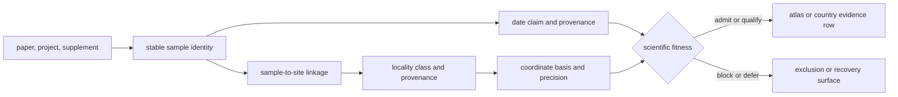
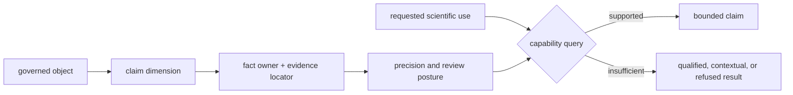
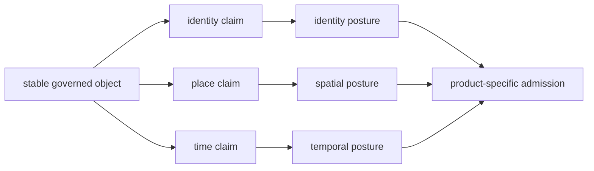
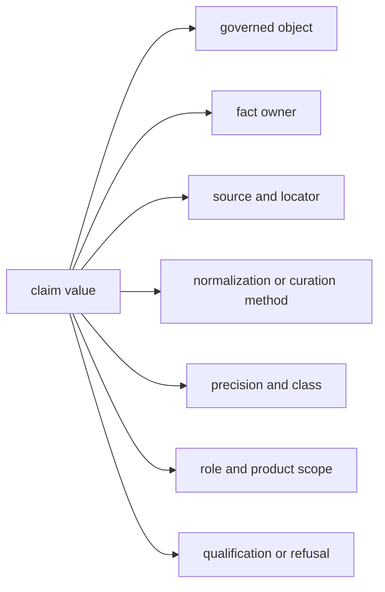
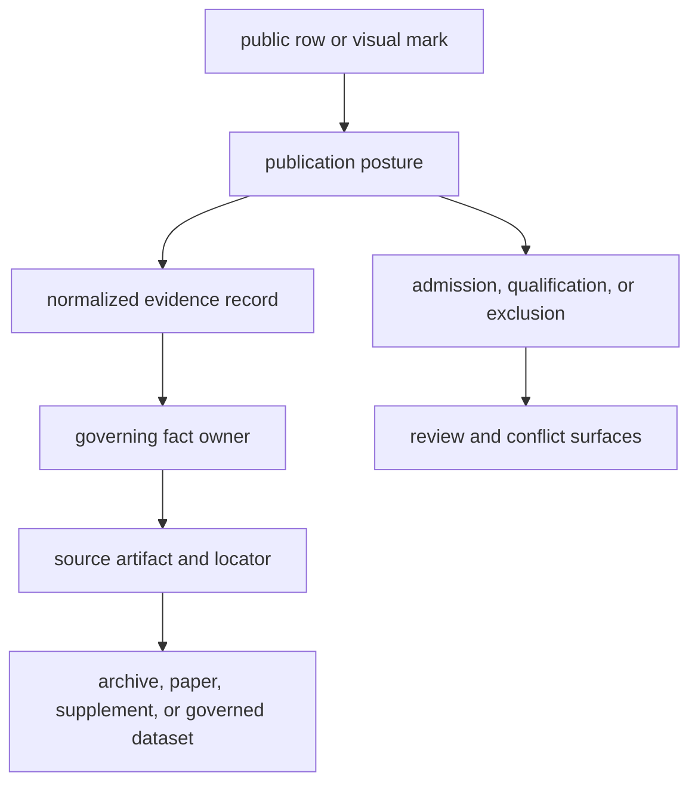

# Evidence Chain

Evidence in Pollenomics is a linked set of claims, not a single confidence
label. A public row can involve source identity, record identity, place, time,
coordinates, scientific role, and publication eligibility. Each claim keeps
its own provenance and precision.

This model serves two kinds of reader at once. A scientific reader can see
what a plotted or summarized record means. An auditor can follow the same row
back through its governing surface, source locator, transformation, caveat,
and admission decision.

## Trust Model

Four invariants govern the evidence chain:

1. **Authority is scoped.** Project records govern project facts; sample
   records govern sample facts; aggregates summarize but do not replace them.
2. **Transformation cannot strengthen evidence.** Normalization may make a
   supported claim comparable, but cannot invent finer place, time, or identity
   resolution.
3. **Joins require evidence.** Shared labels, proximity, and convenient project
   context are not sufficient linkage on their own.
4. **Refusal is data.** Unresolved, conflicted, blocked, and deferred outcomes
   remain visible so published coverage is not mistaken for source coverage.

## Cross-Domain Evidence

All source families preserve origin, version, normalization, review, and
publication posture. Their scientific evidence units remain different:

- pollen sources govern sites, sequences, samples, and modelled context;
- archaeology sources govern sites and contextual records;
- SVAR governs hydrographic registry records;
- AADR governs release-versioned human ancient-DNA metadata;
- animal aDNA governs project-, paper-, supplement-, sample-, and site-owned
  evidence; and
- boundaries govern geographic selection, never scientific support.

[Temporal semantics](temporal-semantics.md) explains how time claims from these
families can be compared without pretending they have equal resolution.

## Animal Sample Evidence

Animal aDNA has the deepest explicit chain because a project accession or paper
citation is not enough to justify a sample-level map point.

```mermaid
flowchart LR
    Source["paper, project, supplement"] --> Sample["stable sample identity"]
    Sample --> Site["sample-to-site linkage"]
    Site --> Locality["locality class and provenance"]
    Sample --> Chronology["date claim and provenance"]
    Locality --> Coordinates["coordinate basis and precision"]
    Chronology --> Fitness{"scientific fitness"}
    Coordinates --> Fitness
    Fitness -->|admit or qualify| Point["atlas or country evidence row"]
    Fitness -->|block or defer| Ledger["exclusion or recovery surface"]
```

Every arrow represents a claim that can fail independently. A stable sample
identifier does not prove a site. A named site does not prove coordinates. A
date attached to a project does not automatically belong to every sample.

The final decision is product-specific. A row may be valid evidence for a
regional count, qualified contextual layer, or curation inventory while still
being ineligible for an exact point or time-aware comparison.

## Evidence Dimensions

| Dimension | Governing question | Failure if flattened |
| --- | --- | --- |
| Identity | Which physical or analytical sample does this row represent? | duplicate or conflated samples |
| Lineage | Which project, paper, supplement, table, and source row support it? | unverifiable extraction |
| Locality | Is the place sample-specific, site-specific, regional, substituted, or unresolved? | false geographic precision |
| Chronology | Is the date direct, derived, interval-based, textual, or unresolved? | false temporal precision |
| Coordinates | What created the point and with what confidence? | map marker outranks place evidence |
| Fitness | Is the combined record eligible for the declared publication? | presentation silently strengthens evidence |

## Minimum Evidence Depends On The Claim

There is no universal “complete record.” Completeness is evaluated against the
claim being made:

| Proposed use | Minimum governing evidence | A valid record can still be ineligible when… |
| --- | --- | --- |
| source inventory | stable source-native identity and capture lineage | the source row cannot be distinguished or recovered |
| sample inventory | resolved sample identity and project lineage | only a project accession or unlinked paper label is known |
| named-site summary | sample-to-site evidence and locality class | place exists only at project or regional scope |
| exact point map | sample-owned locality plus source-backed or verified site coordinates | a coordinate is inferred, substituted, or broader than the locality claim |
| numeric temporal comparison | comparable numeric interval, dating basis, precision posture, and overlap rule | time is textual, contextual, unresolved, or measured under an incompatible contract |
| cross-domain association | eligible records from both domains plus explicit spatial and temporal bridges | proximity is available but chronology or evidence role is not comparable |

The required dimensions are conjunctive. Exact coordinates do not compensate
for unresolved sample identity; a direct date does not compensate for a
project-only locality; strong evidence in one domain does not upgrade a
contextual source in another.

## Evidence Capability Is A Query

Evidence capability is evaluated for a particular object, claim, and use. It
is not inherited from the source family or summarized by the number of filled
columns.

```mermaid
flowchart LR
    Object["governed object"] --> Claim["claim dimension"]
    Claim --> Owner["fact owner + evidence locator"]
    Owner --> Posture["precision and review posture"]
    Use["requested scientific use"] --> Gate{"capability query"}
    Posture --> Gate
    Gate -->|supported| Result["bounded claim"]
    Gate -->|insufficient| Refusal["qualified, contextual, or refused result"]
```

This means “has coordinates” is not a sufficient query. The database asks
whether the governed subject owns the locality, how the pair was produced,
what precision it supports, and whether that posture satisfies the requested
product. Equivalent queries apply to identity, chronology, taxonomy, and
cross-domain association.

## Claim Envelope

A reusable claim must retain enough context to survive outside the page where
it was first seen:

| Envelope field | Why it is indispensable |
| --- | --- |
| governed object ID | identifies the sample, site, source record, or product member without relying on a label |
| fact owner | identifies the record authorized to define the disputed value |
| source family and locator | leads to the captured upstream object and exact supporting location |
| reported value | preserves what the source expressed before repository interpretation |
| normalized value and method | makes comparison possible without hiding transformation |
| precision and evidence class | bounds spatial, temporal, taxonomic, or identity strength |
| role and product scope | explains what the record contributes and where it was admitted |
| qualification or refusal | prevents missing or conflicted evidence from disappearing in reuse |

The envelope is intentionally larger than a popup or CSV cell. Compact views
may point to it, but downstream reuse that drops these fields cannot retain the
same evidential claim.

### Claims Are Addressable Database Objects

A claim is identified by its governed subject, fact type, source or decision
identity, and revision—not by the current displayed value. This allows two
supported values to remain in conflict without overwriting one another and
allows a later decision to change posture without erasing the evidence that
was reviewed.

| Claim member | Database responsibility |
| --- | --- |
| subject identity | binds the claim to one typed sample, site, source member, or product |
| fact type | distinguishes identity, locality, chronology, coordinate, taxon, role, and membership claims |
| assertion identity | keeps several source statements or curated interpretations separately addressable |
| evidence locator | recovers the captured statement or deterministic inputs |
| normalized representation | enables comparison while retaining source wording and method |
| decision state | records acceptance, qualification, conflict, refusal, or unresolved posture |
| supersession relation | explains which later claim or decision replaced an earlier interpretation and why |

Supersession is not deletion. Historical values remain attributable to the
database revision and evidence that supported them; current products select
only the posture accepted by their own contracts.

### A Decision Is Scoped To One Claim

Evidence posture belongs to the pair of claim and intended use, not to the
record as a whole:

| Governed object | Claim under review | Possible decision without changing object identity |
| --- | --- | --- |
| animal sample | labels identify one recovered analytical unit | final identity, ambiguity, merge, split, or refusal |
| animal sample | locality is sample-owned at named-site precision | accepted named site, qualified regional claim, substitution, or unresolved |
| animal sample | chronology supports numeric comparison | comparable interval, text-only time, contextual range, conflict, or unknown |
| locality | geometry represents the supported place precision | exact, approximate, substituted, region-only, withheld, or refused point |
| evidence row | claim is fit for one publication | admitted, qualified, excluded, deferred, or out of scope |

```mermaid
flowchart LR
    Object["stable governed object"] --> IdentityClaim["identity claim"]
    Object --> PlaceClaim["place claim"]
    Object --> TimeClaim["time claim"]
    IdentityClaim --> IdentityDecision["identity posture"]
    PlaceClaim --> PlaceDecision["spatial posture"]
    TimeClaim --> TimeDecision["temporal posture"]
    IdentityDecision --> Admission["product-specific admission"]
    PlaceDecision --> Admission
    TimeDecision --> Admission
```

This model supports partial but honest records. A sample does not become
globally “low quality” because one chronology is unresolved, and it does not
become universally publishable because its identity and coordinates are
strong.

```mermaid
flowchart LR
    Claim["claim value"] --> Object["governed object"]
    Claim --> Owner["fact owner"]
    Claim --> Source["source and locator"]
    Claim --> Method["normalization or curation method"]
    Claim --> Precision["precision and class"]
    Claim --> Scope["role and product scope"]
    Claim --> Limit["qualification or refusal"]
```

## Evidence Joins Are Claims

Joining records is not a neutral formatting operation. Each relationship needs
an identity rule and provenance because a wrong join can create a plausible but
unsupported public point.

| Relationship | Required support | Unsafe shortcut |
| --- | --- | --- |
| project to paper | registry linkage or source-backed publication association | matching by title fragment alone |
| paper to supplement | captured artifact identity and supporting-material manifest | assuming every attachment contains sample rows |
| project to sample | recoverable source label and stable repository identity | treating a project accession as one sample |
| sample to site | sample-owned row, defined group, or explicitly broader locality class | assigning all project samples to the project title's place |
| sample to chronology | sample-owned claim or visibly contextual fallback | copying the project age range to every sample |
| locality to coordinate | declared coordinate source, method, and precision | geocoding a broad region as an exact site |
| evidence row to product | stable identifier and successful product admission | plotting every normalized row |

Conflict and substitution ledgers preserve cases where more than one join is
possible or where a broader relationship is used provisionally. That record is
part of the evidence, not an implementation detail.

## Evidence Outcomes

- **direct** evidence resolves to a sample-owned source location such as a
  supplementary table row;
- **derived** evidence records the transformation and its assumptions;
- **qualified** evidence is usable only with an explicit precision or source
  caveat;
- **conflicted** evidence preserves incompatible claims pending resolution;
- **blocked** evidence fails a known publication requirement; and
- **deferred** evidence awaits source recovery or manual curation.

Blocked and deferred states remain part of the database. Their presence makes
coverage gaps and recovery work measurable.

An evidence-chain summary should therefore report at least three quantities:
the known candidate population, the population for which the required chain
was evaluated, and the population that passed the declared use. Omitting the
first hides discovery coverage; omitting the second hides curation coverage;
omitting the third hides publication selectivity.

Evidence strength is bounded by the weakest claim needed for the proposed
use. Strong identity does not repair unresolved locality; exact coordinates do
not repair uncertain ownership; complete lineage does not create chronology;
and admission to one product does not establish fitness for another.

## Inspect A Claim

1. Begin with the public evidence identifier and publication posture.
2. Resolve the normalized record and governing fact owner.
3. Inspect sample identity and source lineage.
4. Inspect locality and chronology as separate claims.
5. Compare coordinate precision with locality evidence.
6. Read conflicts, caveats, exclusions, and release-gate outcomes.

```mermaid
flowchart TD
    Public["public row or visual mark"] --> Posture["publication posture"]
    Posture --> Normalized["normalized evidence record"]
    Normalized --> Owner["governing fact owner"]
    Owner --> Locator["source artifact and locator"]
    Posture --> Decision["admission, qualification, or exclusion"]
    Decision --> Review["review and conflict surfaces"]
    Locator --> Source["archive, paper, supplement, or governed dataset"]
```

Start from the public artifact when checking a visible claim. Start from the
governing fact owner when checking collection completeness or curation state.
Those directions meet at the normalized evidence record, but they answer
different questions.

The relevant references are [sample records](sample-records.md),
[localities](localities.md), [chronology](chronology.md), and
[coordinates](coordinates.md). The [object and relation model](../database/object-and-relation-model.md)
defines the typed identities used throughout the chain.
