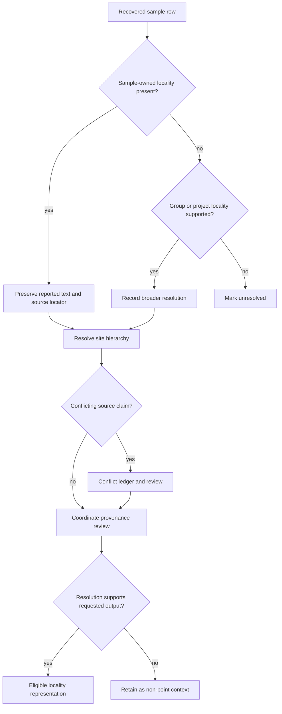

# Locality evidence

Locality is a claim about where a particular sample came from. A country, a
project-wide region, a named archaeological site, and a coordinate pair carry
different precision. Bijux Pollenomics records those distinctions before a
sample can enter a spatial product.

The decisive question is not whether a place name appears somewhere in a
paper. It is whether captured evidence connects that place to the sample at the
resolution being published.

## Resolution classes

| Resolution | Meaning | Safe public use |
| --- | --- | --- |
| `direct_sample_site` | the recovered sample row names its site | site-level review; point mapping still requires coordinate provenance |
| `sample_group_site` | a defined sample group is tied to one site | group-level site context with the grouping visible |
| `project_level_site_only` | the project has a site, but the individual sample does not | project context, not a sample-owned point |
| `named_place_inferred` | evidence supports a named place through an explicit inference | cautious locality context with inference disclosed |
| `region_only` | only a broad area is supported | regional summary or non-point representation |
| `unresolved` | no defensible locality assignment exists | curation record only |

These classes prevent a project title or abstract from assigning every sample
to the same excavation site. They also keep a regional statement from becoming
an exact-looking coordinate through geocoding alone.

## Evidence precedence

Sample-owned evidence takes precedence over a broader project description for
that sample. The broader statement is not discarded: it remains contextual
evidence and, when it disagrees, appears in the locality conflict ledger. This
preserves both source claims without allowing the less specific one to erase
the more specific one.

## What a locality record preserves

The sample-site record joins identity and place evidence without collapsing
them. Its principal fields include:

- stable sample identifier and preferred source label;
- reported `locality_text` and `locality_resolution_status`;
- source artifact path, artifact kind, locator, and supporting text;
- site, municipality, region, country, and broader-geography components;
- coordinate basis, mapping posture, and coordinate confidence;
- chronology wording attached to the same recovered row;
- a review note describing whether the locality is sample-owned or inherited
  from broader context.

Standardized hierarchy fields support search, grouping, and country bundles.
They do not replace the reported place text. A normalization dictionary can
join spelling variants, while the original wording remains available for
audit.

## Conflicts and substitutions

A locality conflict exists when two captured surfaces assign incompatible
places or scopes to the same sample. For example, a supplementary sample table
may name an excavation site while article-level prose describes the project's
broader cultural or geographic context. The repository keeps the sample-owned
site for the sample and records the broader claim, its locator, and the reason
for the disagreement.

Project-level substitution is never silent. If sample-level locality is absent,
the resulting row retains a broader resolution status and cannot pass as a
direct sample site. Manual-curation queues identify the exact sample and
missing source field needed to improve that posture.

## Auditing locality lineage

For one species, begin with
`data/adna/species/<species-slug>/normalized/site_evidence.json`. The row's
project and sample linkage leads to the project-owned `sample_sites.json` and
`sample_locality_evidence.json` under
`data/adna/governance/source_library/projects/<project-accession>/`.
Cross-project coverage and conflicts are summarized in:

- `data/adna/governance/source_library/project_sample_site_review.json`;
- `data/adna/governance/source_library/sample_locality_conflict_ledger.json`;
- `data/adna/governance/source_library/project_locality_substitution_ledger.json`;
- `data/adna/governance/source_library/sample_site_manual_curation_queue.json`.

A resolved locality is necessary but not sufficient for point publication.
Continue to [coordinate provenance](coordinates.md) to see how a place claim
becomes—or deliberately does not become—a coordinate. Return to
[sample records](sample-records.md) when the identity linkage itself is
uncertain.
