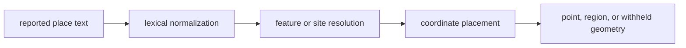
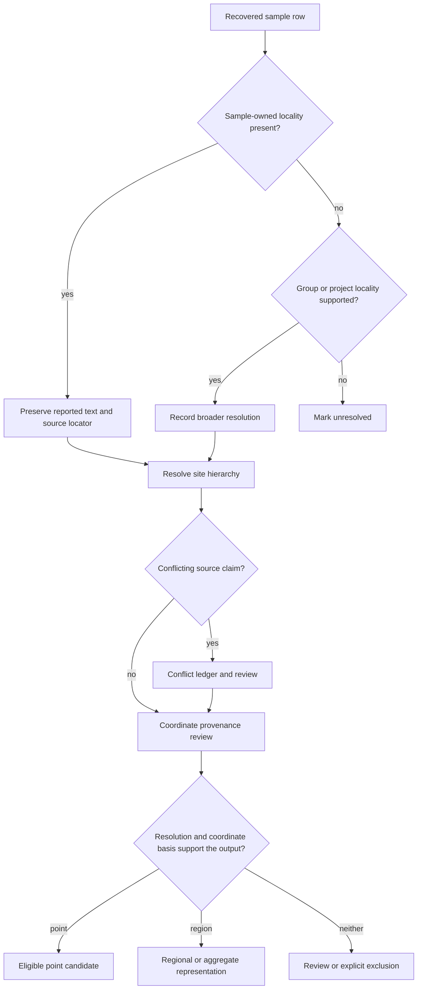
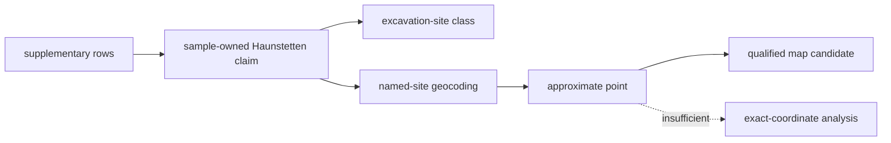

# Locality evidence

Locality is a claim about where a particular sample came from. A country, a
project-wide region, a named archaeological site, and a coordinate pair carry
different precision. Bijux Pollenomics records those distinctions before a
sample can enter a spatial product.

The decisive question is not whether a place name appears somewhere in a
paper. It is whether captured evidence connects that place to the sample at the
resolution being published.

## Current Evidence Posture

Of 868 governed animal sample rows, 820 carry a direct sample-site assignment.
The remaining 48 do not: 32 have region-only context and 16 remain unresolved.
No current row is promoted through a sample-group, project-only, or inferred
named-place assignment. These counts describe locality linkage, not coordinate
quality; even a direct site still needs independent coordinate provenance
before it can become a point.

The repository records three related but non-interchangeable dimensions:

| Dimension | Example values | Question answered |
| --- | --- | --- |
| Resolution status | `direct_sample_site`, `region_only`, `unresolved` | how tightly is place linked to this sample? |
| Locality class | excavation site, municipality, country, broader locality | what kind of place does the source describe? |
| Mapping posture | mappable point or contextual/non-point use | what spatial representation is defensible? |

A named excavation site can be directly linked yet still lack point-quality
coordinates. Conversely, a coordinate resolved from project context does not
become sample-owned merely because it is numeric.

## Four Spatial Operations Stay Separate

Place processing contains four decisions that are often collapsed into
“geocoding”:

| Operation | Allowed change | Evidence it cannot create |
| --- | --- | --- |
| preserve reported text | retain spelling, language, punctuation, and source locator | standardized site identity |
| lexical normalization | make variants searchable and comparable | proof that two names refer to one place |
| feature resolution | link text to a named site or administrative feature with a documented method | sample ownership of that place |
| coordinate placement | attach supplied, verified, or explicitly approximate geometry | finer locality resolution than the source supports |
| publication representation | choose point, aggregate, region, or no geometry | stronger coordinate or locality evidence |

This separation protects homonyms and repeated site names. Two records can
share normalized text without sharing an identity, and one archaeological site
can legitimately have several coordinate candidates. The stable locality
token, sample link, political context, source locator, and resolution method
decide whether those records may be joined.

## Resolution Classes

| Resolution | Meaning | Safe public use |
| --- | --- | --- |
| `direct_sample_site` | the recovered sample row names its site | site-level review; point mapping still requires coordinate provenance |
| `sample_group_site` | a defined sample group is tied to one site | group-level site context with the grouping visible |
| `project_level_site_only` | the project has a site, but the individual sample does not | project context, not a sample-owned point |
| `named_place_inferred` | evidence supports a named place through an explicit inference | cautious locality context with inference disclosed |
| `region_only` | only a broad area is supported | regional summary or non-point representation |
| `unresolved` | no defensible locality assignment exists | curation record only |

These classes prevent a project title or abstract from assigning every sample
to the same excavation site. They also keep a regional statement from becoming
an exact-looking coordinate through geocoding alone.

## Interpret Place And Point Separately

| Locality evidence | Coordinate evidence | Defensible representation |
| --- | --- | --- |
| direct sample site | source-supplied or verified site coordinate | point with declared basis and precision |
| direct sample site | no defensible coordinate | named site without an invented marker |
| sample-group site | verified group-site coordinate | qualified group-level point or site context |
| project-only site | exact project coordinate | project context, never a sample-owned point |
| named-place inference | documented geocoding result | approximate point only when inference and uncertainty remain visible |
| region only | centroid or representative coordinate | region or aggregate geometry, not a point claim |
| unresolved | any unrelated numeric coordinate | exclusion from spatial publication |

Numeric geometry is therefore downstream of locality ownership. A precise
coordinate cannot upgrade a broader place claim, and a strong locality can
remain non-point evidence when coordinate support is absent.

## Evidence Precedence

Sample-owned evidence takes precedence over a broader project description for
that sample. The broader statement is not discarded: it remains contextual
evidence and, when it disagrees, appears in the locality conflict ledger. This
preserves both source claims without allowing the less specific one to erase
the more specific one.

## What A Locality Record Preserves

The sample-site record joins identity and place evidence without collapsing
them. Its principal fields include:

- stable sample identifier and preferred source label;
- reported `locality_text` and `locality_resolution_status`;
- source artifact path, artifact kind, locator, and supporting text;
- site, municipality, region, country, and broader-geography components;
- coordinate basis, mapping posture, and coordinate confidence;
- chronology wording attached to the same recovered row;
- a review note describing whether the locality is sample-owned or inherited
  from broader context.

Standardized hierarchy fields support search, grouping, and country bundles.
They do not replace the reported place text. A normalization dictionary can
join spelling variants, while the original wording remains available for
audit.

The `geocoding_safe_token` is likewise an aid to resolution, not evidence in
its own right. A successful gazetteer lookup can propose a coordinate, but the
source scope, locality class, coordinate basis, confidence, and review posture
still determine whether that result is publishable.

## Worked Locality Trace

Sample `prjeb22390:cgg_1_017139` illustrates why place and point must be
reviewed separately:

| Question | Governed answer |
| --- | --- |
| What place text belongs to the sample? | `Haunstetten` |
| How is it linked? | `direct_sample_site` from the recovered supplementary rows |
| What kind of place is it? | `excavation_site` |
| How was the point obtained? | `named_site_geocoding` |
| How precise is that point? | `approximate` |

The direct sample-site assignment supports the named locality. It does not
turn a geocoded point into a source-reported excavation coordinate. A map can
publish the point only with its approximate confidence and geocoding basis
visible; an analysis requiring exact sample coordinates must exclude or
separately qualify it.

This trace also shows why correcting the coordinate need not alter the sample
or locality identity. The stable sample and named site can remain unchanged
while the coordinate basis, confidence, or publication posture is revised.

## Conflicts And Substitutions

A locality conflict exists when two captured surfaces assign incompatible
places or scopes to the same sample. For example, a supplementary sample table
may name an excavation site while article-level prose describes the project's
broader cultural or geographic context. The repository keeps the sample-owned
site for the sample and records the broader claim, its locator, and the reason
for the disagreement.

Project-level substitution is never silent. If sample-level locality is absent,
the resulting row retains a broader resolution status and cannot pass as a
direct sample site. Manual-curation queues identify the exact sample and
missing source field needed to improve that posture.

This yields a durable invariant: **normalization may standardize a supported
claim, but it may not increase the claim's resolution**. A region does not
become a site, a site does not become an exact point, and a project context does
not become a sample observation through transformation alone.

## Review Outcome

A locality review ends with both an evidence statement and a spatial-use
statement. For example: “the supplement directly links sample X to named site
Y, but no source-backed coordinate has been recovered; retain site-level
locality and withhold exact-point publication.” This is more informative than
either `resolved` or `missing`, because it identifies what is supported and
what evidence would change the mapping posture.

## Auditing Locality Lineage

For one species, begin with
`data/adna/species/<species-slug>/normalized/site_evidence.json`. The row's
project and sample linkage leads to the project-owned `sample_sites.json` and
`sample_locality_evidence.json` under
`data/adna/governance/source_library/projects/<project-accession>/`.
Cross-project coverage and conflicts are summarized in:

- `data/adna/governance/source_library/project_sample_site_review.json`;
- `data/adna/governance/source_library/sample_locality_conflict_ledger.json`;
- `data/adna/governance/source_library/project_locality_substitution_ledger.json`;
- `data/adna/governance/source_library/sample_site_manual_curation_queue.json`.

A resolved locality is necessary but not sufficient for point publication.
Continue to [coordinate provenance](coordinates.md) to see how a place claim
becomes—or deliberately does not become—a coordinate. Return to
[sample records](sample-records.md) when the identity linkage itself is
uncertain.
