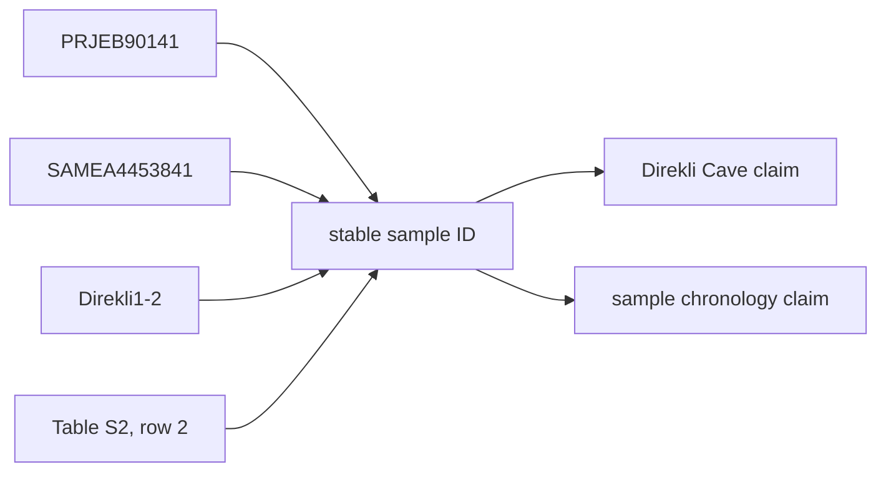
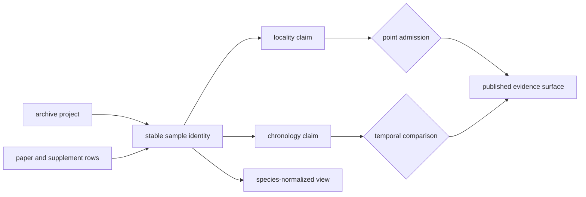
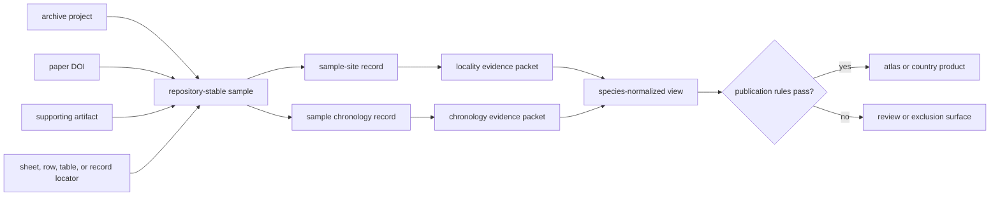

# Sample Records

The durable unit of the animal ancient-DNA database is a repository-stable
sample record. Papers describe studies, archive projects group deposits, and
supplements contain tables; none of those scopes is automatically equivalent
to one physical sample.

A sample record answers **which specimen row is being discussed**. It does not
by itself certify where the specimen came from, when it lived, or whether it
may appear as a map point. Those are separately governed claims joined through
the stable sample identifier.

## Current Evidence Posture

The governed snapshot contains a 894-row sample-foundation truth surface across
10 species and 40 projects. It classifies 502 rows as fully grounded, 256 as
partially grounded, 29 as blocked by missing metadata, four as blocked by
missing location detail, and 103 as blocked by weak chronology.

The project sample-master population contains 868 recovered sample rows across
the same 40 tracked projects. All 868 currently have a final identity
resolution and the identity ambiguity ledger is empty. The two populations
have different curation contracts and are not expected to match row for row.
Neither count proves that every sample deposited by every project has been
recovered. Only four projects currently have a trustworthy expected sample
count, so project completeness remains unknown for most of the collection.

This distinction is intentional:

| Question | Governing signal | What a positive result establishes |
| --- | --- | --- |
| Was a source row recovered? | `recovered_sample_count` | a row exists in the governed sample master |
| How well is the foundation row grounded? | `animal_sample_foundation_truth.json` posture | source preparation is fully grounded, partial, or blocked for a named reason |
| Is its identity usable? | `sample_identity_resolution` | labels resolve to one repository-stable sample |
| Is the project complete? | expected versus final count, with provenance | the recovered set can be measured against a trustworthy expectation |
| Is the sample publishable? | locality, chronology, and coordinate evidence | only the requested public representation is supported |

## Stable Identity

A project sample master assigns a repository-stable identifier and preserves
the labels available from each source surface:

- archive-native sample identifier;
- paper-native sample label;
- supplementary-table sample label;
- preferred display label;
- identity basis and resolution state; and
- ambiguity note when the labels cannot be reconciled safely.

The stable identifier is namespaced by project so identical human-readable
labels in different projects do not collapse into one record.

Identity resolution follows the evidence, not label appearance. Archive,
paper, and supplementary labels remain distinct fields even when they agree.
The preferred label is for display; the repository-stable identifier is the
join key. This prevents punctuation changes, spreadsheet formatting, or a
later preferred-label correction from breaking evidence links.

### Identity Packet

A stable identifier is useful only with the relations that establish what it
identifies. For `capra_hircus:sample:prjeb90141:samea4453841`, the packet
preserves:

| Identity member | Governed value or relation |
| --- | --- |
| object type | animal ancient-DNA sample, distinct from project, paper, site, and point feature |
| species view | `capra_hircus`, a normalized discovery view rather than the extraction authority |
| project namespace | `PRJEB90141`, preventing cross-project label collision |
| source-native identity | archive sample `SAMEA4453841` |
| paper identity | paper label `Direkli1-2` |
| extraction locator | recovered supplementary workbook, Table S2, row 2 |
| identity posture | final, with the archive and paper labels retained as related identities |

The colon-delimited token is an address, not proof by itself. The packet makes
the address defensible and allows a later display-label, locality, chronology,
or publication correction without silently minting another specimen.

### Evidence That Can Establish Identity

Identity evidence is evaluated inside a project and source lineage:

| Evidence | Identity use |
| --- | --- |
| archive-native accession linked to a captured project | strong anchor for the deposited analytical object |
| paper or supplementary label tied to an exact table row | source-backed alias or specimen label |
| explicit table relation between archive and paper labels | evidence that two labels belong to one sample |
| documented one-to-many or many-to-one relation | basis for retaining several analytical IDs or reconciling duplicate source rows |
| preferred display label | presentation only; never the governing join key |

Place, chronology, species expectation, and coordinate proximity may reveal a
possible mismatch, but they cannot prove identity by themselves. Using those
claims to choose an identity and then citing the chosen identity as support
for those same claims would be circular. Unresolved candidates remain in the
ambiguity ledger until label or accession lineage distinguishes them.

### “Sample” Can Name Different Evidence Units

Source ecosystems use *sample* for specimens, subsamples, extracts, libraries,
assays, and archive deposits. Those objects may have one-to-one, one-to-many,
or many-to-one relations. A stable record therefore declares the level it
identifies instead of assuming that every source identifier names the same
physical unit.

| Source identity level | Represents | Required relation when joined |
| --- | --- | --- |
| specimen or physical remain | the material recovered from a context | explicit relation to subsample, extract, or analysis |
| subsample or tissue portion | material taken from a specimen | parent specimen and sampling relation |
| extract or library | laboratory preparation | source material and preparation identity |
| assay or analytical result | one measurement or sequencing event | library or material analyzed and method context |
| archive accession | deposited digital or physical object | declared object type and equivalence evidence |

Equal labels across these levels do not prove equality, and several analytical
identifiers do not necessarily mean several specimens. Counts state their
identity level; merge and split decisions retain the predecessor objects and
the relation used to reconcile them.

## Relational Contract

The sample identifier is the hub of the evidence model, not a container that
turns every linked statement into a sample-owned fact:

This structure enforces four invariants:

- every descendant resolves through the project-namespaced stable identifier;
- source-native labels remain evidence attributes, never cross-project join
  keys;
- locality and chronology can be corrected without minting a new specimen;
- a species view may aggregate governed samples but cannot become their
  identity authority.

One paper row may mention several analytical identifiers, and several source
rows may describe one specimen. The identity decision records that
relationship explicitly. Row count, identifier count, specimen count, and map
point count are therefore different quantities unless a product proves them
equivalent.

## One Sample, Several Record Roles

The database exposes the same governed sample through several record roles.
They are joins over one identity, not interchangeable copies:

| Record role | Owns | Must not become |
| --- | --- | --- |
| captured source row | source wording, row position, and captured values | the repository identity solely because it was encountered first |
| project sample master | stable sample identity, aliases, and extraction lineage | authority for reviewed locality or chronology conclusions |
| dimension evidence row | one locality, chronology, coordinate, or conflict claim | a complete sample record by itself |
| species-normalized row | a discovery and comparison view across projects | extraction authority or a new specimen identity |
| publication member | role and posture inside one product | proof of universal eligibility |

Every descendant carries the project-namespaced sample key. Where a compact
surface cannot carry the full evidence packet, it retains a locator to the
governing record rather than duplicating an unexplained value.

### Database Constraints

| Constraint | Refused state |
| --- | --- |
| a stable sample belongs to one governed project namespace | an unscoped label used as a repository key |
| every alias resolves through evidence to a stable sample or remains ambiguous | spelling similarity used as identity proof |
| locality and chronology attach through separate claim relations | a single denormalized row treated as one indivisible fact |
| species views reference project-owned samples | an aggregate species row minting a replacement identity |
| publication membership references both sample and product | map feature identity used as the sample authority |
| merge and split decisions retain predecessor identities and reasons | silent deletion or reassignment of descendants |

These constraints let the database correct a place, date, preferred label, or
publication decision without changing the specimen identity. They also force
true identity splits and merges to propagate through every dependent relation
instead of being hidden as field edits.

## Identity Change Or Claim Change?

Not every corrected field creates a new sample identity:

| Change | Identity consequence | Downstream consequence |
| --- | --- | --- |
| preferred-label spelling corrected | stable ID remains | update display copies; preserve prior source labels |
| locality or chronology strengthened | stable ID remains | reevaluate the affected claim and product admission |
| two source labels proven to name one specimen | one governing identity with retained aliases and merge evidence | redirect descendants and review duplicate membership |
| one row proven to conflate distinct specimens | split into independently governed identities | reassess every site, chronology, species, and publication relation |
| project assignment corrected | identity reviewed against source lineage | move authority only with explicit sample-to-project evidence |
| source row replaced by a new release | stable ID may remain when equivalence is proven | retain release lineage and review changed fields |

The decisive question is whether the physical or analytical evidence unit
changed, not whether its presentation changed. Merge and split decisions need
their own source locators and cannot be inferred from matching labels or
coordinates.

## Source Lineage

A direct extraction records the source artifact, its kind, an internal locator,
and a short source excerpt. This makes the transformation auditable without
requiring a reader to infer which spreadsheet row produced the record.

## Worked Identity Trace

The governed horse sample `prjeb22390:cgg_1_017139` demonstrates the contract.
Its archive identifier is `CGG_1_017139`; its paper and supplementary display
labels use `Haunstetten 1979` and `Haunstetten_1979`. The stable ID binds those
spellings to one sample while preserving two supplementary locators:
`Sheet1!row204` and `Sheet1!row16` in the captured Science supporting tables.

That identity supports joins; it does not settle the joined claims. The same
sample currently carries a direct Haunstetten locality, approximate geocoded
coordinates, and a sample-owned `1979 BP` chronology. Each has its own evidence
class and publication rule. A reviewer can therefore accept the label
reconciliation while rejecting or revising a coordinate or temporal
interpretation without changing the specimen identity.

## Project Completeness

`project_sample_master_completeness.json` compares expected, recovered,
unresolved, and final sample counts when a trustworthy expectation is
available. It also records the provenance of the expected count and the
project's sample-identifier status.

An unknown expected count is not rewritten as zero. It remains a curation state
such as `not_yet_curated`, with a reason and the artifact needed to resolve it.
This prevents a large recovered table from being mistaken for proven project
completeness.

Completeness denominators are versioned evidence. A later source capture can
establish a trustworthy expected count without changing any recovered sample
identity; the project completeness claim changes because its denominator has
become known. Conversely, a changed expected count requires provenance and a
member comparison even when the final recovered count stays constant.

The same rule applies to arithmetic. `unresolved_sample_count` is meaningful
only when an expected count exists. A null value means the denominator is not
known; it does not mean that no samples are missing.

### Grounding Is Not Completeness

Foundation posture and project completeness answer separate questions. A row
can be fully grounded because its available identity, locality, and chronology
evidence are well traced while the project still lacks a trustworthy expected
sample denominator. Conversely, learning an expected project count does not
strengthen any row's locality or chronology.

| Claim | Required denominator or evidence |
| --- | --- |
| percentage of foundation rows fully grounded | all 894 governed foundation rows |
| percentage of recovered sample identities resolved | all 868 project sample-master rows |
| project recovery completeness | project-specific expected sample population with provenance |
| point publication rate | explicitly defined eligible candidate population and point contract |

These ratios cannot borrow one another's denominators.

## Sample-Owned Claims

The sample master carries the source-facing identity and the raw locality and
chronology text recovered with it. Narrower governed surfaces then evaluate
those claims:

| Surface | Responsibility |
| --- | --- |
| `sample_master.json` | stable identity, labels, lineage, and extracted source text |
| `sample_sites.json` | sample-to-site linkage and site hierarchy |
| `sample_locality_evidence.json` | locality class, resolution, provenance, and mapping posture |
| `sample_chronology_evidence.json` | chronology strength, class, precision, normalization, and provenance |
| species `sample_records.json` | cross-project species view over governed sample evidence |

Separating these surfaces prevents a correction to place or time from changing
sample identity, and prevents species aggregation from becoming the authority
for project-level extraction.

The source-fact ownership registry makes that direction explicit: the
project-owned `sample_master.json` governs identity, while species-normalized
records and completeness summaries support discovery and review. Readers can
therefore trace a species-level row back to its project authority without
treating the convenient aggregate as a new source of truth.

### Identity Acceptance Does Not Complete The Sample

An accepted identity answers only whether the physical or analytical unit is
addressable. Its claim packet can still contain different outcomes:

| Dimension | Independent accepted outcome |
| --- | --- |
| identity | stable sample ID with source labels and lineage |
| locality | exact site, named place, broader region, substitution, or unresolved |
| chronology | numeric interval, qualified estimate, context, text only, or unresolved |
| coordinates | supplied pair, verified site anchor, approximate resolution, or withheld geometry |
| publication | admitted, qualified, excluded, or deferred for one named product |

Consumers must select on the dimensions required by their claim. Filtering for
resolved identity alone is sufficient for an inventory, but not for an exact
spatial or temporal analysis.

## Ambiguity And Refusal

A sample remains unresolved when source labels collide, lineage is missing, or
several candidate rows cannot be distinguished. The ambiguity ledger retains
the candidates and reason. Downstream publication must not resolve the problem
by choosing the most convenient label.

Likewise, a recovered sample can be valid while its locality, chronology, or
coordinate evidence remains unfit for exact publication. Sample recovery and
atlas admission are separate decisions.

## Audit One Identity

1. Resolve the published or species-level row to its project-namespaced stable
   sample ID.
2. Inspect all source-native labels and the exact paper, supplement, sheet,
   table, or archive locator.
3. Confirm that the identity decision accounts for collisions, aliases, and
   any merge or split history.
4. Verify that site, chronology, species, and publication descendants reference
   the same governing ID.
5. Treat a missing link as an identity failure; do not repair it with a display
   label or spatial proximity.

## Governing Records

- `data/adna/governance/source_library/project_registry.json`
- `data/adna/governance/source_library/paper_registry.json`
- `data/adna/governance/source_library/projects/<project_accession>/sample_master.json`
- `data/adna/governance/source_library/projects/<project_accession>/sample_sites.json`
- `data/adna/governance/source_library/project_sample_master_completeness.json`
- `data/adna/governance/animal_sample_foundation_truth.json`
- `data/adna/governance/source_library/sample_identity_ambiguity_ledger.json`
- `data/adna/species/<latin_name>/normalized/sample_records.json`

Continue with [localities](localities.md), [chronology](chronology.md), and
[coordinates](coordinates.md) to evaluate the sample-owned claims that control
publication. See the [database object model](../database/object-and-relation-model.md)
for the wider project, paper, sample, claim, and product cardinalities.
