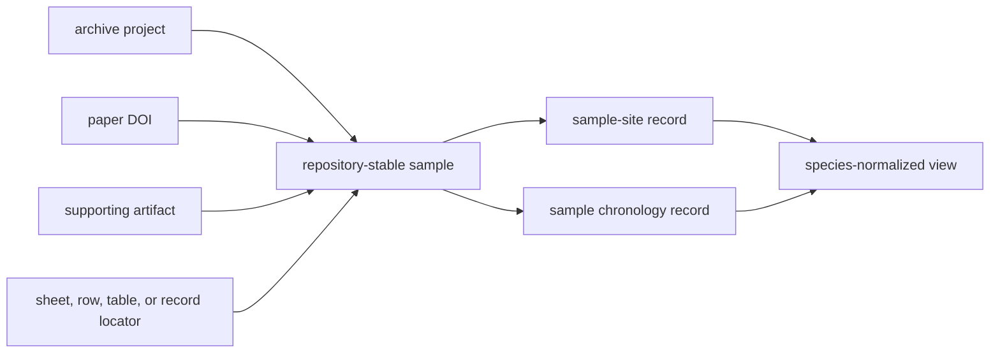

# Sample Records

The durable unit of the animal ancient-DNA database is a repository-stable
sample record. Papers describe studies, archive projects group deposits, and
supplements contain tables; none of those scopes is automatically equivalent
to one physical sample.

## Stable Identity

A project sample master assigns a repository-stable identifier and preserves
the labels available from each source surface:

- archive-native sample identifier;
- paper-native sample label;
- supplementary-table sample label;
- preferred display label;
- identity basis and resolution state; and
- ambiguity note when the labels cannot be reconciled safely.

The stable identifier is namespaced by project so identical human-readable
labels in different projects do not collapse into one record.

## Source Lineage

A direct extraction records the source artifact, its kind, an internal locator,
and a short source excerpt. This makes the transformation auditable without
requiring a reader to infer which spreadsheet row produced the record.

## Project Completeness

`project_sample_master_completeness.json` compares expected, recovered,
unresolved, and final sample counts when a trustworthy expectation is
available. It also records the provenance of the expected count and the
project's sample-identifier status.

An unknown expected count is not rewritten as zero. It remains a curation state
such as `not_yet_curated`, with a reason and the artifact needed to resolve it.
This prevents a large recovered table from being mistaken for proven project
completeness.

## Sample-Owned Claims

The sample master carries the source-facing identity and the raw locality and
chronology text recovered with it. Narrower governed surfaces then evaluate
those claims:

| Surface | Responsibility |
| --- | --- |
| `sample_master.json` | stable identity, labels, lineage, and extracted source text |
| `sample_sites.json` | sample-to-site linkage and site hierarchy |
| `sample_locality_evidence.json` | locality class, resolution, provenance, and mapping posture |
| `sample_chronology_evidence.json` | chronology strength, class, precision, normalization, and provenance |
| species `sample_records.json` | cross-project species view over governed sample evidence |

Separating these surfaces prevents a correction to place or time from changing
sample identity, and prevents species aggregation from becoming the authority
for project-level extraction.

## Ambiguity And Refusal

A sample remains unresolved when source labels collide, lineage is missing, or
several candidate rows cannot be distinguished. The ambiguity ledger retains
the candidates and reason. Downstream publication must not resolve the problem
by choosing the most convenient label.

Likewise, a recovered sample can be valid while its locality, chronology, or
coordinate evidence remains unfit for exact publication. Sample recovery and
atlas admission are separate decisions.

## Governing Records

- `data/adna/governance/source_library/project_registry.json`
- `data/adna/governance/source_library/paper_registry.json`
- `data/adna/governance/source_library/projects/<project_accession>/sample_master.json`
- `data/adna/governance/source_library/projects/<project_accession>/sample_sites.json`
- `data/adna/governance/source_library/project_sample_master_completeness.json`
- `data/adna/governance/source_library/sample_identity_ambiguity_ledger.json`
- `data/adna/species/<latin_name>/normalized/sample_records.json`

Continue with [localities](localities.md), [chronology](chronology.md), and
[coordinates](coordinates.md) to evaluate the sample-owned claims that control
publication.
