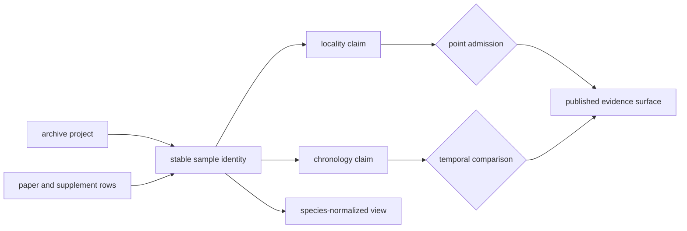
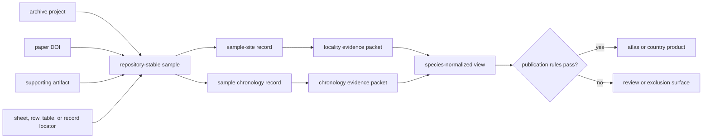

# Sample Records

The durable unit of the animal ancient-DNA database is a repository-stable
sample record. Papers describe studies, archive projects group deposits, and
supplements contain tables; none of those scopes is automatically equivalent
to one physical sample.

A sample record answers **which specimen row is being discussed**. It does not
by itself certify where the specimen came from, when it lived, or whether it
may appear as a map point. Those are separately governed claims joined through
the stable sample identifier.

## Current Evidence Posture

The governed snapshot contains 868 recovered sample rows across 40 animal
archive projects. All 868 currently have a final identity resolution and the
identity ambiguity ledger is empty. That is strong evidence for the recovered
rows; it is not a claim that every sample deposited by every project has been
recovered. Only four projects currently have a trustworthy expected sample
count, so project completeness remains unknown for most of the collection.

This distinction is intentional:

| Question | Governing signal | What a positive result establishes |
| --- | --- | --- |
| Was a source row recovered? | `recovered_sample_count` | a row exists in the governed sample master |
| Is its identity usable? | `sample_identity_resolution` | labels resolve to one repository-stable sample |
| Is the project complete? | expected versus final count, with provenance | the recovered set can be measured against a trustworthy expectation |
| Is the sample publishable? | locality, chronology, and coordinate evidence | only the requested public representation is supported |

## Stable Identity

A project sample master assigns a repository-stable identifier and preserves
the labels available from each source surface:

- archive-native sample identifier;
- paper-native sample label;
- supplementary-table sample label;
- preferred display label;
- identity basis and resolution state; and
- ambiguity note when the labels cannot be reconciled safely.

The stable identifier is namespaced by project so identical human-readable
labels in different projects do not collapse into one record.

Identity resolution follows the evidence, not label appearance. Archive,
paper, and supplementary labels remain distinct fields even when they agree.
The preferred label is for display; the repository-stable identifier is the
join key. This prevents punctuation changes, spreadsheet formatting, or a
later preferred-label correction from breaking evidence links.

## Relational Contract

The sample identifier is the hub of the evidence model, not a container that
turns every linked statement into a sample-owned fact:

This structure enforces four invariants:

- every descendant resolves through the project-namespaced stable identifier;
- source-native labels remain evidence attributes, never cross-project join
  keys;
- locality and chronology can be corrected without minting a new specimen;
- a species view may aggregate governed samples but cannot become their
  identity authority.

One paper row may mention several analytical identifiers, and several source
rows may describe one specimen. The identity decision records that
relationship explicitly. Row count, identifier count, specimen count, and map
point count are therefore different quantities unless a product proves them
equivalent.

## Identity Change Or Claim Change?

Not every corrected field creates a new sample identity:

| Change | Identity consequence | Downstream consequence |
| --- | --- | --- |
| preferred-label spelling corrected | stable ID remains | update display copies; preserve prior source labels |
| locality or chronology strengthened | stable ID remains | reevaluate the affected claim and product admission |
| two source labels proven to name one specimen | one governing identity with retained aliases and merge evidence | redirect descendants and review duplicate membership |
| one row proven to conflate distinct specimens | split into independently governed identities | reassess every site, chronology, species, and publication relation |
| project assignment corrected | identity reviewed against source lineage | move authority only with explicit sample-to-project evidence |
| source row replaced by a new release | stable ID may remain when equivalence is proven | retain release lineage and review changed fields |

The decisive question is whether the physical or analytical evidence unit
changed, not whether its presentation changed. Merge and split decisions need
their own source locators and cannot be inferred from matching labels or
coordinates.

## Source Lineage

A direct extraction records the source artifact, its kind, an internal locator,
and a short source excerpt. This makes the transformation auditable without
requiring a reader to infer which spreadsheet row produced the record.

## Worked Identity Trace

The governed horse sample `prjeb22390:cgg_1_017139` demonstrates the contract.
Its archive identifier is `CGG_1_017139`; its paper and supplementary display
labels use `Haunstetten 1979` and `Haunstetten_1979`. The stable ID binds those
spellings to one sample while preserving two supplementary locators:
`Sheet1!row204` and `Sheet1!row16` in the captured Science supporting tables.

That identity supports joins; it does not settle the joined claims. The same
sample currently carries a direct Haunstetten locality, approximate geocoded
coordinates, and a sample-owned `1979 BP` chronology. Each has its own evidence
class and publication rule. A reviewer can therefore accept the label
reconciliation while rejecting or revising a coordinate or temporal
interpretation without changing the specimen identity.

## Project Completeness

`project_sample_master_completeness.json` compares expected, recovered,
unresolved, and final sample counts when a trustworthy expectation is
available. It also records the provenance of the expected count and the
project's sample-identifier status.

An unknown expected count is not rewritten as zero. It remains a curation state
such as `not_yet_curated`, with a reason and the artifact needed to resolve it.
This prevents a large recovered table from being mistaken for proven project
completeness.

The same rule applies to arithmetic. `unresolved_sample_count` is meaningful
only when an expected count exists. A null value means the denominator is not
known; it does not mean that no samples are missing.

## Sample-Owned Claims

The sample master carries the source-facing identity and the raw locality and
chronology text recovered with it. Narrower governed surfaces then evaluate
those claims:

| Surface | Responsibility |
| --- | --- |
| `sample_master.json` | stable identity, labels, lineage, and extracted source text |
| `sample_sites.json` | sample-to-site linkage and site hierarchy |
| `sample_locality_evidence.json` | locality class, resolution, provenance, and mapping posture |
| `sample_chronology_evidence.json` | chronology strength, class, precision, normalization, and provenance |
| species `sample_records.json` | cross-project species view over governed sample evidence |

Separating these surfaces prevents a correction to place or time from changing
sample identity, and prevents species aggregation from becoming the authority
for project-level extraction.

The source-fact ownership registry makes that direction explicit: the
project-owned `sample_master.json` governs identity, while species-normalized
records and completeness summaries support discovery and review. Readers can
therefore trace a species-level row back to its project authority without
treating the convenient aggregate as a new source of truth.

## Ambiguity And Refusal

A sample remains unresolved when source labels collide, lineage is missing, or
several candidate rows cannot be distinguished. The ambiguity ledger retains
the candidates and reason. Downstream publication must not resolve the problem
by choosing the most convenient label.

Likewise, a recovered sample can be valid while its locality, chronology, or
coordinate evidence remains unfit for exact publication. Sample recovery and
atlas admission are separate decisions.

## Audit One Identity

1. Resolve the published or species-level row to its project-namespaced stable
   sample ID.
2. Inspect all source-native labels and the exact paper, supplement, sheet,
   table, or archive locator.
3. Confirm that the identity decision accounts for collisions, aliases, and
   any merge or split history.
4. Verify that site, chronology, species, and publication descendants reference
   the same governing ID.
5. Treat a missing link as an identity failure; do not repair it with a display
   label or spatial proximity.

## Governing Records

- `data/adna/governance/source_library/project_registry.json`
- `data/adna/governance/source_library/paper_registry.json`
- `data/adna/governance/source_library/projects/<project_accession>/sample_master.json`
- `data/adna/governance/source_library/projects/<project_accession>/sample_sites.json`
- `data/adna/governance/source_library/project_sample_master_completeness.json`
- `data/adna/governance/source_library/sample_identity_ambiguity_ledger.json`
- `data/adna/species/<latin_name>/normalized/sample_records.json`

Continue with [localities](localities.md), [chronology](chronology.md), and
[coordinates](coordinates.md) to evaluate the sample-owned claims that control
publication.
