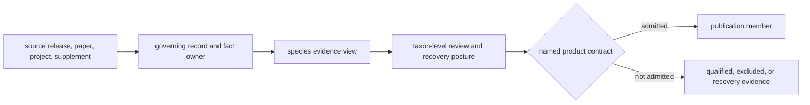
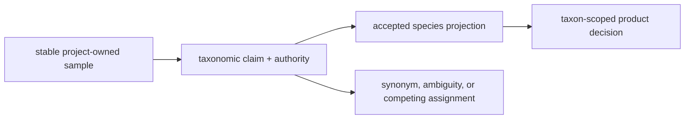
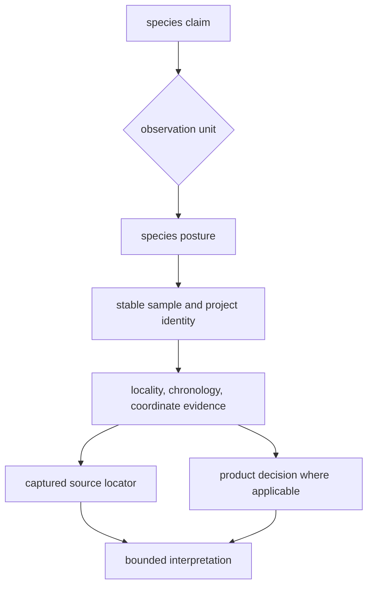

# Species Evidence Views

A species directory is a governed projection over source and project evidence.
It groups records by the accepted taxon so readers can inspect curation,
spatial support, recovery gaps, and product posture without treating the
species folder as a new source of scientific facts.

The projection direction matters. A species view may repeat a sample label,
locality, chronology, or coordinate so the taxon can be inspected as a unit.
That repeated value remains subordinate to the project-owned sample and claim
identified by its lineage.

## Two Lifecycle Models

Human and non-human ancient DNA share a species-owned directory shape, but
they do not currently share one material lifecycle.

| View | Current source route | Material posture | Supported use |
| --- | --- | --- | --- |
| `homo_sapiens` | governed link to the AADR v66 release capture | raw capture present; normalized, manifest, review, and species-report members absent | inspect retained AADR metadata and release identity at the captured panel boundary |
| ten non-human species | project and paper source library with generated species projections | raw inventories, normalized evidence, manifests, reports, and species review are materialized | inspect recovered evidence, curation posture, project deficits, and downstream fitness at each declared boundary |

Directory symmetry therefore does not prove evidence symmetry. A query must
inspect material artifacts and their contracts rather than infer lifecycle
completion from the existence of a folder.

## Non-Human Species Views

The tracked animal program currently exposes cattle, cat, dog, donkey,
dromedary camel, goat, horse, pig, reindeer, and sheep views. Each README is
generated from the same evidence code that materializes the species records,
so the narrative and counts share an owner.

Each view separates four questions:

| Question | Evidence surface |
| --- | --- |
| What material was tracked? | raw archive inventory and source snapshot |
| Which samples, sites, localities, and coordinates were normalized? | typed files under `normalized/` |
| Which project and curation revision produced the view? | manifests under `manifests/` |
| What remains blocked or incomplete? | recovery reports and species review |

The README reports samples, projects, sites, coordinate classes, Nordic
members, recovery deficits, pending projects, and rejected projects as
different observation units. Those counts describe related evidence surfaces;
they are not stages of one universal attrition funnel.

## Roles Are Evidence Policy

`product_role`, `dataset_bucket`, and `curation_class` are repository policy
fields. They describe how the current evidence may participate in governed
products and comparisons. They are not taxonomic ranks, domestication facts,
or permanent scientific labels.

| Policy signal | Governs | Does not establish |
| --- | --- | --- |
| product role | intended contribution to a named comparison or publication family | biological importance or collection completeness |
| dataset bucket | current grouping by evidence posture | a natural scientific category |
| curation class | rule used to evaluate project and paper support | that every tracked project passed review |
| species release gate | whether the taxon-level review satisfies its declared gate | that every member is sample-complete or publication-ready |
| supported-status eligibility | whether current evidence permits stronger support language | universal fitness for every analysis or product |

A comparator can satisfy its comparator release contract while remaining
ineligible for domesticated-core interpretation. A species can have supported
curated projects while retaining blocked, pending, rejected, or under-recovered
projects. Preserve both statements.

### Taxonomic Reassignment Does Not Rewrite Sample History

The accepted taxon is a versioned claim about a governed sample, not the
sample's identity. A revised taxonomy, synonym decision, or stronger molecular
assignment can move a sample between species views while preserving its
project namespace, source labels, locality, chronology, and evidence lineage.

| Change | Stable authority | Required reassessment |
| --- | --- | --- |
| display-name or synonym change | sample and source lineage | labels, taxonomy revision, and discovery views |
| accepted species changes | sample identity | species projection, taxon counts, role, and every taxon-scoped product |
| assignment becomes ambiguous | competing attributed claims | eligibility, aggregation, and public qualification |
| project species expectation disagrees with sample evidence | sample-owned evidence and conflict record | project summaries and affected taxonomic decisions |

Species totals are therefore revision-dependent projections. They cannot be
used as permanent specimen counts without the accepted taxonomy revision and
the included sample identities.

## Audit One Species Claim

1. Name the proposed claim and its observation unit: source project, sample,
   site, chronology, coordinate, species aggregate, or product member.
2. Open the species README and identify the current role, evidence bucket,
   release posture, and blocking reasons.
3. Resolve the stable sample and project identity in the normalized records
   and project-owned sample master.
4. Inspect locality, chronology, and coordinate evidence independently; one
   strong dimension does not repair another weak dimension.
5. Recover the paper, project, supplement, table, sheet, row, or archive
   locator that supports the disputed fact.
6. If the claim concerns a map or report, inspect the product-specific
   admission decision and manifest rather than inferring membership from the
   species view.
7. Carry unresolved projects and non-members into any coverage statement.

## Cross-Species Comparison Contract

Species views make taxon-level discovery easier, but comparison requires an
explicit population contract. Record at least:

| Contract member | Why it is required |
| --- | --- |
| included species and accepted taxonomy revision | fixes which views and names were compared |
| observation unit | prevents projects, recovered samples, sites, localities, and publication points from being counted together |
| eligible population | identifies which records could have entered the comparison |
| evidence requirements | fixes identity, locality, chronology, coordinate, and source-lineage thresholds |
| geography and temporal operation | prevents visual proximity from becoming an ungoverned association |
| exclusions and qualified members | keeps weak or out-of-scope evidence in the denominator account |
| source, curation, and product revisions | makes the comparison recoverable after a refresh |

Do not compare raw species README counts as though every taxon had equal
project recovery, site granularity, chronology depth, coordinate support, or
publication rules. Normalize the question and evidence requirements—not the
facts or their uncertainty.

## Reuse Packet

A reusable species-level result carries the species identity, policy role,
observation unit, selected record identities, source and curation revisions,
eligibility rule, included and excluded populations, dimension-specific
evidence posture, product identity where applicable, and unresolved blockers.

A screenshot, species total, or release-gate Boolean is an entry into that
packet, not a substitute for it. The result remains defensible when another
reader can recover the governing sample facts, reproduce the population, and
see which stronger claims were refused.

Continue with [animal source intake](../sources/animal-source-intake.md),
[sample records](sample-records.md), [locality evidence](localities.md),
[chronology evidence](chronology.md), and [record admission](../curation/record-admission.md).
