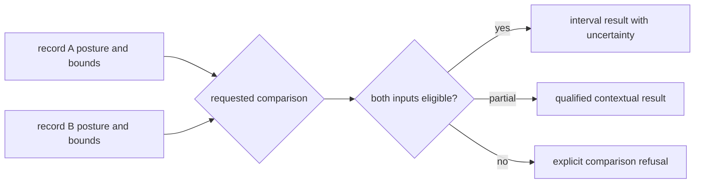
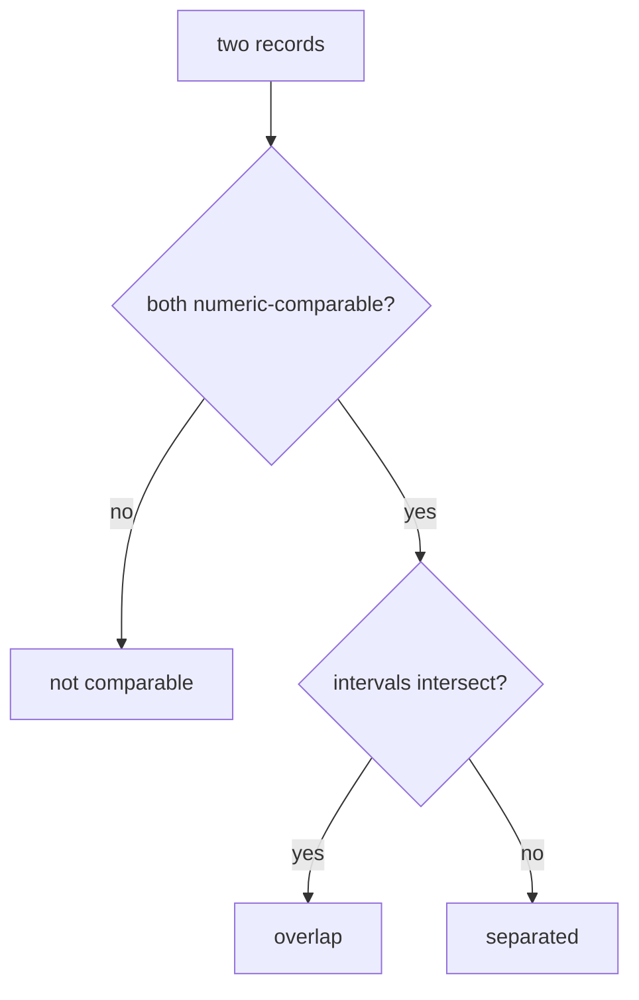
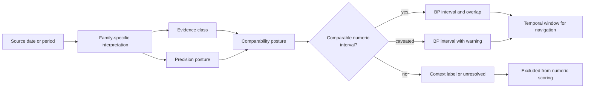
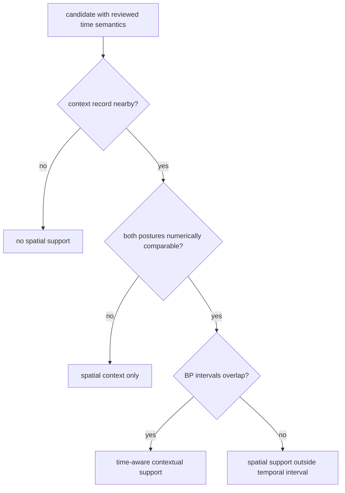

# Temporal Semantics

Temporal semantics is the common contract used to compare time across direct
ancient-DNA evidence, pollen context, and archaeology context. It keeps a
numeric interval, a caveated estimate, a textual period, and an unresolved date
from becoming equivalent simply because they appear in the same atlas.

The contract does not force every source into a shared chronology model. It
provides a shared vocabulary for stating what each source can support and for
refusing comparisons that would manufacture precision.

## The Comparison Contract

Every temporal payload answers four distinct questions:

| Field | Question answered |
| --- | --- |
| `evidence_class` | What kind of dating support exists? |
| `precision_posture` | How precise is that support for this record? |
| `comparability_posture` | May this record participate in numeric comparison? |
| `temporal_window_key` | Which broad display window contains its midpoint? |

The payload also preserves the summary label, BP bounds and midpoint,
duration, source path and locator, original and normalized labels, comparison
note, and uncertainty notes. A display window never replaces the source
interval.

## Comparability Postures

| Posture | Meaning | Permitted use |
| --- | --- | --- |
| `numeric_interval` | numeric bounds with direct, sufficiently precise support | interval filtering and overlap comparison |
| `numeric_interval_with_caveat` | numeric bounds exist, but modeling or contextual ownership limits them | comparison only with the caveat attached |
| `contextual_label_only` | time is expressed as a period or textual label | orientation and display, not numeric overlap |
| `mixed_interval_and_context` | an aggregate combines numeric and contextual time support | aggregate comparison with explicit mixed-support warning |
| `unresolved` | no trustworthy comparable time representation | exclusion from temporal scoring |

Numeric fields alone do not authorize comparison. The posture must also be one
of the numeric classes; this prevents a parsed number from overruling its
evidence class.

## Comparison Operations

| Operation | Required inputs | Result boundary |
| --- | --- | --- |
| interval overlap | two numeric-comparable BP bounds | overlapping or non-overlapping intervals at declared uncertainty |
| interval distance | two numeric-comparable BP bounds | distance between intervals, not between display midpoints |
| window filter | numeric midpoint plus retained source bounds | navigation subset, not contemporaneity |
| contextual grouping | explicit labels and evidence roles | shared descriptive context, not numeric order |
| mixed aggregate | member-level postures and denominators | aggregate with visible mixed-support warning |

An operation must refuse inputs whose posture does not meet its contract. A
textual period cannot enter interval arithmetic through an assumed lookup, and
an unresolved date cannot be treated as zero or as outside every window.

### Interval Arithmetic Contract

Canonical BP intervals are ordered from the younger, lower BP bound to the
older, higher BP bound. For eligible intervals `[a_start, a_end]` and
`[b_start, b_end]`:

| Derived value | Rule |
| --- | --- |
| overlap start | `max(a_start, b_start)` |
| overlap end | `min(a_end, b_end)` |
| overlap | overlap start is less than or equal to overlap end |
| separation | the younger interval's older bound is below the older interval's younger bound |
| midpoint | rounded mean of one interval's bounds; navigation only |
| duration | older bound minus younger bound |

Touching endpoints count as overlap at the represented precision. Reversed
source bounds are normalized before comparison; missing bounds do not become
zero-width intervals. The result inherits the weaker comparability posture of
its inputs and retains both original intervals, because an overlap label alone
cannot communicate width or uncertainty.

## Three-State Comparison Logic

Temporal comparison has at least three outcomes, not a Boolean pair:

| Outcome | Required support | Meaning |
| --- | --- | --- |
| overlap | both records are numeric-comparable and their intervals intersect | compatible time support at the declared precision |
| separated | both records are numeric-comparable and their intervals do not intersect | numeric non-overlap at the declared precision |
| not comparable | either record lacks an eligible numeric posture | no numeric temporal conclusion is available |

`not comparable` must remain distinct from `separated`. Collapsing both into
false would turn missing or contextual chronology into evidence of temporal
absence. The same distinction applies to aggregates: an overlap rate needs the
number of eligible pairs as its denominator, plus the number excluded as not
comparable.

An atlas may display all three records together, but a temporal score must use
only eligible comparisons and must report the refused share. Otherwise a
source family with weak chronology can appear artificially precise merely
because its unresolved records disappeared from the denominator.

## Capability In The Checked-In Collection

| Source family | Records | Numeric intervals | Time-aware use |
| --- | ---: | ---: | --- |
| LandClim | 492 site sequences | 482 | supporting pollen context at the sequence interval |
| Neotoma | 200 sites | 175 | supporting pollen context where a site span exists |
| SEAD | 2,172 normalized sites | 0 | archaeology context only in the current capture |
| RAÄ | 761,917 published sites in the density source | 0 | coarse spatial archaeology context |
| SVAR | 40,565 lakes | 0 | candidate-lake identity and location |
| boundaries | 4 polygons | 0 | geographic framing only |

Record volume is not temporal capability. The largest contextual collection
in the table has no repository-owned numeric intervals, while the smaller
pollen collections carry varying degrees of time support. A score or visual
summary must use the declared posture, not infer evidentiary weight from row
count.

## From Source Date To Atlas Comparison

Broad navigation windows are assigned from a numeric midpoint:

- recent and historical: 0–1000 BP;
- Late Holocene: 1001–3000 BP;
- Mid-Holocene: 3001–6000 BP;
- Early Holocene and older: 6001+ BP;
- unresolved when no numeric midpoint exists.

These bins make filtering understandable; they do not claim that records in
the same bin are contemporaneous.

Temporal overlap itself is interval-aware. Two numeric rows can overlap even
when their midpoints fall on opposite sides of a navigation boundary, and two
rows in the same broad window can remain thousands of years apart. The window
key supports browsing; the source bounds and comparability posture govern
analysis.

For example, an animal sample interval of 2500–2200 BP and a pollen sequence
interval of 2300–1800 BP overlap from 2300 to 2200 BP. Their midpoints alone
would obscure that shared range. If the archaeology layer nearby carries only
a textual period, it remains contextual beside the numeric overlap; it does
not acquire the same interval.

## Source-Family Differences Remain Visible

The checked-in collection currently carries different temporal capability by
source family:

- **LandClim** site sequences usually carry numeric BP windows and can
  contribute pollen context to time-aware comparison;
- **Neotoma** includes many numeric site spans, but the review surface records
  uneven chronology-row capture and sites without BP ranges;
- **SEAD** currently functions as a site-inventory context layer in the
  Sweden-facing capture and must not be treated as uniformly time-resolved;
- **RAÄ** contributes spatial archaeology density without repository-owned time
  windows;
- **SVAR** and boundary layers provide lake identity and geographic framing,
  not dated evidence;
- **human and animal aDNA** can contribute sample-owned intervals when their
  chronology lineage and precision support it.

Spatial proximity therefore does not guarantee temporal overlap. Ranking can
count a nearby record as time-aware only when both the candidate evidence and
the context point have numeric bounds; unresolved or context-only time cannot
increase an overlap count.

## Auditing Cross-Source Time

`data/source_spatiotemporal_posture_registry.json` gives the governing path,
record count, numeric-interval count, scoring posture, and caveats for each
context source. Family-specific reviews remain authoritative for coverage
details, including `data/neotoma/review/temporal_review.json` and
`data/sead/review/temporal_review.json`.

For direct animal evidence, begin with the species-owned
`normalized/sample_records.json`, use its project linkage to reach
`data/adna/governance/source_library/projects/<project-accession>/`, and inspect
the project's `sample_chronology_evidence.json` and
`sample_chronology_provenance.json`. See [chronology evidence](chronology.md)
for sample-level classification and
[spatiotemporal posture](../sources/spatiotemporal-posture.md) for the
source-family comparison boundary.
