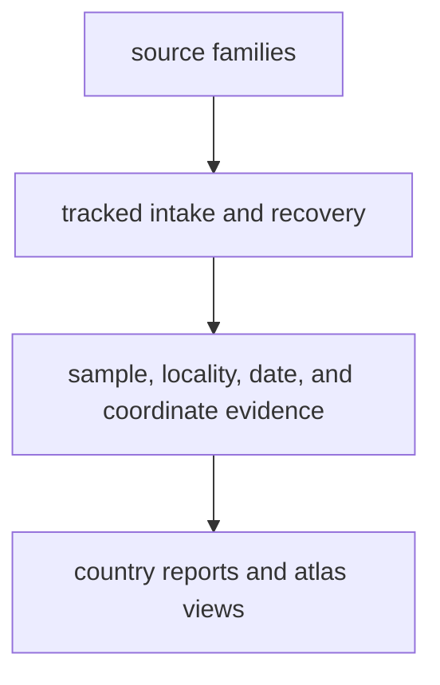

# bijux-pollenomics-data

`bijux-pollenomics-data` is the public handbook for the evidence side of the
repository. It explains what evidence enters the system, which questions each
family can answer, how that evidence is checked before publication, and under
which conditions it is allowed to become a visible report row or map point.

Use this section when your first questions are practical and evidence-first:

- what data is actually in scope here
- where that data comes from and why it was selected
- which parts are mature public context and which parts remain partial
- how one public row can be traced back to narrower governing evidence
- whether this repository can already help with a new country, region, or
  evidence question you care about

<strong>Use this section when the real question is about evidence, coverage, or trust.</strong> It should help a reader understand what the repository knows today, what remains incomplete, and how the public publications stay tied to the evidence behind them.

  <a class="md-button md-button--primary" href="overview/">Start with the system</a>
  <a class="md-button" href="sources/">See the source families</a>
  <a class="md-button" href="evidence/">Follow the evidence chain</a>
  <a class="md-button" href="publications/">See maps and reports</a>
  <a class="md-button" href="overview/data-architecture-handbook/">Open the data architecture handbook</a>
  <a class="md-button" href="overview/pollenomics-publication-model/">Open the publication model</a>
  <a class="md-button" href="overview/cross-domain-evidence-matrix/">Open the cross-domain evidence matrix</a>

## What This Section Covers

The purpose of this handbook is to keep those stages readable. Readers should
not have to reverse-engineer the difference between a source paper, a
normalized evidence file, a locality decision, and a public map point.

## What Makes This Repository Unusual

Most data projects speak about one family of evidence at a time. This
repository does not. It places several different families beside each other:

- pollen context from large environmental databases
- archaeology context from environmental and heritage sources
- boundary layers used for framing and filtering
- human ancient DNA release material
- animal ancient DNA recovery work that is still being strengthened project by project

In practice that means the section has to explain pollen context,
environmental archaeology, boundary framing, human release material, and
animal aDNA recovery as one joined evidence system.

That mixed setting is useful, but it creates a documentation burden. If the
site is vague, readers cannot tell whether they are looking at mature evidence,
supporting context, or work that is still under recovery. This section exists
to remove that ambiguity.

It also needs to keep boundary framing explicit, because borders and framing
layers shape what a public map can honestly imply even when the underlying
evidence stays unchanged.

## What You Can Use This Handbook For

- deciding whether a public map or report is enough for your question
- finding the narrower evidence surface behind a public output
- understanding why one source family supports broad use while another stays
  caveated
- learning how the same evidence system could support future publication for
  other countries or regions without inventing a second product model

## Start Here

- [System](overview/index.md): understand the overall data model before the file details
- [Sources](sources/index.md): see what each source family contributes and what it cannot honestly answer
- [Evidence](evidence/index.md): follow the chain from sample record to locality, chronology, and coordinates
- [Publications](publications/index.md): learn what the published report tree shows and what it intentionally does not promote
- [Data architecture handbook](overview/data-architecture-handbook.md): learn where truth lives and how capture, normalization, review, and publication differ
- [Cross-domain evidence matrix](overview/cross-domain-evidence-matrix.md): compare the repository's evidence balance without relying on file counts alone

## Restored System Coverage

- [provenance and publication linkage](overview/provenance-and-publication-linkage/)
- [source selection and refresh](overview/source-selection-and-refresh/)
- [coverage and naming](overview/coverage-and-naming/)

## Source-Family Comparison

Start with the [source-family comparison](sources/source-comparison.md) when the
main question is source comparison across pollen, archaeology, boundaries,
human aDNA, and animal aDNA. That page is the fastest way to understand why two
layers can appear on the same map while still answering very different
questions.

## Reader Questions

- Where does the repository's pollen, archaeology, boundary, and aDNA material come from?
- What happens between a paper or dataset and a public-facing output?
- Which animal records already have sample-level locality and date evidence?
- Why is one row publishable while another stays blocked or uncertain?
- What could I responsibly reuse for a region that is not yet published as a
  map atlas surface?

## Reading Strategy

If you are new to the project, read this section in the same order that the
repository handles evidence:

1. start with the [system guide](overview/index.md) to understand the overall shape
2. move to [sources](sources/index.md) to see what enters the repository
3. move to [evidence](evidence/index.md) to see how claims are justified
4. finish with [publications](publications/index.md) to see how public-facing bundles are derived

That order is deliberate. The publications only make sense once the source and
evidence stages are clear.

## Section Map

| Section | Main question | Main pages |
| --- | --- | --- |
| System | How is the repository's data system structured? | [overview](overview/index.md) |
| Sources | What source families are in scope and what do they contribute? | [sources](sources/index.md) |
| Evidence | How are sample, locality, chronology, and coordinate claims justified? | [evidence](evidence/index.md) |
| Publications | What reaches reports and maps, and what remains partial? | [publications](publications/index.md) |
