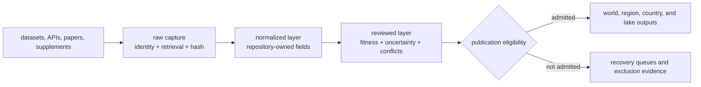
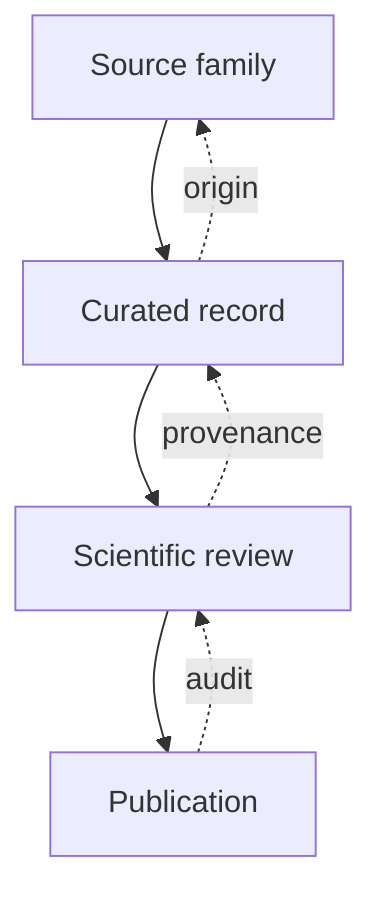

# Pollenomics Data

The Pollenomics data system preserves the chain between an upstream source and
a public claim. It combines eight contracted source families without erasing
their differences: LandClim, Neotoma, SEAD, RAÄ, boundaries, SMHI SVAR, AADR,
and animal ancient DNA.

Every family has an explicit role. Pollen sources provide primary
palaeoenvironmental context; archaeology sources provide contextual domains;
boundaries frame geography; SVAR provides a lake registry; AADR provides
versioned human ancient-DNA context; and animal aDNA is curated as
sample-owned evidence from papers, supplements, and project archives.

  <a class="md-button md-button--primary" href="overview/">Understand the data system</a>
  <a class="md-button" href="sources/">Inspect source families</a>
  <a class="md-button" href="evidence/">Follow the evidence chain</a>
  <a class="md-button" href="publications/">Interpret publications</a>
  <a class="md-button" href="overview/cross-domain-evidence-matrix/">Compare evidence maturity</a>

## Database Architecture

```mermaid
flowchart LR
    Upstream["datasets, APIs, papers, supplements"] --> Raw["raw capture\nidentity + retrieval + hash"]
    Raw --> Normalized["normalized layer\nrepository-owned fields"]
    Normalized --> Reviewed["reviewed layer\nfitness + uncertainty + conflicts"]
    Reviewed --> Gate{"publication eligibility"}
    Gate -->|admitted| Published["world, region, country, and lake outputs"]
    Gate -->|not admitted| Account["recovery queues and exclusion evidence"]
```

Four machine-readable contracts make this flow inspectable:

- `data/source_family_contracts.json` declares each family's question, role,
  paths, and coverage metrics;
- `data/source_family_evidence_stage_matrix.json` records the state of raw,
  normalized, reviewed, and published layers;
- `data/source_fact_ownership_registry.json` identifies the authority for
  facts repeated across the tree; and
- `data/evidence_artifact_contracts.json` defines recurring project, sample,
  regional, and country artifact shapes.

## Curation Is Evidence Work

Normalization is not the final step. Records may require scientific and
documentary decisions that cannot be inferred safely from a column name.

For animal ancient DNA, the curated database preserves:

- project and paper registries;
- source-intake dossiers and supporting-material manifests;
- sample identity and sample-to-site linkage;
- locality claims, coordinate provenance, and precision posture;
- chronology claims, normalization, precision, and conflict ledgers;
- species-normalized records and project recovery deficits;
- atlas candidates, exclusions, caveats, and release-gate decisions.

The result is an accountability system as well as a dataset. Missing source
material, ambiguous identity, conflicting chronology, and region-only locality
remain queryable outcomes rather than being converted into apparently complete
rows.

## Curation Decisions Remain Queryable

| Decision class | Preserved distinction | Why publication depends on it |
| --- | --- | --- |
| source admission | discovered, captured, recoverable, and licensed are separate states | a known source is not automatically usable evidence |
| identity resolution | source label, stable sample identity, project membership, and species view remain linked | grouping must not erase the physical or analytical sample |
| locality resolution | reported text, site assignment, geographic hierarchy, and substitution posture remain separate | a regional description cannot become an exact sample point |
| chronology resolution | reported wording, numeric interpretation, dating basis, and precision remain separate | contextual or broad time cannot become a precise sample interval |
| coordinate resolution | supplied, resolved, approximate, substituted, and unresolved coordinates remain distinguishable | marker precision must not outrank locality evidence |
| publication admission | eligible, qualified, excluded, and deferred outcomes remain recorded | the visible subset must be explainable against the curated population |

These decisions are durable database content. They can be counted, compared,
reviewed, and revised when stronger source evidence is recovered. The system
therefore represents both what can be published and why the larger collected
population does not all publish.

## Read The System In Either Direction

```mermaid
flowchart TB
    Source[Source family] --> Record[Curated record]
    Record --> Review[Scientific review]
    Review --> Output[Publication]
    Output -. audit .-> Review
    Review -. provenance .-> Record
    Record -. origin .-> Source
```

- Start with [Sources](sources/index.md) to evaluate origin, acquisition,
  license, version, refresh behavior, and intended use.
- Start with [Evidence](evidence/index.md) to evaluate sample identity,
  locality, chronology, coordinates, and scientific qualification.
- Start with [Publications](publications/index.md) to interpret maps, reports,
  filters, rankings, and their derivation.
- Use the [data architecture handbook](overview/data-architecture-handbook.md)
  to locate the governing file when the same fact appears in several outputs.

## Evidence Does Not Collapse Into One Score

Evidence families can co-occur spatially without answering the same question.
A pollen site is not an animal sample, a heritage record is not a chronology
claim, a lake polygon is not a sampling recommendation, and a country boundary
does not validate any point inside it.

Cross-domain publications preserve those distinctions through layer labels,
source posture, temporal semantics, coordinate precision, and visible caveats.
Where comparability is weak, the system publishes the limitation or refuses a
stronger release claim.

## Core References

- [Data system overview](overview/data-system-overview.md)
- [Data architecture handbook](overview/data-architecture-handbook.md)
- [Publication model](overview/pollenomics-publication-model.md)
- [Provenance and publication linkage](overview/provenance-and-publication-linkage.md)
- [Source selection and refresh](overview/source-selection-and-refresh.md)
- [Coverage and naming](overview/coverage-and-naming.md)
- [Cross-domain evidence matrix](overview/cross-domain-evidence-matrix.md)
- [Animal ancient-DNA evidence](overview/animal-ancient-dna-evidence.md)
