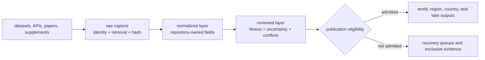
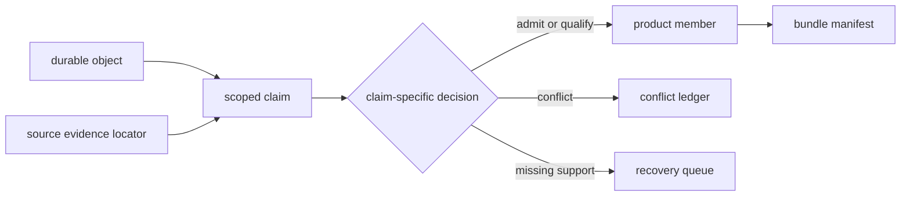
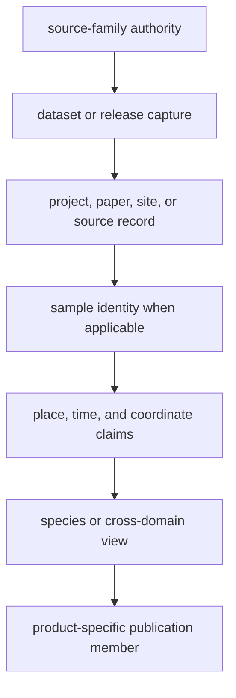
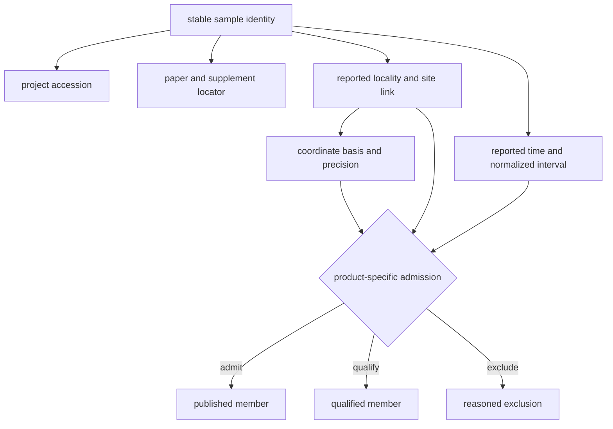
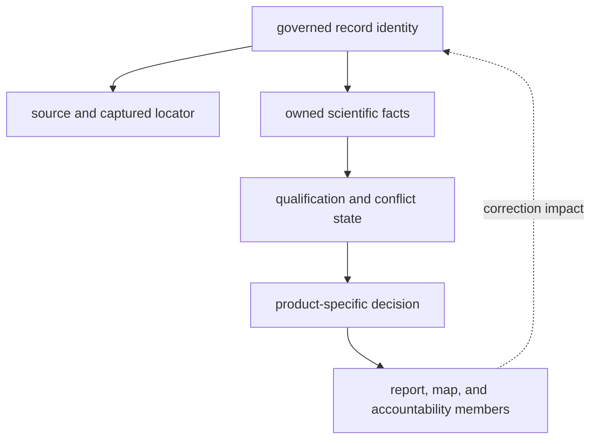
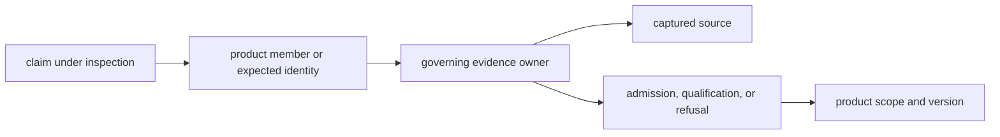
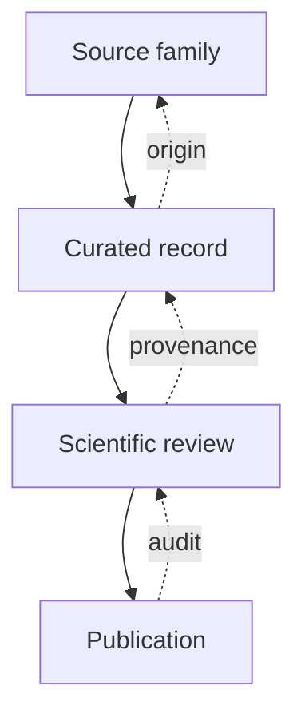

# Pollenomics Data

The Pollenomics data system is a version-controlled evidence database that
preserves the chain between an upstream source and a public claim. It combines
eight contracted source families without erasing their differences: LandClim,
Neotoma, SEAD, RAÄ, boundaries, SMHI SVAR, AADR, and animal ancient DNA.

Every family has an explicit role. Pollen sources provide primary
palaeoenvironmental context; archaeology sources provide contextual domains;
boundaries frame geography; SVAR provides a lake registry; AADR provides
versioned human ancient-DNA context; and animal aDNA is curated as
sample-owned evidence from papers, supplements, and project archives.

  <a class="md-button md-button--primary" href="overview/">Understand the data system</a>
  <a class="md-button" href="database/">Inspect the database model</a>
  <a class="md-button" href="sources/">Inspect source families</a>
  <a class="md-button" href="curation/">Understand evidence curation</a>
  <a class="md-button" href="evidence/">Follow the evidence chain</a>
  <a class="md-button" href="publications/">Interpret publications</a>
  <a class="md-button" href="overview/cross-domain-evidence-matrix/">Compare evidence maturity</a>

## Database Architecture

```mermaid
flowchart LR
    Upstream["datasets, APIs, papers, supplements"] --> Raw["raw capture\nidentity + retrieval + hash"]
    Raw --> Normalized["normalized layer\nrepository-owned fields"]
    Normalized --> Reviewed["reviewed layer\nfitness + uncertainty + conflicts"]
    Reviewed --> Gate{"publication eligibility"}
    Gate -->|admitted| Published["world, region, country, and lake outputs"]
    Gate -->|not admitted| Account["recovery queues and exclusion evidence"]
```

Four machine-readable contracts make this flow inspectable:

- `data/source_family_contracts.json` declares each family's question, role,
  paths, and coverage metrics;
- `data/source_family_evidence_stage_matrix.json` records the state of raw,
  normalized, reviewed, and published layers;
- `data/source_fact_ownership_registry.json` identifies the authority for
  facts repeated across the tree; and
- `data/evidence_artifact_contracts.json` defines recurring project, sample,
  regional, and country artifact shapes.

The collector summary and the evidence-family contract answer different
inventory questions. `data/collection_summary.json` pins seven
collector-managed source trees. The evidence system contains eight contracted
families because animal ancient DNA is curated through its own archive,
literature, supplement, project, and sample authorities.

### The Database Is A Claim Ledger

Rows are useful representations, but the durable model is a graph of objects,
claims, evidence locators, decisions, and products:

| Record class | Owns | Must remain resolvable |
| --- | --- | --- |
| object | the identity of a source record, project, paper, sample, site, lake, or boundary | stable key, object type, aliases, and source-native identity |
| claim | one assertion about identity, taxonomy, locality, chronology, coordinate, or role | claimant, subject, value, scope, and precision |
| evidence locator | the material that supports or conflicts with a claim | source family, release or accession, artifact, table or field, and content identity |
| decision | the repository's treatment of a claim for a declared use | rule, outcome, qualification, conflict, and recovery condition |
| product member | one decision admitted to one publication scope | product, version, member ID, evidence role, and companion warnings |

```mermaid
flowchart LR
    Object["durable object"] --> Claim["scoped claim"]
    Locator["source evidence locator"] --> Claim
    Claim --> Decision{"claim-specific decision"}
    Decision -->|admit or qualify| Member["product member"]
    Decision -->|conflict| Ledger["conflict ledger"]
    Decision -->|missing support| Recovery["recovery queue"]
    Member --> Manifest["bundle manifest"]
```

This separation is what makes database curation auditable. Correcting a claim
does not require inventing a new object identity; refusing publication does
not delete the captured object; and one product decision does not grant the
same claim fitness in another product.

## Curation Is Evidence Work

Normalization is not the final step. Records may require scientific and
documentary decisions that cannot be inferred safely from a column name.

For animal ancient DNA, the curated database preserves:

- project and paper registries;
- source-intake dossiers and supporting-material manifests;
- sample identity and sample-to-site linkage;
- locality claims, coordinate provenance, and precision posture;
- chronology claims, normalization, precision, and conflict ledgers;
- species-normalized records and project recovery deficits;
- atlas candidates, exclusions, caveats, and release-gate decisions.

The result is an accountability system as well as a dataset. Missing source
material, ambiguous identity, conflicting chronology, and region-only locality
remain queryable outcomes rather than being converted into apparently complete
rows.

## The Database Stores Claims At Their Natural Scope

| Scope | Typical governing object | Why it stays separate |
| --- | --- | --- |
| source family | source contract, acquisition metadata, and lifecycle roots | establishes what one upstream ecosystem contributes |
| dataset or release | version, snapshot identity, retrieval method, and hashes | makes refresh and comparison reproducible |
| project or paper | archive accession, DOI, source bundle, and supporting-material inventory | relates literature and deposits without treating either as a sample |
| sample | stable identity, native labels, lineage locator, and ambiguity state | preserves the physical or analytical evidence unit |
| place and time claim | locality, chronology, coordinate basis, precision, and conflict state | allows each scientific claim to succeed or fail independently |
| species view | cross-project normalized records | supports taxon-level discovery without replacing project authority |
| publication member | product, geography, admission, caveat, and feature identity | explains why one governed record appears in one output |

This scoped model is the main reason the data tree contains several related
records for one visible point. Flattening them into one row would make access
easier at the cost of losing which source, decision, and scope owns each fact.

```mermaid
flowchart TB
    Family["source-family authority"] --> Release["dataset or release capture"]
    Release --> Unit["project, paper, site, or source record"]
    Unit --> Sample["sample identity when applicable"]
    Sample --> Claims["place, time, and coordinate claims"]
    Claims --> View["species or cross-domain view"]
    View --> Member["product-specific publication member"]
```

## One Sample, Several Independent Claims

Animal evidence makes the database design concrete. One sample identity can
link to a project and paper while its locality, chronology, coordinate, and
publication claims succeed or fail independently.

```mermaid
flowchart TB
    Sample["stable sample identity"] --> Project["project accession"]
    Sample --> Paper["paper and supplement locator"]
    Sample --> Locality["reported locality and site link"]
    Sample --> Chronology["reported time and normalized interval"]
    Locality --> Coordinate["coordinate basis and precision"]
    Locality --> Admission{"product-specific admission"}
    Chronology --> Admission
    Coordinate --> Admission
    Admission -->|admit| Member["published member"]
    Admission -->|qualify| Qualified["qualified member"]
    Admission -->|exclude| Excluded["reasoned exclusion"]
```

This shape prevents partial evidence from masquerading as a complete sample.
A paper can establish project context without establishing sample chronology;
a named region can support a locality statement without supporting an exact
point; and a sample can remain scientifically relevant while being excluded
from one map contract.

For non-animal families, the governing unit changes—site, sequence, grid cell,
heritage record, lake, boundary, or AADR row—but the rule remains: preserve the
source-native object, declare normalized meaning, and make product admission a
separate decision.

### Independent Claims In One Accepted Record

The accepted world feature for goat sample `APOR012` shows why the database
does not reduce evidence quality to one flag:

| Dimension | Governed state |
| --- | --- |
| identity | final sample identity `capra_hircus:sample:prjeb90261:apor012` from supplementary Table S2, row 76 |
| locality | sample-owned `El Portalón`, linked to Burgos |
| coordinates | directly supplied `42.2853, -3.8335`, with exact coordinate posture |
| chronology | source text `86-237 cal CE (sample)` retained as text-only, unparsed chronology |
| conflict | sample wording is recorded as disagreeing with the broader project chronology wording |
| publication | spatially accepted in the world animal surface; numeric BP comparison remains unavailable |

The coordinate and chronology decisions are deliberately different. Exact
source coordinates support an exact point, while the chronology remains
non-numeric because its expression and dating basis do not satisfy the numeric
normalization contract. Accepting the point does not silently promote its time
claim.

## Curation Decisions Remain Queryable

| Decision class | Preserved distinction | Why publication depends on it |
| --- | --- | --- |
| source admission | discovered, captured, recoverable, and licensed are separate states | a known source is not automatically usable evidence |
| identity resolution | source label, stable sample identity, project membership, and species view remain linked | grouping must not erase the physical or analytical sample |
| locality resolution | reported text, site assignment, geographic hierarchy, and substitution posture remain separate | a regional description cannot become an exact sample point |
| chronology resolution | reported wording, numeric interpretation, dating basis, and precision remain separate | contextual or broad time cannot become a precise sample interval |
| coordinate resolution | supplied, resolved, approximate, substituted, and unresolved coordinates remain distinguishable | marker precision must not outrank locality evidence |
| publication admission | eligible, qualified, excluded, and deferred outcomes remain recorded | the visible subset must be explainable against the curated population |

These decisions are durable database content. They can be counted, compared,
reviewed, and revised when stronger source evidence is recovered. The system
therefore represents both what can be published and why the larger collected
population does not all publish.

A revision to a claim begins at its governing scope. If a supplement resolves
a sample label, the sample authority changes first; locality, chronology,
species, atlas, and country descendants are then regenerated and reviewed.
Editing only the visible map row would leave the database internally
contradictory.

### Corrections Propagate By Ownership

| Correction | Change first | Re-evaluate downstream |
| --- | --- | --- |
| source release or retrieved bytes | capture identity, retrieval record, and hash | normalization, coverage, review, and every affected publication member |
| sample identity or project membership | project-owned sample authority and ambiguity decision | species view, locality and chronology joins, atlas candidates, and scoped reports |
| locality or coordinate evidence | claim owner and coordinate-provenance record | point admission, distance relations, country membership, and map geometry |
| chronology evidence | source wording, normalized interval, basis, and conflict posture | temporal comparability, popup fields, contextual credit, and derived rankings |
| source-family role or semantics | family contract and affected review records | legends, cross-domain comparisons, publication contracts, and narrative claims |
| product scope or admission rule | publication contract and manifest logic | membership, exclusions, traceability, counts, maps, and reports |

This propagation model is what makes the checked-in database more than a
collection of exports. Corrections begin with the owner of the disputed fact;
derived files are evidence of impact, not alternative places to patch the
answer.

## Record Contract

A governed evidence record is usable outside its original folder only when six
relations remain resolvable:

| Relation | What remains recoverable |
| --- | --- |
| identity | stable object identifier, object type, aliases, and source-native key |
| origin | source family, release or accession, captured artifact, and locator |
| ownership | the authority for every repeated scientific fact |
| qualification | precision, uncertainty, conflict, and unresolved state |
| admission | product, scope, role, membership outcome, and reason |
| descendants | normalized views, review surfaces, and publications affected by correction |

```mermaid
flowchart TB
    Record["governed record identity"] --> Origin["source and captured locator"]
    Record --> Facts["owned scientific facts"]
    Facts --> Review["qualification and conflict state"]
    Review --> Admission["product-specific decision"]
    Admission --> Descendants["report, map, and accountability members"]
    Descendants -. correction impact .-> Record
```

A table can repeat owned fields for convenience, but repetition does not
transfer authority. A portable extract therefore keeps these relations with
the selected rows instead of treating column presence as provenance.

## Query By Claim, Not By Folder

The database is easiest to inspect when the question determines the traversal.
Directory names locate lifecycle state; identifiers and ownership records
connect the evidence needed to answer the claim.

| Question | Follow this path | Stop when you can name… |
| --- | --- | --- |
| What is this record? | publication member → normalized identity → source-native identity | the stable unit, its aliases, and its captured origin |
| Where is it? | member → locality claim → site relationship → coordinate evidence | the place owner, resolution method, basis, and precision |
| When is it? | member → chronology claim → normalized interval → dating basis | the source wording, allowed comparison, and caveat |
| Why is it visible? | member → admission decision → product contract → manifest | the passed rules, scope, and bundle identity |
| Why is it absent? | expected identity → scope, recovery, ambiguity, and exclusion surfaces | whether absence means not captured, unresolved, refused, or out of scope |
| What changed after refresh? | capture identity → normalized diff → review diff → membership diff | the owning semantic change and every affected descendant |

A query is complete only when it reaches both the governing evidence and the
decision that connects that evidence to the product. Finding the same value in
several generated files is not equivalent to finding its authority.

```mermaid
flowchart LR
    Question["claim under inspection"] --> Member["product member or expected identity"]
    Member --> Owner["governing evidence owner"]
    Owner --> Origin["captured source"]
    Owner --> Decision["admission, qualification, or refusal"]
    Decision --> Scope["product scope and version"]
```

## Read The System In Either Direction

```mermaid
flowchart TB
    Source[Source family] --> Record[Curated record]
    Record --> Review[Scientific review]
    Review --> Output[Publication]
    Output -. audit .-> Review
    Review -. provenance .-> Record
    Record -. origin .-> Source
```

- Start with [Sources](sources/index.md) to evaluate origin, acquisition,
  license, version, refresh behavior, and intended use.
- Start with [Curation](curation/index.md) to evaluate fact ownership,
  admission, conflicts, qualifications, and recovery outcomes.
- Start with [Evidence](evidence/index.md) to evaluate sample identity,
  locality, chronology, coordinates, and scientific qualification.
- Start with [Publications](publications/index.md) to interpret maps, reports,
  filters, rankings, and their derivation.
- Use the [data architecture handbook](overview/data-architecture-handbook.md)
  to locate the governing file when the same fact appears in several outputs.

## Evidence Does Not Collapse Into One Score

Evidence families can co-occur spatially without answering the same question.
A pollen site is not an animal sample, a heritage record is not a chronology
claim, a lake polygon is not a sampling recommendation, and a country boundary
does not validate any point inside it.

Cross-domain publications preserve those distinctions through layer labels,
source posture, temporal semantics, coordinate precision, and visible caveats.
Where comparability is weak, the system publishes the limitation or refuses a
stronger release claim.

## Core References

- [Evidence database](database/index.md)
- [Object and relation model](database/object-and-relation-model.md)
- [Revision and state model](database/revision-and-state-model.md)
- [Data system overview](overview/data-system-overview.md)
- [Data architecture handbook](overview/data-architecture-handbook.md)
- [Publication model](overview/pollenomics-publication-model.md)
- [Provenance and publication linkage](overview/provenance-and-publication-linkage.md)
- [Source selection and refresh](overview/source-selection-and-refresh.md)
- [Evidence curation](curation/index.md)
- [Record admission](curation/record-admission.md)
- [Conflicts and recovery](curation/conflicts-and-recovery.md)
- [Coverage and naming](overview/coverage-and-naming.md)
- [Cross-domain evidence matrix](overview/cross-domain-evidence-matrix.md)
- [Animal ancient-DNA evidence](overview/animal-ancient-dna-evidence.md)
