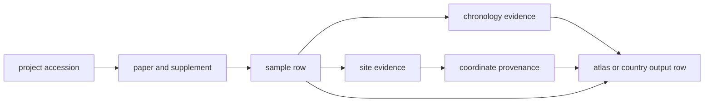

# Animal Ancient DNA Evidence

Animal ancient DNA enters this repository through studies, project accessions,
and supplementary tables, but the public-facing claim is rarely about the
project alone. It is about a sample, a locality, a date, and a mapping
decision that can be checked.

That is why the key unit is the sample-backed evidence chain:

## Why This Domain Needs Extra Care

Animal ancient DNA is the part of the repository most likely to look stronger
from a distance than it really is. A species can appear in a report, a map, or
coverage summary long before every supporting sample row has clean locality and
chronology support.

This page exists to slow that down. It explains that animal evidence is not a
single file family or one project list. It is a recovery chain that has to
hold together from source capture to public publication.

## What Readers Should Expect

A strong animal row in this repository should make the following questions
answerable:

| Question | Where the answer usually lives | Example |
| --- | --- | --- |
| Which study or archive project is this record tied to? | project and paper registries | `data/adna/governance/source_library/project_registry.json` |
| Which recoverable sample rows exist? | project sample masters and normalized sample records | `data/adna/governance/source_library/projects/PRJEB36540/sample_master.json` |
| What locality claim is actually supported? | project sample sites and normalized site evidence | `data/adna/species/ovis_aries/normalized/site_evidence.json` |
| What date claim survives review? | project chronology and chronology audits | `data/adna/governance/source_library/project_sample_chronology_review.json` |
| Why is a point mapped or blocked? | coordinate provenance | `data/adna/species/ovis_aries/normalized/coordinate_provenance.json` |
| Where does the public row appear? | country reports and geography outputs | [`docs/report/world/world_animal_atlas_evidence.json`](../../../report/world/world_animal_atlas_evidence.json) |

## One Concrete Reading Path

If a reader wants to check one animal point carefully, the shortest path is:

1. identify the sample row in `data/adna/species/<latin_name>/normalized/sample_records.json`
2. confirm the named place in `data/adna/species/<latin_name>/normalized/site_evidence.json`
3. confirm the date posture in `data/adna/governance/source_library/project_sample_chronology_review.json`
4. confirm the mapping basis in `data/adna/species/<latin_name>/normalized/coordinate_provenance.json`
5. confirm the published row in the relevant country bundle or atlas evidence file

## What This Evidence Model Rejects

- treating a project list as if it were already a sample table
- treating a broad locality label as if it were an exact excavation point
- treating vague chronology text as if it were a precise date
- treating a visible atlas point as stronger than the evidence chain behind it

## Where To Go Next

- [animal source intake](../sources/animal-source-intake.md) if your question is still about project and supplement recovery
- [sample records](../evidence/sample-records.md) if your question is already about one recoverable row
- [coordinates](../evidence/coordinates.md) if your question is about why a row appears on a map
- [geographic limits and honesty](../outputs/geographic-limits-and-honesty.md) if your question is about why some animal rows remain qualified or excluded
