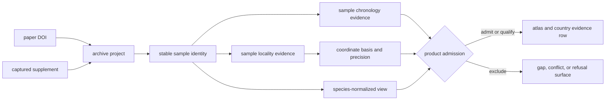
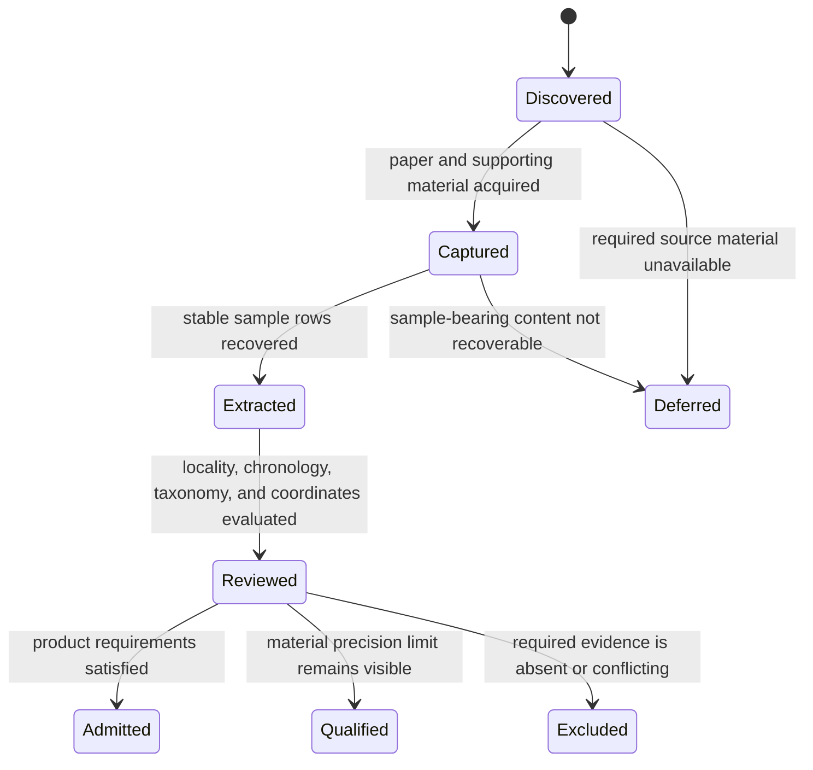
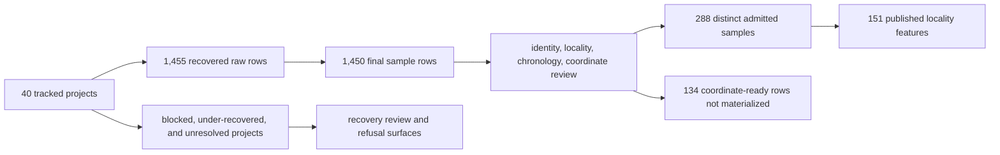
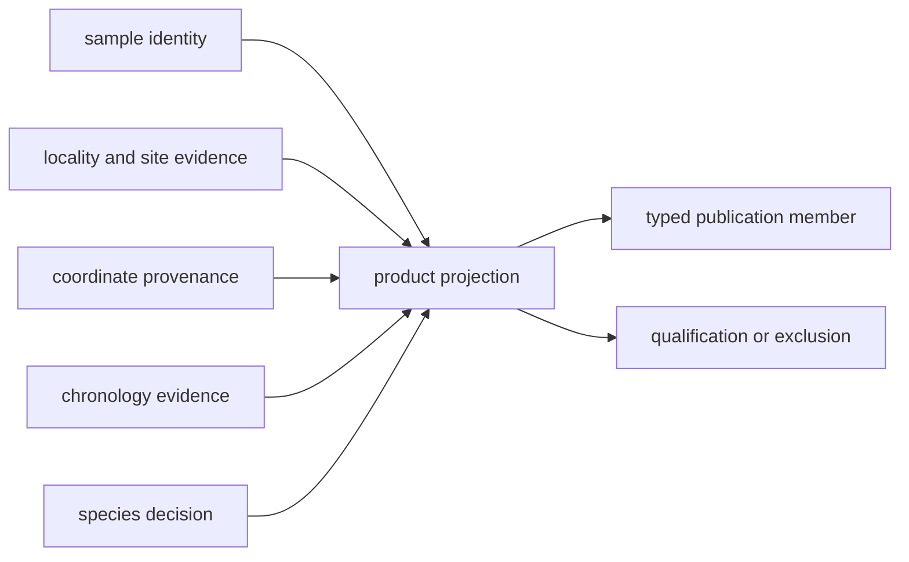

# Animal Ancient DNA Evidence

Animal ancient-DNA publication normally begins with a source-backed sample,
not a project title or species mention. Papers, archive projects, supplements,
sample tables, sites, chronology statements, and coordinates remain distinct
evidence units until their relationships are explicitly curated. The current
point surface also contains one explicitly qualified project-anchored context
feature; it must not be described as a recovered sample.

## Evidence Chain

```mermaid
flowchart LR
    Paper["paper DOI"] --> Project["archive project"]
    Supplement["captured supplement"] --> Project
    Project --> Sample["stable sample identity"]
    Sample --> Locality["sample locality evidence"]
    Sample --> Chronology["sample chronology evidence"]
    Locality --> Coordinate["coordinate basis and precision"]
    Sample --> Species["species-normalized view"]
    Chronology --> Decision{"product admission"}
    Coordinate --> Decision
    Species --> Decision
    Decision -->|admit or qualify| Published["atlas and country evidence row"]
    Decision -->|exclude| Accountability["gap, conflict, or refusal surface"]
```

## Evidence Units And Authorities

| Evidence unit | Governing surface | Required distinction |
| --- | --- | --- |
| project | `source_library/project_registry.json` | archive identity is not a sample identity |
| paper | `source_library/paper_registry.json` | publication identity is not project identity |
| captured artifact | project source bundle and supporting-material manifest | discovered URL is not recovered content |
| sample | project `sample_master.json` | source labels and stable repository identity remain linked |
| locality | project `sample_locality_evidence.json` and species `site_evidence.json` | verbatim place, resolved site, and publication precision differ |
| chronology | project `sample_chronology_evidence.json` and chronology review surfaces | source text, normalized interval, basis, and caveat remain linked |
| coordinate | species `coordinate_provenance.json` | supplied, resolved, approximate, substituted, and unresolved differ |
| publication | atlas evidence row and product manifest | visible membership is downstream of admission |

## Recovery States

```mermaid
stateDiagram-v2
    [*] --> Discovered
    Discovered --> Captured: paper and supporting material acquired
    Captured --> Extracted: stable sample rows recovered
    Extracted --> Reviewed: locality, chronology, taxonomy, and coordinates evaluated
    Reviewed --> Admitted: product requirements satisfied
    Reviewed --> Qualified: material precision limit remains visible
    Reviewed --> Excluded: required evidence is absent or conflicting
    Discovered --> Deferred: required source material unavailable
    Captured --> Deferred: sample-bearing content not recoverable
```

Tracked but deferred evidence is not equivalent to a negative scientific
result. It records what is known about the source and what remains unavailable.

## Current Evidence Depth

The governed foundation currently contains **1,450 final sample rows** across
**10 species and 21 contributing projects**. Of those rows, 531 are fully
grounded, 333 are partly grounded, 11 are blocked by missing metadata, 79 by
missing location detail, and 496 by weak chronology. This is the final sample
evidence-preparation population, not a publication-feature count.

The generated project intake review separately covers **40 tracked projects**
and contains **1,455 recovered raw sample-master rows**, of which **1,450 enter
the final sample population**. Only four projects have an exact expected-sample
denominator. The repository therefore does not present either total as a
complete census of every deposited sample.

The point-evidence review contains **151 published locality features**
representing **288 distinct admitted samples**. The features comprise 116
`domesticated_core` localities and 35 `wild_or_progenitor_context` localities.
These are admitted evidence features, not proof that every project, species,
locality, or chronology has reached the same maturity.

All 151 published features are backed by at least one admitted sample. Wadi
Halfa dromedary context for project `SRP073444` remains useful source context,
but it is not published. Map-readiness accounting retains it among the 134
not-materialized rows with reason
`no_admitted_sample_backed_locality_candidate`.

| Point population | Rows | Identity and coordinate posture |
| --- | ---: | --- |
| domesticated-core localities | 116 | admitted sample backing and product scope retained |
| wild or progenitor context localities | 35 | admitted sample backing with context role retained |
| total published locality features | 151 | represents 288 distinct admitted samples |

### Three Ledgers Answer Three Questions

| Ledger | Unit | Question answered |
| --- | --- | --- |
| foundation truth | curated preparation row | how completely is the available identity, locality, chronology, and metadata evidence grounded? |
| project sample master | recovered sample identity | which source labels resolve to a stable sample within a project? |
| point publication | locality feature and represented sample | which sample-backed domesticated-core or wild/progenitor-context localities satisfy this map contract? |

No universal completeness percentage spans all three. A preparation blocker is
not necessarily an identity ambiguity; a final identity is not necessarily
point-ready; and retained project context is not a published sample-backed
locality.

### Evidence Depth Is Dimension-Specific

| Dimension | What the repository can establish | Remaining boundary |
| --- | --- | --- |
| source discovery | which projects, papers, and supplements are tracked | discovery does not prove sample-bearing material was recovered |
| sample recovery | which source rows became stable sample records | most projects do not have an exact expected-row denominator |
| locality | which verbatim localities resolve to sample- or group-owned sites | regional or conflicting assignments remain non-point evidence |
| coordinate | whether a pair is source-supplied or repository-resolved, with confidence | coordinate class does not imply uniform real-world precision |
| chronology | which source statement, interval, and basis belong to a sample | broad or contextual time does not authorize synthetic numeric bounds |
| publication | which rows satisfy a named product contract | admission does not establish collection completeness |

There is therefore no single collection-wide maturity score. A project can be
well documented at the paper and supplement level while its locality recovery
is incomplete; a spatially admitted sample can still have chronology that is
too broad for numeric comparison. The governing files preserve those
different states instead of averaging them into one quality label.

```mermaid
flowchart LR
    Inventory["40 tracked projects"] --> Recovery["1,455 recovered raw rows"]
    Recovery --> Foundation["1,450 final sample rows"]
    Foundation --> Review["identity, locality, chronology, coordinate review"]
    Review --> Samples["288 distinct admitted samples"]
    Samples --> Points["151 published locality features"]
    Review --> Excluded["134 coordinate-ready rows not materialized"]
    Inventory --> Gaps["blocked, under-recovered, and unresolved projects"]
    Gaps --> Accountability["recovery review and refusal surfaces"]
```

The generated reports make both branches visible. The published branch shows
what satisfies the point contract; the accountability branch prevents the
admitted subset from masquerading as collection completeness.

## A Published Point Is A Typed Projection

The point row does not become a new authority for the facts it displays. It is
a product-specific projection over separately governed evidence:

| Point field | Governing owner | Projection rule |
| --- | --- | --- |
| feature identity | publication manifest and evidence-row identity | stable within the named product and linked to one or more admitted governed samples |
| sample label and accession | project sample master | display the admitted identity without replacing source-native aliases |
| species | species-normalized sample record and taxonomy decision | use the governed taxon posture, including qualification or conflict |
| locality label | sample locality and site evidence | display at the admitted resolution; broad text remains broad |
| geometry | coordinate-provenance decision | supplied, resolved, approximate, substituted, or withheld posture travels with the pair |
| time label or interval | sample chronology evidence | preserve source wording, normalized basis, ownership, and comparability caveat |
| admission posture | named product rule | distinguish sample-backed scope classes from excluded and deferred populations |

```mermaid
flowchart LR
    Sample["sample identity"] --> Projection["product projection"]
    Locality["locality and site evidence"] --> Projection
    Coordinate["coordinate provenance"] --> Projection
    Chronology["chronology evidence"] --> Projection
    Taxonomy["species decision"] --> Projection
    Projection --> Member["typed publication member"]
    Projection --> Refusal["qualification or exclusion"]
```

This model permits a narrow supported point without declaring the whole
project complete. It also permits curation to strengthen later without
rewriting history: a new evidence decision creates a reviewable projection
change and affected product diff rather than silently mutating the earlier
source claim.

## Audit A Published Animal Point

1. resolve its feature and evidence-row identifiers in the product traceability
   surface;
2. confirm the species record under
   `data/adna/species/<latin_name>/normalized/sample_records.json`;
3. inspect the species `site_evidence.json`, then follow its project linkage to
   `sample_sites.json` and `sample_locality_evidence.json`;
4. inspect project `sample_chronology_evidence.json` and the cross-project
   chronology review for temporal posture;
5. inspect `coordinate_provenance.json` for basis and precision;
6. follow the sample lineage to the project sample master, source bundle,
   paper, and captured supporting artifact;
7. confirm that the product manifest records the point's admission posture.

## Publication Boundary

A species-level presence, archive project, or paper citation cannot substitute
for a recoverable sample row. A broad locality cannot become an exact point. A
cultural period cannot acquire a synthetic numeric interval. A visible point
cannot outrank its governing evidence.

The point contract is also narrower than “animal evidence available.” A
project can contribute paper, supplement, taxonomy, or broad locality evidence
without contributing an atlas point. Conversely, a point admitted under its
present traceability and precision does not certify complete recovery of its
project. The release posture records the narrower claim that the admitted
subset satisfies its point contract while project-level recovery denominators,
blocked sources, and unresolved evidence remain visible outside that subset.

Wadi Halfa is a concrete example of why publication decisions must travel with
the evidence row. Its source context and approximate named-place coordinate
remain traceable, but the current product does not materialize it without an
admitted sample-backed locality candidate. Analyses must preserve that explicit
exclusion rather than infer a point from retained context.

Continue with [animal source intake](../sources/animal-source-intake.md),
[sample records](../evidence/sample-records.md), [locality evidence](../evidence/localities.md),
[chronology](../evidence/chronology.md), and [point publication rules](../publications/point-rules.md).
