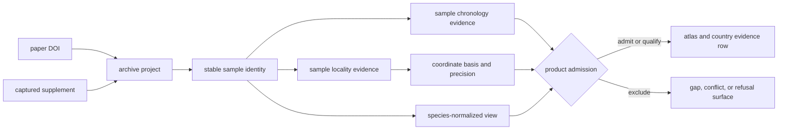
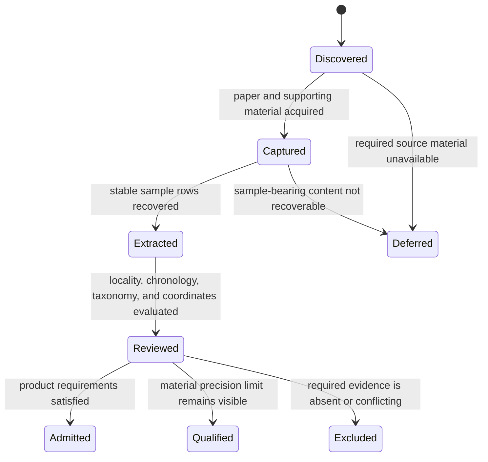

# Animal Ancient DNA Evidence

Animal ancient-DNA publication begins with a source-backed sample, not a
project title or species mention. Papers, archive projects, supplements,
sample tables, sites, chronology statements, and coordinates remain distinct
evidence units until their relationships are explicitly curated.

## Evidence Chain

```mermaid
flowchart LR
    Paper["paper DOI"] --> Project["archive project"]
    Supplement["captured supplement"] --> Project
    Project --> Sample["stable sample identity"]
    Sample --> Locality["sample locality evidence"]
    Sample --> Chronology["sample chronology evidence"]
    Locality --> Coordinate["coordinate basis and precision"]
    Sample --> Species["species-normalized view"]
    Chronology --> Decision{"product admission"}
    Coordinate --> Decision
    Species --> Decision
    Decision -->|admit or qualify| Published["atlas and country evidence row"]
    Decision -->|exclude| Accountability["gap, conflict, or refusal surface"]
```

## Evidence Units And Authorities

| Evidence unit | Governing surface | Required distinction |
| --- | --- | --- |
| project | `source_library/project_registry.json` | archive identity is not a sample identity |
| paper | `source_library/paper_registry.json` | publication identity is not project identity |
| captured artifact | project source bundle and supporting-material manifest | discovered URL is not recovered content |
| sample | project `sample_master.json` | source labels and stable repository identity remain linked |
| locality | project `sample_locality_evidence.json` and species `site_evidence.json` | verbatim place, resolved site, and publication precision differ |
| chronology | project `sample_chronology_evidence.json` and chronology review surfaces | source text, normalized interval, basis, and caveat remain linked |
| coordinate | species `coordinate_provenance.json` | supplied, resolved, approximate, substituted, and unresolved differ |
| publication | atlas evidence row and product manifest | visible membership is downstream of admission |

## Recovery States

```mermaid
stateDiagram-v2
    [*] --> Discovered
    Discovered --> Captured: paper and supporting material acquired
    Captured --> Extracted: stable sample rows recovered
    Extracted --> Reviewed: locality, chronology, taxonomy, and coordinates evaluated
    Reviewed --> Admitted: product requirements satisfied
    Reviewed --> Qualified: material precision limit remains visible
    Reviewed --> Excluded: required evidence is absent or conflicting
    Discovered --> Deferred: required source material unavailable
    Captured --> Deferred: sample-bearing content not recoverable
```

Tracked but deferred evidence is not equivalent to a negative scientific
result. It records what is known about the source and what remains unavailable.

## Audit A Published Animal Point

1. resolve its feature and evidence-row identifiers in the product traceability
   surface;
2. confirm the species record under
   `data/adna/species/<latin_name>/normalized/sample_records.json`;
3. inspect the species `site_evidence.json`, then follow its project linkage to
   `sample_sites.json` and `sample_locality_evidence.json`;
4. inspect project `sample_chronology_evidence.json` and the cross-project
   chronology review for temporal posture;
5. inspect `coordinate_provenance.json` for basis and precision;
6. follow the sample lineage to the project sample master, source bundle,
   paper, and captured supporting artifact;
7. confirm that the product manifest records the point's admission posture.

## Publication Boundary

A species-level presence, archive project, or paper citation cannot substitute
for a recoverable sample row. A broad locality cannot become an exact point. A
cultural period cannot acquire a synthetic numeric interval. A visible point
cannot outrank its governing evidence.

Continue with [animal source intake](../sources/animal-source-intake.md),
[sample records](../evidence/sample-records.md), [locality evidence](../evidence/localities.md),
[chronology](../evidence/chronology.md), and [point publication rules](../publications/point-rules.md).
