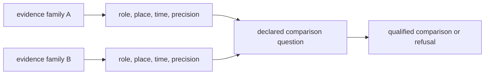

# Cross-Domain Evidence Matrix

The evidence families differ in observation unit, spatial meaning, temporal
meaning, geographic reach, and publication maturity. Their coexistence in one
atlas enables comparison; it does not make them interchangeable.

## Domain Matrix

| Domain | Observation unit | Spatial meaning | Temporal meaning | Publication role | Principal limit |
| --- | --- | --- | --- | --- | --- |
| LandClim | pollen sequence or model-grid context | site and modelled landscape context | sequence- or model-specific | primary palaeoenvironmental context | model grids are not direct sample observations |
| Neotoma | palaeoecological site and dataset | named site coordinates | site-specific chronology and resolution | primary pollen context | coverage and age control vary by site |
| SEAD | environmental-archaeology site or record | archaeological place | heterogeneous archaeological chronology | contextual archaeology | access, normalization, and temporal comparability remain uneven |
| RAÄ | Swedish heritage record or density surface | Sweden-specific registered location | record-specific and often broad | contextual archaeology | national scope and heterogeneous dating |
| boundaries | administrative geometry | product scope and clipping | none | geographic framing | carries no independent scientific weight |
| SMHI SVAR | registered Swedish water body | lake identity and geometry | current registry state | sampling context and lake prioritization | registry presence is not coring suitability |
| AADR | release-versioned human sample metadata | sample location at declared precision | metadata interval or cultural context | direct human aDNA evidence | genotype processing is outside current scope |
| animal aDNA | curated sample linked to project and literature | sample-owned locality and coordinate posture | sample-owned chronology posture | direct evidence when admitted | project recovery and sample support remain uneven |
| fieldwork | dated repository visit | declared visit coordinates | exact visit date | direct visit evidence | one visit is not representative coverage |

## Valid Comparisons

Cross-domain comparison requires an explicit bridge:

Geographic proximity is only one input. A valid interpretation also accounts
for temporal overlap, observation unit, source maturity, and whether each layer
is direct evidence, context, framing, or decision support.

## Maturity Is Not A Single Rank

A family can have reliable acquisition but weak temporal comparability, or
strong sample identity but unresolved coordinates. The live matrix therefore
tracks evidence dimensions separately instead of collapsing them into a
single confidence score.

The [repository cross-domain evidence matrix](../../../report/repository_cross_domain_evidence_matrix.md)
reports current family posture. The
[atlas input audit](../../../report/repository_atlas_input_audit.md) reports
which governed inputs reach publication. Source-specific interpretation begins
with the [source-family matrix](../sources/source-family-matrix.md).
