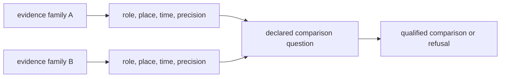
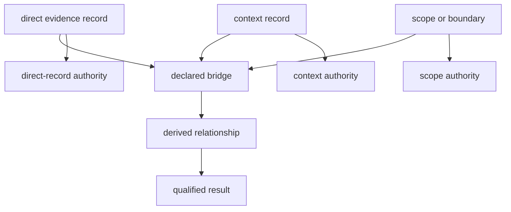

# Cross-Domain Evidence Matrix

The evidence families differ in observation unit, spatial meaning, temporal
meaning, geographic reach, and publication maturity. Their coexistence in one
atlas enables comparison; it does not make them interchangeable.

## Domain Matrix

| Domain | Observation unit | Spatial meaning | Temporal meaning | Publication role | Principal limit |
| --- | --- | --- | --- | --- | --- |
| LandClim | pollen sequence or model-grid context | site and modelled landscape context | sequence- or model-specific | primary palaeoenvironmental context | model grids are not direct sample observations |
| Neotoma | palaeoecological site and dataset | named site coordinates | site-specific chronology and resolution | primary pollen context | coverage and age control vary by site |
| SEAD | environmental-archaeology site or record | archaeological place | heterogeneous archaeological chronology | contextual archaeology | access, normalization, and temporal comparability remain uneven |
| RAÄ | Swedish heritage record or density surface | Sweden-specific registered location | record-specific and often broad | contextual archaeology | national scope and heterogeneous dating |
| boundaries | administrative geometry | product scope and clipping | none | geographic framing | carries no independent scientific weight |
| SMHI SVAR | registered Swedish water body | lake identity and geometry | current registry state | sampling context and lake prioritization | registry presence is not coring suitability |
| AADR | release-versioned human sample metadata | sample location at declared precision | metadata interval or cultural context | direct human aDNA evidence | genotype processing is outside current scope |
| animal aDNA | curated sample linked to project and literature | sample-owned locality and coordinate posture | sample-owned chronology posture | direct evidence when admitted | project recovery and sample support remain uneven |
| fieldwork | dated repository visit | declared visit coordinates | exact visit date | direct visit evidence | one visit is not representative coverage |

## Valid Comparisons

Cross-domain comparison requires an explicit bridge:

Geographic proximity is only one input. A valid interpretation also accounts
for temporal overlap, observation unit, source maturity, and whether each layer
is direct evidence, context, framing, or decision support.

## Relationship Contract

Cross-domain publication joins records for a declared question; it does not
merge their identities or evidence roles.

The bridge may be a distance band, interval-overlap rule, country predicate,
species relation, or fieldwork criterion. Its result is a new derived relation,
not new source evidence. Removing the bridge must leave each input record and
its authority intact.

Every derived relationship should preserve the identities of its members,
their roles and precision, the rule and parameters, the product scope, and an
outcome of supported, boundary-sensitive, contextual-only, or refused. A
reader can then challenge the relationship without having to challenge the
existence of its source records.

## Comparison Protocol

1. State the scientific or operational question without naming the desired
   outcome.
2. Identify the observation unit and governing identity in each family.
3. Declare each family's evidence role for this question.
4. Normalize spatial and temporal precision only to the weakest supported
   common level.
5. Record source version, scope, missingness, and inclusion rules.
6. Decide whether the bridge supports comparison, context, prioritization, or
   refusal.
7. Preserve the member-level inputs and qualifications with the result.

The bridge is part of the result. A distance threshold, temporal-overlap rule,
administrative containment, species relation, or sampling criterion must be
named rather than implied by a combined map.

## Count Units And Denominators

Counts are comparable only after their observation units and transformations
are declared. The checked-in collection contains several instructive cases:

| Published quantity | Unit | What must not be inferred |
| --- | --- | --- |
| 2,195 SEAD inventory rows | captured inventory row | 2,195 distinct normalized map points |
| 2,172 normalized SEAD records | published site point | complete or uniformly dated archaeology evidence |
| 761,917 RAÄ records | source registry record | equivalent density or recording effort across space |
| 106 RAÄ density cells | one-degree aggregate cell | 106 archaeological sites |
| two fieldwork pages | documentation surface | two independent visits |
| one fieldwork feature | dated visit event | representative lake or regional coverage |

The SEAD difference reflects transformation from source inventory to
normalized spatial records. The RAÄ difference reflects deliberate
aggregation. The fieldwork difference separates documentation pages from the
single event they describe. None is an error when the unit remains attached;
all become misleading when reduced to an unlabeled total.

For any rate or comparison, publish the numerator, eligible denominator,
excluded or unresolved count, and unit of observation. “Evidence-rich” is not
a defensible substitute for those quantities.

## Comparisons To Refuse

| Proposed inference | Why it fails |
| --- | --- |
| map co-location proves contemporaneity | spatial overlap carries no temporal equivalence |
| a project location is an exact sample location | project and sample are different observation units |
| more registered sites means greater historical activity | registry coverage, preservation, and recording effort differ |
| a contextual layer confirms a direct-evidence claim | evidence roles are not interchangeable |
| absence from one product proves source absence | scope, admission, recovery, or precision may explain exclusion |
| counts across families measure the same abundance | denominators and observation units differ |

Refusal does not make the families useless together. It defines the narrower
question they can answer without manufacturing comparability.

## Example: Lake Prioritization

A registered lake can supply sampling identity and geometry. Nearby
archaeological records can describe contextual density; pollen sources can
describe palaeoenvironmental context; and admitted ancient-DNA samples can
provide direct evidence for their own governed specimens. A ranking may
combine declared distance bands and sensitivity scenarios to prioritize
fieldwork.

That result supports a decision about where to investigate. It does not show
that contextual records originated at the lake, that the layers are
contemporaneous, or that a high-ranked basin will yield a successful core.
Those limits travel with the ranking.

## Maturity Is Not A Single Rank

A family can have reliable acquisition but weak temporal comparability, or
strong sample identity but unresolved coordinates. The live matrix therefore
tracks evidence dimensions separately instead of collapsing them into a
single confidence score.

The [repository cross-domain evidence matrix](../../../report/repository_cross_domain_evidence_matrix.md)
reports current family posture. The
[atlas input audit](../../../report/repository_atlas_input_audit.md) reports
which governed inputs reach publication. Source-specific interpretation begins
with the [source-family matrix](../sources/source-family-matrix.md).
