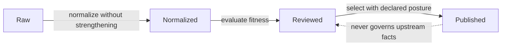
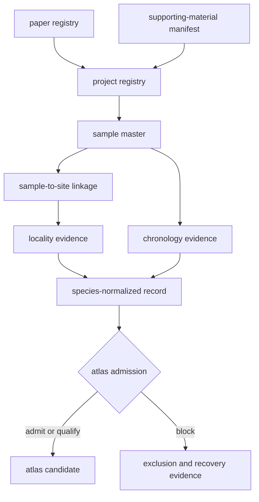

# Data Architecture Handbook

The database separates evidence by lifecycle and authority. Upstream bytes,
normalized fields, scientific decisions, and public presentation are related,
but no layer is allowed to impersonate another.

## Four Evidence Layers

| Layer | Governing question | Typical contents |
| --- | --- | --- |
| Raw | What exactly was acquired? | source payload, version, retrieval metadata, license, and hash |
| Normalized | How is the source represented consistently? | typed fields, stable identifiers, normalized dates, and geometry |
| Reviewed | Is the record fit for a declared use? | conflicts, precision, coverage, caveats, exclusions, and release posture |
| Published | What qualified evidence is exposed to readers? | report bundles, maps, tables, rankings, and public review surfaces |

## Family Topology

| Family | Raw | Normalized | Reviewed | Published |
| --- | --- | --- | --- | --- |
| LandClim | `data/landclim/raw/` | `data/landclim/normalized/` | cross-family stage matrix | world and regional pollen layers |
| Neotoma | `data/neotoma/raw/` | `data/neotoma/normalized/` | `data/neotoma/review/` | world and regional pollen layers |
| SEAD | `data/sead/raw/` | `data/sead/normalized/` | `data/sead/review/` | environmental archaeology layers |
| RAÄ | `data/raa/raw/` | `data/raa/normalized/` | cross-family stage matrix | Sweden archaeology layers |
| Boundaries | `data/boundaries/raw/` | `data/boundaries/normalized/` | cross-family stage matrix | geographic framing |
| SVAR | `data/svar/raw/` | `data/svar/normalized/` | lake evidence and ranking reviews | Sweden lake packet and overlays |
| AADR | `data/aadr/` | `data/adna/species/homo_sapiens/normalized/` | human species review | country and regional human aDNA layers |
| Animal aDNA | project source library | species-normalized records | animal governance and scientific reviews | admitted atlas and country records |

The exact contract, example artifacts, and coverage metrics for each family are
published in `data/source_family_contracts.json`.

## Animal Evidence Topology

Animal aDNA requires a richer topology because publication metadata, archive
metadata, supplements, and sample evidence frequently have different owners.

The source library keeps a project accession distinct from a paper DOI and a
sample identifier distinct from a site. This prevents a broad project locality
or publication date from being copied into every sample row as if it were
sample-specific evidence.

## Fact Ownership

`data/source_fact_ownership_registry.json` resolves repeated facts to one
governing surface. Representative authorities include:

- project inventory: `project_registry.json`;
- paper inventory: `paper_registry.json`;
- sample identity: a project's `sample_master.json`;
- sample-site linkage: a project's `sample_sites.json`;
- locality claims: a project's `sample_locality_evidence.json`;
- chronology claims: a project's `sample_chronology_evidence.json`;
- species views: `species/<latin_name>/normalized/sample_records.json`; and
- atlas admission: `final/atlas/animal_atlas_point_candidates.json`.

A downstream bundle may repeat these facts for use, but disagreement is
resolved at the governing surface and then regenerated downstream.

## Artifact Contracts

`data/evidence_artifact_contracts.json` defines recurring scopes for project
source bundles, paper supporting-material manifests, sample foundations, site
evidence, regional atlas bundles, and country publications. The per-project
animal subtree is further specified by
`data/adna/governance/source_library/project_surface_contract.json`.

Contracts make absence interpretable. A missing required artifact is a
structural failure; an empty governed field can be a legitimate evidence gap;
and a blocked review is an explicit scientific outcome.

## Traceability Rule

A public claim is complete only when it resolves through the publication
manifest, admitted evidence row, governing normalized record, and source
identity. A visually precise coordinate does not compensate for a missing link
in that chain.
