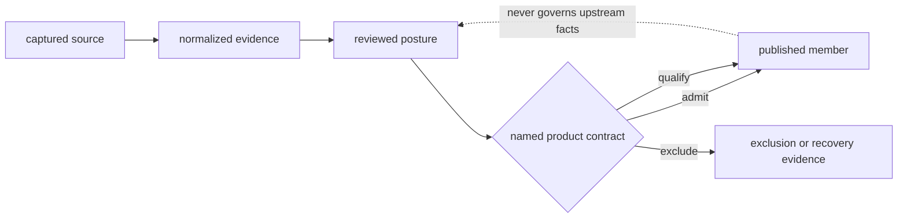
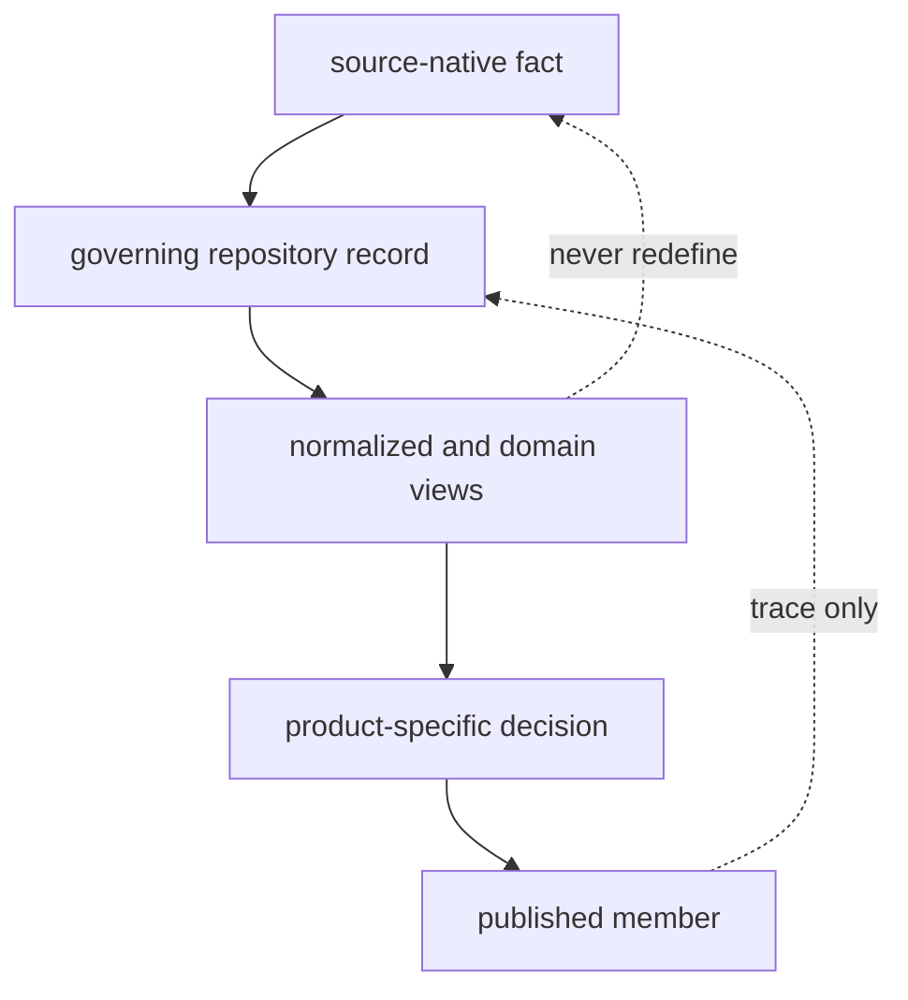
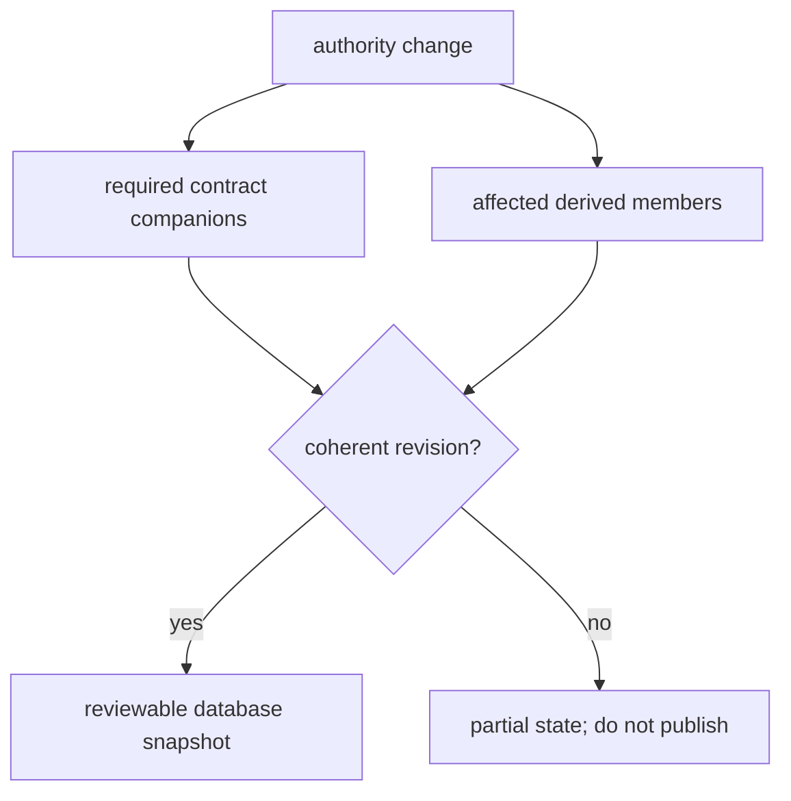
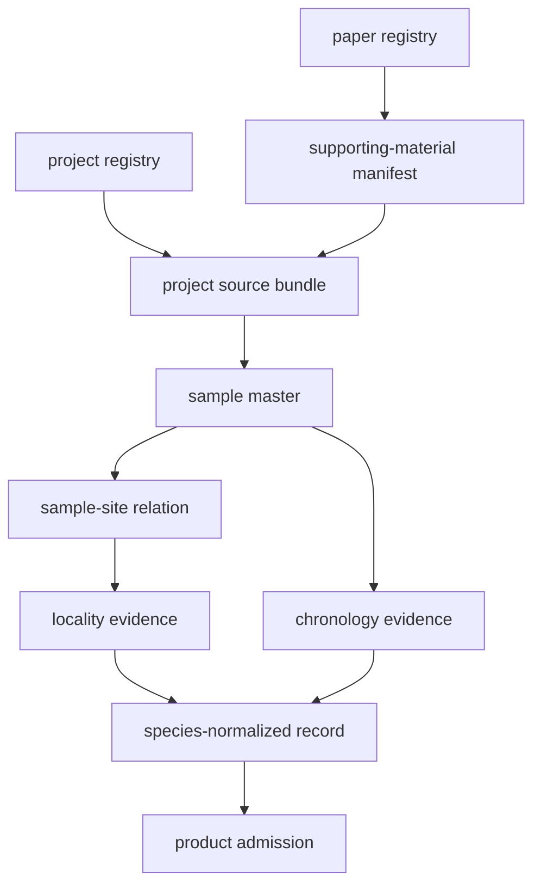

# Data Architecture Handbook

Bijux Pollenomics uses a version-controlled evidence database. Its records are
governed files whose history, schemas, identifiers, and publication effects
can be inspected together. It is not a database service hidden behind the
maps, and the maps are not the database.

## Evidence Layers

| Layer | Governing question | Typical contents | Authority limit |
| --- | --- | --- | --- |
| captured | What material entered the repository? | payloads, retrieval metadata, upstream identity, license, and hashes | does not imply correct interpretation |
| normalized | How is source meaning represented consistently? | typed fields, stable identifiers, geometry, dates, and source-native values | does not imply publication fitness |
| reviewed | What can this record support for a named use? | conflict, precision, coverage, substitution, caveat, and exclusion decisions | remains product- and claim-specific |
| published | Which qualified records are exposed? | manifests, rows, maps, tables, rankings, warnings, and citations | cannot redefine upstream facts |

## Three Contract Registries

The database is made legible by three cross-cutting registries:

| Registry | Responsibility |
| --- | --- |
| `data/source_family_contracts.json` | declares each family's scientific role, lifecycle roots, example artifacts, and coverage metrics |
| `data/source_fact_ownership_registry.json` | assigns recurring facts to one governing surface and lists downstream supporting copies |
| `data/evidence_artifact_contracts.json` | defines project, paper, sample, species, atlas, and country artifact shapes |

These registries answer different questions. A source-family contract says
what a family contributes. Fact ownership says where disagreement is resolved.
An artifact contract says which files must exist for a complete evidence unit.

## Database Invariants

The file-backed design depends on invariants that are stronger than directory
conventions:

| Invariant | Consequence |
| --- | --- |
| one fact, one owner | repeated values resolve to a declared governing record rather than majority agreement |
| source and interpretation remain distinct | normalization can be challenged without losing what the source said |
| derivation moves downstream | a map, report, or species view cannot silently feed facts back into project evidence |
| precision never increases without evidence | formatting, geocoding, or normalization cannot manufacture certainty |
| negative states remain typed | missing, unresolved, excluded, deferred, and outside-scope records retain different meanings |
| membership is product-specific | admission to one scope or surface does not grant universal publication fitness |
| every public member is reversible | product identity can be traced to evidence, decision, captured artifact, and upstream identity |

These invariants let the repository use ordinary versioned files while still
behaving like an evidence database: ownership, lineage, constraints, and
revision effects remain inspectable.

## Database Model Boundaries

The architecture separates three kinds of structure that are easy to conflate:

| Structure | Defines | Does not define |
| --- | --- | --- |
| directory lifecycle | where captured, normalized, reviewed, and published artifacts belong | object identity or scientific joins |
| object and relation model | typed identities, cardinality, fact ownership, and supported relations | fitness for a particular publication |
| revision and state model | accepted database snapshot, claim states, supersession, and causal consistency | stronger evidence than the governing records contain |

Directory proximity never grants authority. A review file beside normalized
rows may evaluate them without owning their source facts; a `final/` input may
be downstream-complete while remaining subordinate to its sample evidence.

## Revision Consistency

A Git revision is the database snapshot. It is coherent only when authorities,
required companions, and derived consumers describe the same evidence state.
Checking in one regenerated table while leaving its manifest, traceability, or
review surface behind is equivalent to a partial database transaction.

Review consistency across four dimensions:

| Dimension | Consistency question |
| --- | --- |
| identity | do manifests, rows, traceability, and exclusions name the same governing members? |
| semantics | do units, roles, precision, and null states agree with their owners? |
| membership | do additions and removals have an admission, scope, or recovery explanation? |
| accounting | do totals equal their declared member populations without mixing observation units? |

File timestamps and successful rendering are not consistency evidence. The
revision must preserve causal order: authority first, required companions with
it, derived consumers from the same state, and public claims no stronger than
the resulting review posture.

## Source-Family Topology

| Family | Evidence role | Characteristic reviewed state | Public use |
| --- | --- | --- | --- |
| LandClim | primary pollen context | freshness, coverage, and publication posture | world and regional pollen layers |
| Neotoma | primary pollen context | site-level temporal comparability | world and regional pollen layers |
| SEAD | contextual archaeology | access, temporal, and normalization legibility | environmental archaeology context |
| RAÄ | contextual archaeology | Sweden-specific coverage and spatial interpretation | Sweden archaeology context |
| SVAR | sampling and hydrography | lake identity, coverage, and ranking inputs | Sweden lake products |
| boundaries | geographic framing | scope and geometry fitness | world, regional, and country selection |
| AADR | direct human aDNA | sample identity, chronology, and locality | human country and regional layers |
| animal aDNA | direct animal aDNA | project, paper, supplement, sample, place, time, coordinate, and archive integrity | admitted animal atlas and country members |

Role is preserved across shared products. An archaeology or boundary layer can
frame direct evidence without inheriting its claim strength.

## Animal Evidence Graph

Animal evidence is modeled as linked authorities because one publication can
cover multiple projects, one project can contain multiple sites, and one site
can contain samples with different chronologies.

The graph prevents project locality, publication date, or archive metadata
from being copied into every sample as if it were sample-owned evidence.

## Curation Decisions

Curation is recorded whenever source material does not map mechanically to a
claim. Typical decisions include:

- connecting an archive project to a paper and its supporting materials;
- reconciling source-native and repository-owned sample identifiers;
- choosing whether a place is sample-owned, site-owned, project-level, or
  unresolved;
- preserving reported chronology alongside its normalization basis and
  precision;
- classifying a coordinate as source-supplied, resolved, approximate,
  substituted, region-only, or withheld;
- admitting, qualifying, or excluding a record for one product.

The decision must retain its evidence owner and reason. A normalized value
without that context is easier to consume but harder to trust.

## Negative Evidence

Absence has several meanings:

| State | Interpretation |
| --- | --- |
| required artifact missing | the evidence unit is structurally incomplete |
| governed field empty | the source chain contains no defensible value |
| unresolved | competing or insufficient support prevents a decision |
| excluded | a known record fails a named product contract |
| outside scope | the record may be valid but is not a member of this product |

These states remain queryable. They are not collapsed into zero, false, or an
invented value.

## Traceability Invariant

A public feature must resolve through product membership, admission decision,
governing evidence record, captured source, and upstream identity. A product
that cannot make that traversal is incomplete even when its visible geometry
looks precise.

Continue to the [evidence database](../database/index.md) for the unified
contract, the [object and relation model](../database/object-and-relation-model.md)
for identities and cardinality, and the
[revision and state model](../database/revision-and-state-model.md) for coherent
snapshots and change semantics.
