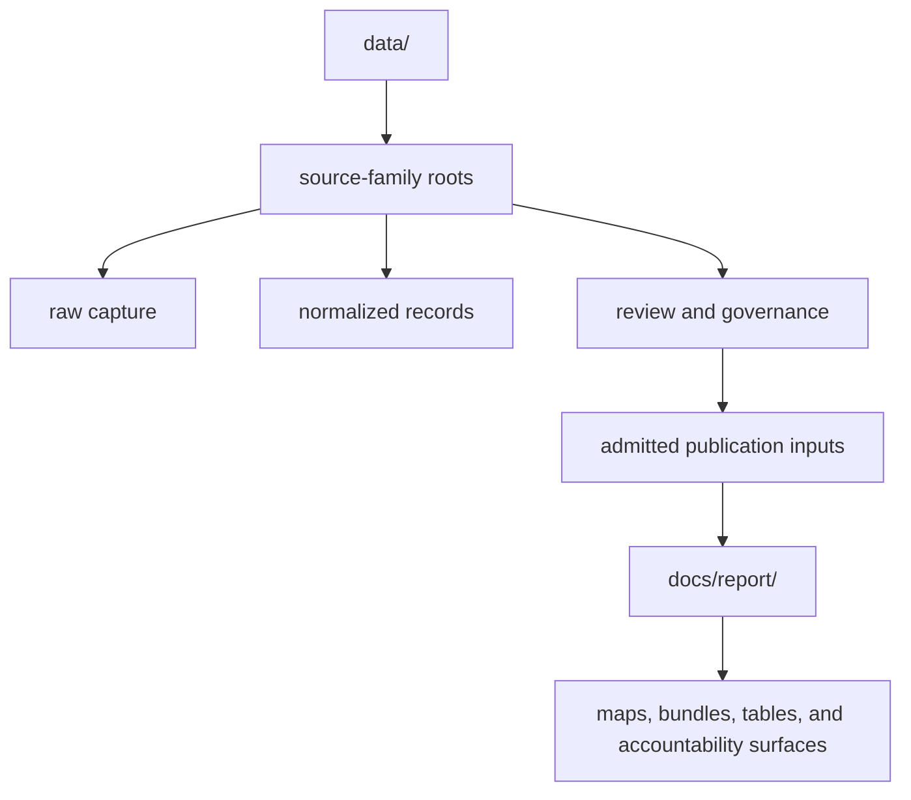

# Data Directory Layout

The tracked tree separates governed evidence state from derived publication
state. Directory position communicates lifecycle and authority; it is not only
an implementation detail.

## Main Areas

| Area | What lives there | Why it matters |
| --- | --- | --- |
| `data/aadr/` | human ancient DNA release material | release-based human context |
| `data/adna/` | animal aDNA governance, normalized species data, and final atlas inputs | sample-backed animal evidence chain |
| `data/landclim/` | pollen sequence and REVEALS context | environmental background |
| `data/neotoma/` | paleoecological pollen context | environmental comparison and extension |
| `data/sead/` | environmental archaeology context | archaeology and environmental support |
| `data/raa/` | Swedish archaeology context | Sweden-specific archaeology framing |
| `data/boundaries/` | country and region framing geometry | filtering and scope clarity |
| `data/svar/` | Swedish water-body registry and normalized lake geometry | lake identity and decision-support inputs |
| `docs/report/` | generated world, regional, and country publication bundles | public-facing outputs |

## The Animal aDNA Tree

The `data/adna/` tree separates source recovery from species views and final
publication inputs:

| Path | Authority |
| --- | --- |
| `data/adna/governance/source_library/` | projects, papers, captured artifacts, sample foundations, conflicts, and recovery state |
| `data/adna/species/<latin_name>/normalized/` | cross-project species representation over governed sample evidence |
| `data/adna/species/<latin_name>/review/` | species fitness, gaps, and release posture |
| `data/adna/final/atlas/` | candidate and accountability inputs for atlas publication |

Species roots are views over governed project evidence, not independent source
databases. Final atlas files are admitted downstream inputs, not authorities
for project, sample, locality, chronology, or coordinate facts.

## Path Semantics

- `raw/` answers what was captured;
- `normalized/` answers how it is represented;
- `review/`, ledgers, and queues answer what is fit, conflicting, or missing;
- `final/` answers what was admitted for a named downstream contract; and
- `docs/report/` answers what was published from those admitted inputs.

When repeated values disagree, resolve them at the governing evidence path and
regenerate downstream views. Hand-editing a report or final input would create
a competing authority.
