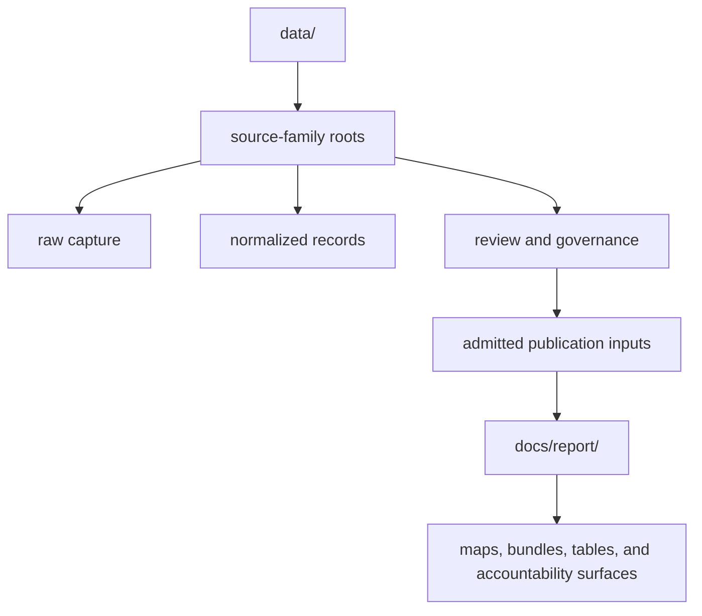

# Data Directory Layout

The tracked tree separates governed evidence state from derived publication
state. Directory position communicates lifecycle and authority; it is not only
an implementation detail.



The path answers **where a record is governed**. The record identifier answers
**which scientific object it represents**. Neither can replace the other: a
copied file without its identifiers loses joinability, while an identifier
without its governing path loses the evidence needed to interpret it.

## Main Areas

| Area | What lives there | Why it matters |
| --- | --- | --- |
| `data/aadr/` | human ancient DNA release material | release-based human context |
| `data/adna/` | animal aDNA governance, normalized species data, and final atlas inputs | sample-backed animal evidence chain |
| `data/landclim/` | pollen sequence and REVEALS context | environmental background |
| `data/neotoma/` | paleoecological pollen context | environmental comparison and extension |
| `data/sead/` | environmental archaeology context | archaeology and environmental support |
| `data/raa/` | Swedish archaeology context | Sweden-specific archaeology framing |
| `data/boundaries/` | country and region framing geometry | filtering and scope clarity |
| `data/svar/` | Swedish water-body registry and normalized lake geometry | lake identity and decision-support inputs |
| `docs/report/` | generated world, regional, and country publication bundles | public-facing outputs |

Two repository-wide registries make the family boundaries explicit:

| Registry | Question it answers |
| --- | --- |
| `data/source_fact_ownership_registry.json` | which surface owns each repeated fact, and which surfaces contain derived copies? |
| `data/source_spatiotemporal_posture_registry.json` | what spatial and temporal claims can each source family support? |

These registries are cross-family indexes. They do not supersede a project,
sample, site, chronology, or source record. Their role is to prevent a
convenient downstream copy from becoming an accidental authority.

## The Animal aDNA Tree

The `data/adna/` tree separates source recovery from species views and final
publication inputs:

| Path | Authority |
| --- | --- |
| `data/adna/governance/source_library/` | projects, papers, captured artifacts, sample foundations, conflicts, and recovery state |
| `data/adna/species/<latin_name>/normalized/` | cross-project species representation over governed sample evidence |
| `data/adna/species/<latin_name>/review/` | species fitness, gaps, and release posture |
| `data/adna/final/atlas/` | candidate and accountability inputs for atlas publication |

Species roots are views over governed project evidence, not independent source
databases. Final atlas files are admitted downstream inputs, not authorities
for project, sample, locality, chronology, or coordinate facts.

## Locate A Claim

Read a repository locator from left to right:

```text
source family / lifecycle stage / governed object / representation
```

For example, `data/adna/governance/source_library/paper_registry.json` is the
animal-aDNA, governance-stage registry for papers. By contrast,
`data/adna/final/atlas/animal_atlas_point_candidates.json` is a product input:
it contains admitted candidates, but its repeated paper and sample fields
remain governed by the source library.

The same distinction applies to the other families. A Neotoma normalized site,
a Swedish National Heritage Board normalized archaeology record, and an SVAR
normalized lake are repository representations of upstream objects. The raw
capture and source identity remain necessary to explain how each
representation was obtained.

## Path Semantics

- `raw/` answers what was captured;
- `normalized/` answers how it is represented;
- `review/`, ledgers, and queues answer what is fit, conflicting, or missing;
- `final/` answers what was admitted for a named downstream contract; and
- `docs/report/` answers what was published from those admitted inputs.

When repeated values disagree, resolve them at the governing evidence path and
regenerate downstream views. Hand-editing a report or final input would create
a competing authority.

## Move Evidence Without Losing Meaning

A portable evidence slice contains more than the selected rows. It travels
with the source release or acquisition identity, stable record identifiers,
the applicable fact-ownership and spatiotemporal posture entries, admission or
exclusion state, and the product manifest that names its members. If file
integrity is material, the slice also carries the recorded digest or checksum
from its acquisition surface.

This makes a copied bundle independently auditable. A recipient can determine
which rows were published, which source and version they came from, which
fields are derived, and which caveats still constrain interpretation without
reconstructing meaning from directory names alone.
