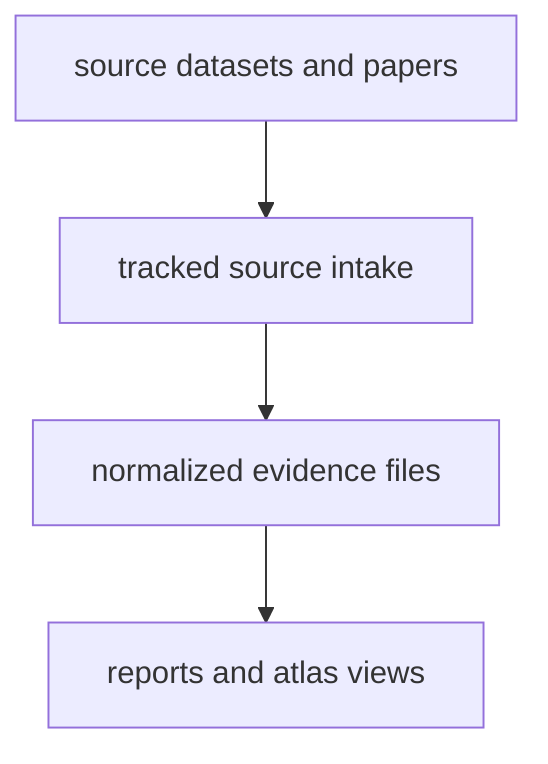

# Data System Overview

The data system in `bijux-pollenomics` is designed to keep different kinds of
evidence visible instead of merging everything into one vague export. Readers
should be able to tell whether they are looking at pollen context,
archaeological context, boundary framing, fieldwork documentation, public
review surfaces, or ancient DNA sample evidence.

## The Basic Shape

That structure matters because the repository serves two audiences at once.
Some readers want to inspect the tracked evidence directly. Others want to read
the public-facing country bundles or regional atlas outputs. The repository
needs both, but it should not force those readers to decode an internal file
tree before they understand what the product is doing.

## Main Data Families

| Family | Role in the repository | Main location | Current publication posture |
| --- | --- | --- | --- |
| Pollen context | environmental and paleoecological context | `data/landclim/`, `data/neotoma/` | first-class pollenomics context |
| Archaeology context | broader settlement and environmental archaeology layers | `data/sead/`, `data/raa/` | contextual support layers |
| Boundary framing | country filtering and regional map framing | `data/boundaries/` | framing layer, not scientific evidence |
| Animal ancient DNA | sample-backed contextual evidence from papers and supplements | `data/adna/` | partial recovery program |
| Fieldwork | direct visit and observation records | `docs/public/fieldwork/` | narrow but explicit record surface |

## What Each Family Contributes

- pollen context helps explain environmental setting, vegetation history, and
  broader landscape change
- archaeology context helps explain settlement and material activity around the
  same geographies
- boundary layers make filtering and regional framing readable, but they are
  not themselves scientific evidence
- human ancient DNA gives release-based historical population context
- animal ancient DNA provides sample-level domestication and movement clues when
  source recovery is strong enough
- fieldwork gives a narrow, explicit ground-level record rather than a claim of
  regional completeness

## Main Repository Surfaces

- `data/` keeps repository-owned source material, normalized records, and review artifacts.
- `docs/report/` keeps the generated country bundles, atlas assets, and public review surfaces.
- `docs/public/pollenomics-data/` explains how those tracked files fit together.
- `data/source_family_contracts.json` and `data/source_family_evidence_stage_matrix.json` keep the stage model explicit instead of forcing readers to infer it from directory names.
- `data/source_fact_ownership_registry.json` names the governing surface for recurring concepts such as project inventory, sample identity, and atlas candidates.

## Reading Pressure

- [Data architecture handbook](data-architecture-handbook.md) explains the raw -> normalized -> review -> publication model in one place.
- [Pollenomics publication model](pollenomics-publication-model.md) explains how these families should publish together without pretending they are equally mature.
- [Cross-domain evidence matrix](cross-domain-evidence-matrix.md) keeps domain balance visible in evidence units instead of file counts.
- [Output surface classes](../outputs/output-surface-classes.md) separates pollenomics context, contextual support, animal recovery, and scaffolding outputs.

## Why The Separation Matters

- A source page should explain what a dataset or paper family contributes.
- An evidence page should explain how sample, locality, date, or coordinate claims are justified.
- An output page should explain what readers can trust in a report or map view.

When those roles blur together, documentation becomes a list of files for
insiders instead of a clear guide for the people actually trying to understand
the repository.
