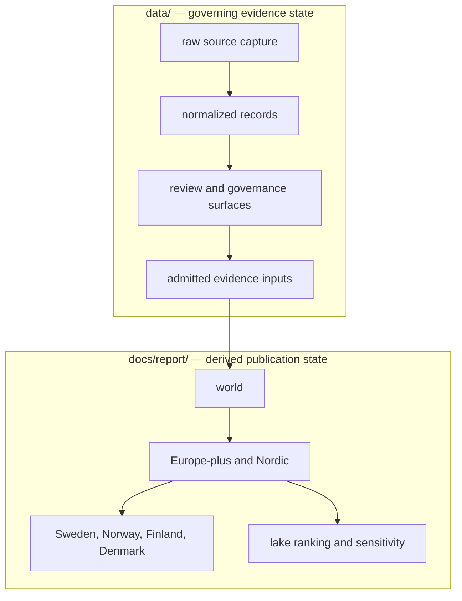

# Data System Overview

Pollenomics uses a layered database because source capture, scientific
interpretation, and public presentation have different trust requirements. A
source snapshot establishes what was acquired. A normalized file establishes a
repository-owned representation. A review establishes fitness and uncertainty.
A publication selects only the evidence appropriate to its declared purpose.

## Evidence Families And Roles

| Family | Contracted role | Primary use | Important boundary |
| --- | --- | --- | --- |
| LandClim | primary pollen context | pollen sites and model-grid context | model context is not a direct sample observation |
| Neotoma | primary pollen context | normalized pollen-site context | site chronology controls temporal interpretation |
| SEAD | contextual archaeology domain | environmental archaeology sites | access and temporal comparability require review |
| RAÄ | contextual archaeology domain | Swedish heritage and archaeology context | coverage is Sweden-specific |
| Boundaries | geographic framing domain | filtering and map extent | geometry adds no scientific support |
| SMHI SVAR | sampling-context domain | Swedish lakes and hydrography | a registered water body is not a suitable coring site by itself |
| AADR | direct human aDNA domain | release-versioned human sample metadata | current processing uses metadata, not genotype files |
| Animal aDNA | sample-owned evidence domain | curated animal samples from source literature | admission depends on recoverable sample-level evidence |

The family contract states what each source can answer before publication code
combines it with another layer.

## Tracked State

```mermaid
flowchart TB
    subgraph Data["data/ — governing evidence state"]
        Raw["raw source capture"] --> Normalized["normalized records"]
        Normalized --> Review["review and governance surfaces"]
        Review --> Final["admitted evidence inputs"]
    end
    subgraph Reports["docs/report/ — derived publication state"]
        World["world"] --> Region["Europe-plus and Nordic"]
        Region --> Country["Sweden, Norway, Finland, Denmark"]
        Region --> Lake["lake ranking and sensitivity"]
    end
    Final --> World
```

The geography hierarchy is a selection hierarchy, not four independent
databases. A country bundle cannot legitimately contain a stronger fact than
its governing evidence or parent publication family.

## Source Identity And Refresh

`data/collection_summary.json` records the selected source version, retrieval
date, acquisition method, source and normalized hashes, provenance, output
roots, and replacement behavior. Collectors write to a staging root and swap
it into place only after successful preparation. A failed refresh therefore
does not silently replace the last tracked source tree with a partial one.

Hash equality proves byte identity, not scientific fitness. Fitness enters at
the review layer, where chronology, spatial precision, source legibility,
coverage, and publication use are evaluated.

## Fact Ownership

The same concept can appear in a project dossier, normalized record, atlas
candidate, country bundle, and summary. `data/source_fact_ownership_registry.json`
identifies which surface governs each recurring fact. Downstream files may
carry the value for publication, but they do not become competing authorities.

This distinction is especially important for animal aDNA:

- project registries govern admitted project identity;
- project sample surfaces govern sample identity, sites, locality, and
  chronology evidence;
- species-normalized records govern species views;
- atlas-candidate records govern geographic admission; and
- report bundles govern presentation of the admitted subset.

## Review Outcomes

A review can admit, qualify, block, or defer a record. These outcomes preserve
different meanings:

- **admitted**: evidence meets the declared publication contract;
- **qualified**: publication is allowed with explicit precision or source
  limits;
- **blocked**: a known evidence failure prevents publication;
- **deferred**: the source or supporting material needed for a decision has not
  been recovered.

Keeping blocked and deferred states visible prevents absence from being
misread as proof that no relevant project or sample exists.

## Related Surfaces

- [Architecture handbook](data-architecture-handbook.md) identifies the
  governing artifacts at each layer.
- [Source families](../sources/index.md) covers acquisition and intended use.
- [Evidence](../evidence/index.md) covers identity, place, time, and coordinate
  semantics.
- [Publications](../publications/index.md) covers derived outputs and limits.
