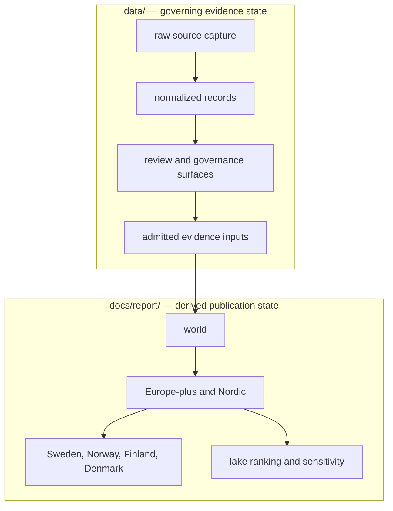
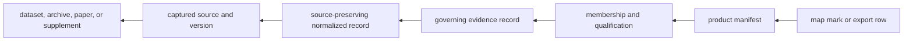

# Data System Overview

Pollenomics uses a layered database because source capture, scientific
interpretation, and public presentation have different trust requirements. A
source snapshot establishes what was acquired. A normalized file establishes a
repository-owned representation. A review establishes fitness and uncertainty.
A publication selects only the evidence appropriate to its declared purpose.

## Evidence Families And Roles

| Family | Contracted role | Primary use | Important boundary |
| --- | --- | --- | --- |
| LandClim | primary pollen context | pollen sites and model-grid context | model context is not a direct sample observation |
| Neotoma | primary pollen context | normalized pollen-site context | site chronology controls temporal interpretation |
| SEAD | contextual archaeology domain | environmental archaeology sites | access and temporal comparability require review |
| RAÄ | contextual archaeology domain | Swedish heritage and archaeology context | coverage is Sweden-specific |
| Boundaries | geographic framing domain | filtering and map extent | geometry adds no scientific support |
| SMHI SVAR | sampling-context domain | Swedish lakes and hydrography | a registered water body is not a suitable coring site by itself |
| AADR | direct human aDNA domain | release-versioned human sample metadata | current processing uses metadata, not genotype files |
| Animal aDNA | sample-owned evidence domain | curated animal samples from source literature | admission depends on recoverable sample-level evidence |

The family contract states what each source can answer before publication code
combines it with another layer.

## Curation Is Evidence Work

Curation does more than make fields consistent. It records which identity,
place, time, coordinate, and source claim is supported strongly enough for a
specific use.

| Curation operation | Preserved evidence | Refused shortcut |
| --- | --- | --- |
| identity resolution | source-native identifier, repository identifier, aliases, and lineage | merging records because names look similar |
| locality resolution | verbatim locality, resolved feature, country or region, method, and precision | copying a project-level place into every sample |
| chronology normalization | source text, numeric interval where supported, dating basis, and caveat | deriving precise years from a broad cultural label |
| coordinate review | supplied or resolved coordinates, basis, precision, and evidence owner | plotting a regional centroid as an exact sample point |
| species normalization | source taxon, accepted view, assignment rule, and unresolved state | silently forcing ambiguous taxonomy into a target species |
| publication admission | product, rule, decision, and exclusion reason | treating every normalized record as publishable |

Null, ambiguous, blocked, and deferred values are part of the database. They
identify the limit of current evidence and the recovery action that could
change it.

## Tracked State

```mermaid
flowchart TB
    subgraph Data["data/ — governing evidence state"]
        Raw["raw source capture"] --> Normalized["normalized records"]
        Normalized --> Review["review and governance surfaces"]
        Review --> Final["admitted evidence inputs"]
    end
    subgraph Reports["docs/report/ — derived publication state"]
        World["world"] --> Region["Europe-plus and Nordic"]
        Region --> Country["Sweden, Norway, Finland, Denmark"]
        Region --> Lake["lake ranking and sensitivity"]
    end
    Final --> World
```

The geography hierarchy is a selection hierarchy, not four independent
databases. A country bundle cannot legitimately contain a stronger fact than
its governing evidence or parent publication family.

## Source Identity And Refresh

`data/collection_summary.json` records the selected source version, retrieval
date, acquisition method, source and normalized hashes, provenance, output
roots, and replacement behavior. Collectors write to a staging root and swap
it into place only after successful preparation. A failed refresh therefore
does not silently replace the last tracked source tree with a partial one.

Hash equality proves byte identity, not scientific fitness. Fitness enters at
the review layer, where chronology, spatial precision, source legibility,
coverage, and publication use are evaluated.

## Fact Ownership

The same concept can appear in a project dossier, normalized record, atlas
candidate, country bundle, and summary. `data/source_fact_ownership_registry.json`
identifies which surface governs each recurring fact. Downstream files may
carry the value for publication, but they do not become competing authorities.

This distinction is especially important for animal aDNA:

- project registries govern admitted project identity;
- project sample surfaces govern sample identity, sites, locality, and
  chronology evidence;
- species-normalized records govern species views;
- atlas-candidate records govern geographic admission; and
- report bundles govern presentation of the admitted subset.

## Review Outcomes

A review can admit, qualify, block, or defer a record. These outcomes preserve
different meanings:

- **admitted**: evidence meets the declared publication contract;
- **qualified**: publication is allowed with explicit precision or source
  limits;
- **blocked**: a known evidence failure prevents publication;
- **deferred**: the source or supporting material needed for a decision has not
  been recovered.

Keeping blocked and deferred states visible prevents absence from being
misread as proof that no relevant project or sample exists.

## Follow One Published Object

The most reliable way to understand the database is to follow an object rather
than a directory name. A published mark first resolves to its product bundle,
then to the record that owns its scientific claim, and finally to captured
source identity.

```mermaid
flowchart RL
    Mark["map mark or export row"] --> Manifest["product manifest"]
    Manifest --> Admission["membership and qualification"]
    Admission --> Evidence["governing evidence record"]
    Evidence --> Normalized["source-preserving normalized record"]
    Normalized --> Capture["captured source and version"]
    Capture --> Upstream["dataset, archive, paper, or supplement"]
```

The chain differs by family. An AADR row resolves to a release manifest and
annotation panel. A Neotoma point resolves to a site record and its temporal
review. An animal point can cross a project registry, paper, supplement,
sample master, site link, locality packet, chronology packet, coordinate
provenance, and admission record. Those different chain lengths reflect the
source material; they are not maturity scores.

## Separate Three Populations

Many apparent contradictions disappear when three populations are kept
distinct:

| Population | Question answered | Example |
| --- | --- | --- |
| captured | What material did the repository acquire? | two AADR annotation panels or 2,195 SEAD inventory rows |
| normalized and reviewed | Which records have a stable repository representation and evidence posture? | 200 Neotoma site records with temporal review |
| published | Which records satisfy one named product contract? | 2,172 mapped Nordic SEAD features or 2 Nordic animal localities |

A smaller published population can be the honest result of stronger review,
geographic scope, or missing evidence. It must not be described as failed
collection without inspecting the captured and reviewed populations.

## Read Disagreement As Evidence

When two surfaces disagree, first identify whether they count the same object
and population. A source total, normalized total, and product total may all be
correct. If the object and population are identical, follow the fact-ownership
registry to the governing record and treat downstream copies as
representations rather than competing authorities.

Unresolved and conflicted states are informative. They tell a reader which
join, precision, or source claim is missing and why a record was qualified,
excluded, or deferred. Choosing the most convenient downstream value would
erase that evidence.

## Related Surfaces

- [Architecture handbook](data-architecture-handbook.md) identifies the
  governing artifacts at each layer.
- [Source families](../sources/index.md) covers acquisition and intended use.
- [Evidence](../evidence/index.md) covers identity, place, time, and coordinate
  semantics.
- [Publications](../publications/index.md) covers derived outputs and limits.
