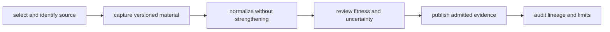

# Data System

Pollenomics is a multi-domain evidence system with a single publication
lineage. Pollen, archaeology, hydrography, boundaries, human ancient DNA,
animal ancient DNA, and field observations retain separate scientific roles
while contributing to governed geographic publications.

## Evidence Lifecycle

The lifecycle is represented in machine-readable contracts and checked-in
artifacts. It supports forward questions—what can be published from this
source?—and reverse questions—what evidence supports this visible result?

## System References

| Question | Reference |
| --- | --- |
| How do all evidence families and tracked roots fit together? | [Data system overview](data-system-overview.md) |
| Which file governs a fact repeated across outputs? | [Data architecture handbook](data-architecture-handbook.md) |
| How do unlike domains appear together without becoming equivalent? | [Pollenomics publication model](pollenomics-publication-model.md) |
| How does a publication resolve to provenance? | [Provenance and publication linkage](provenance-and-publication-linkage.md) |
| Why was a source selected and what happens during refresh? | [Source selection and refresh](source-selection-and-refresh.md) |
| How are coverage and durable identifiers represented? | [Coverage and naming](coverage-and-naming.md) |
| Which evidence dimensions are strong, contextual, or incomplete? | [Cross-domain evidence matrix](cross-domain-evidence-matrix.md) |
| Why does animal aDNA require project- and sample-level recovery? | [Animal ancient-DNA evidence](animal-ancient-dna-evidence.md) |
| Where do the governing artifacts live? | [Data directory layout](data-directory-layout.md) |

## Authority Boundaries

- Source captures govern acquired identity and provenance.
- Normalized records govern repository-owned representation.
- Review surfaces govern scientific fitness, uncertainty, and refusal.
- Publication manifests govern the selected output and its members.
- A downstream report never becomes the authority for an upstream sample,
  locality, chronology, coordinate, or source claim.

## Cross-Domain Interpretation

The system does not reduce all evidence to one measure. A temporal interval,
pollen sequence, archaeology record, lake polygon, administrative boundary,
and ancient-DNA sample carry different units and uncertainty. Publication
preserves those differences through source roles, temporal semantics,
coordinate posture, layer labeling, and visible caveats.

For claim-level inspection, continue to [Sources](../sources/index.md),
[Evidence](../evidence/index.md), or [Publications](../publications/index.md).
